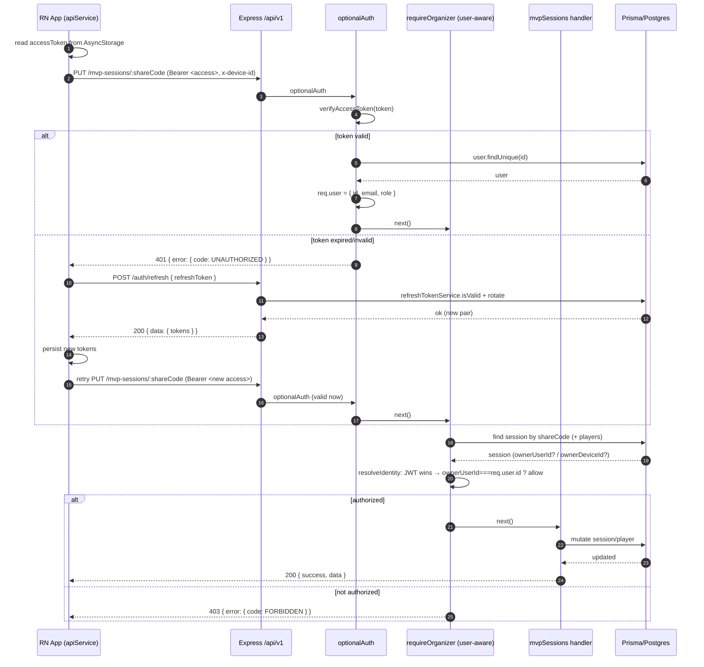
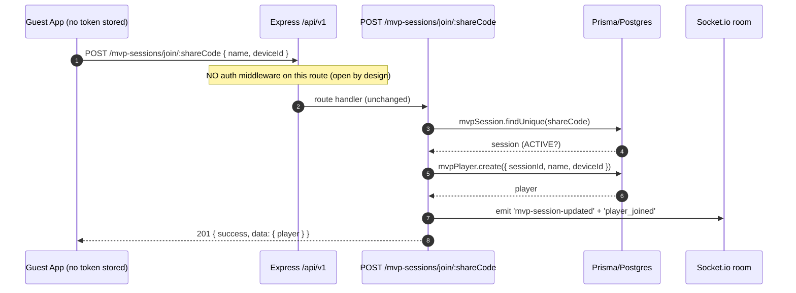
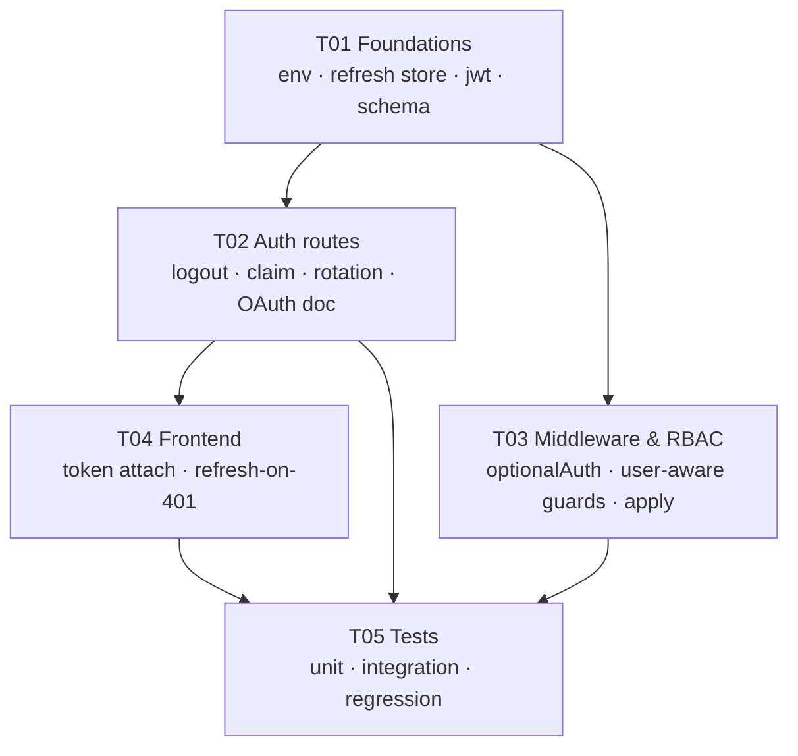

# Story 6.1 — Authenticated Identity and Auth Hardening — System Design

**Author:** Architect (高见远)
**Status:** Ready for implementation
**Source story:** `docs/stories/6.1.story.md`
**Epic:** `docs/epics/epic-6.md` (Workstream WS1, P0)

---

## 0. Recon verification (facts confirmed against the codebase)

All of the team-lead's recon was verified. Corrections/additions marked **⚠ NEW**.

| # | Claim | Verdict | Evidence |
|---|-------|---------|----------|
| 1 | `utils/jwt.ts` store/revoke/isValid are stubs; `isRefreshTokenValid` always `true`; hardcoded secret fallbacks | ✅ confirmed | `jwt.ts:16-17,49-64` |
| 2 | `middleware/auth.ts` has `authenticateToken` + `requireRole(allowedRoles)`, no `optionalAuth` | ✅ confirmed | `auth.ts:13-103` |
| 3 | `middleware/permissions.ts` is device-ID based (`requireRole`/`requireOrganizer`/`requireOrganizerOrSelf`/`requireSessionOwner`) | ✅ confirmed | `permissions.ts:61-338` |
| 4 | `mvpSessions.ts` 4383 lines, ~45 endpoints, **no** `authenticateToken`; `POST /claim` at line 872 (device + organizer-secret) | ✅ confirmed | grep of `router.*` |
| 5 | `/auth` and `/oauth` mounted in `routes/index.ts`; `/mvp-sessions` at line 63 | ✅ confirmed | `routes/index.ts:59,63,126` |
| 6 | Two coexisting rate-limit modules | ✅ confirmed | `rateLimit.ts`, `rateLimiter.ts` |
| 7 | No FK from `MvpSession`/`MvpPlayer` to `User` | ✅ confirmed | `MvpSession.ownerDeviceId String?` (line 54); `MvpPlayer.deviceId String?` (line 237). `User.ownedSessions` points at the **separate `Session` model**, not `MvpSession` |
| 8 | — | **⚠ NEW** | **No `RefreshToken` model exists** in `schema.prisma` |
| 9 | — | **⚠ NEW** | **`POST /mvp-sessions/claim` already exists but is a DIFFERENT concept** (organizer-secret claim for an existing session). Story 6.1 AC 5 needs a *new* `POST /auth/claim { deviceId }`. Do not repurpose. |
| 10 | — | **⚠ NEW** | **No `POST /auth/logout` exists today** although the story's API contract lists it. |
| 11 | — | **⚠ NEW** | Frontend already has partial scaffolding: `authSlice.ts` (Redux, stores `accessToken`/`refreshToken` in AsyncStorage), `apiService.ts` (`ApiService.request()` with stubbed `setAuthToken`/`clearAuthToken`), `mvpApiService.ts extends ApiService`. |
| 12 | — | **⚠ NEW** | **Join-path mismatch:** `sessionApi.ts` calls `POST /mvp-sessions/${shareCode}/join`; the backend route is `POST /mvp-sessions/join/:shareCode`. The *canonical* client `mvpApiService.ts` uses the correct `/mvp-sessions/join/${shareCode}`. `sessionApi.ts` join appears stale/dead. |
| 13 | — | **⚠ NEW** | Token storage keys are inconsistent: `config/api.ts` defines `AUTH_TOKEN_KEY='@badminton_auth_token'`, but `authSlice.ts` uses `'accessToken'`/`'refreshToken'`. |
| 14 | — | **⚠ NEW** | Test infra ready: `jest.config.js` (ts-jest, supertest), existing `routes/__tests__/auth.test.ts`, `middleware/__tests__/permissions.test.ts`, `__tests__/joinSession.test.ts`. |

---

## 1. Implementation approach & decisions

### 1.1 Shape of the change

Story 6.1 does **not** add a new subsystem — it **activates and hardens** the auth scaffolding that already exists and threads identity into the device-centric MVP session flow. The design principle throughout is **additive and dual-path**:

- **Reads and share-link join stay token-free and open** (AC 4, 9 — the #1 risk).
- **Mutating / ownership routes accept EITHER a valid JWT (user identity) OR the existing device path.**
- **No existing error code or response envelope changes for unauthenticated callers.**

### 1.2 Decision D1 — `optionalAuth` vs `requiredAuth` semantics

**Recommendation (firm):**

- `authenticateToken` (existing) stays as **required auth** → hard `401` when the token is missing/invalid. Export an alias `requiredAuth = authenticateToken` for readability.
- Add **`optionalAuth`** with these exact rules:
  1. **No `Authorization` header** → anonymous: leave `req.user` undefined, call `next()`. (Guest path.)
  2. **Header present, token valid** → set `req.user = { id, email, role }`, call `next()`.
  3. **Header present, token invalid/expired** → **`401 UNAUTHORIZED`** (do *not* silently downgrade to anonymous).

**Why 401 on a present-but-invalid token rather than silent anonymous?** It is the trigger the frontend needs for transparent refresh-on-401 (AC 10). If we silently downgraded, a logged-in organizer whose access token expired would fall back to the device path and could be wrongly denied (or wrongly allowed) with no signal to refresh. Guests never send the header (the client only attaches a token when one is stored), so this does not endanger the guest path.

**Where each is applied:**

| Middleware | Routes |
|-----------|--------|
| **none** (fully open) | All `GET` reads on `mvpSessions.ts` (discovery, `GET /join/:shareCode`, recap, rotation, stats, leaderboard, check-in-summary, rest-status, player-stats, `my-sessions`, `players/me/:deviceId`) and `POST /join/:shareCode` (guest join) |
| **`optionalAuth`** | All ~23 mutating/ownership routes (list in §5, T03) + `POST /` (create) + `POST /claim` (organizer-secret) + `DELETE /:shareCode/leave-by-device` |
| **`requiredAuth`** | `POST /auth/claim`, `POST /auth/logout` (user-only operations) |

> Rationale for leaving `POST /join` and all reads with **no** middleware: it keeps the guest join and read experience byte-for-byte identical and immune to token-state bugs. Identity on mutating routes is *opt-in*.

### 1.3 Decision D2 — Identity resolution precedence

**Recommendation (firm): when both a JWT and a `deviceId` are present, the JWT (userId) wins.**

Introduce one shared helper so precedence is defined in exactly one place:

```ts
// middleware/permissions.ts
export interface ResolvedIdentity {
  userId?: string;         // from verified JWT (req.user)
  deviceId?: string;       // from body.deviceId or x-device-id header
  role?: 'ORGANIZER' | 'PLAYER'; // resolved session role for this caller
  source: 'jwt' | 'device' | 'anonymous';
}
export function resolveIdentity(req): ResolvedIdentity;
```

Ownership check order used by every guard:

1. **If `req.user` (JWT) present** → identity is authoritative. A caller is the owner if `session.ownerUserId === req.user.id`, or a member if a `MvpPlayer` row has `userId === req.user.id` with the required role.
2. **Else if `deviceId` present** → existing device logic: `session.ownerDeviceId === deviceId`, or `MvpPlayer.deviceId === deviceId`.
3. **Else** → anonymous; existing guards already reject (e.g. `MISSING_DEVICE_ID`).

**Why JWT wins:** a device that was later linked to a different account must not override the logged-in user; user identity is the stronger, verified claim. The device path is a *fallback used only when no valid user identity exists*.

### 1.4 Decision D3 — Ownership enforcement without rewriting ~20 call sites

**Recommendation (firm): make the existing middlewares user-aware internally, keep their exported signatures unchanged, and prepend `optionalAuth` per mutating route. Do NOT rewrite call sites.**

- `requireRole`, `requireOrganizer`, `requireOrganizerOrSelf`, `requireSessionOwner` in `permissions.ts` are modified **internally only**:
  - `requireRole(requiredRole, action)`: if `req.user`, first look for a `MvpPlayer` by `userId` (fallback `deviceId`); if no player row but `session.ownerUserId === req.user.id`, treat the caller as `ORGANIZER`. Otherwise identical to today.
  - `requireSessionOwner`: add `session.ownerUserId === req.user.id` as the first allow condition, before the device check and the existing `role === 'OWNER'|'ORGANIZER'` fallback.
  - `requireOrganizerOrSelf`: add a `userId` match for the requesting player, and treat `session.ownerUserId === req.user.id` as organizer.
- The **only** edit at each of the ~23 call sites is prepending `optionalAuth` as the first middleware argument (so `req.user` is populated before the guard runs). The guard logic and route handlers are untouched.

**Why not router-level `router.use(optionalAuth)`?** Because rule D1-3 (present-invalid ⇒ 401) would then also apply to public reads, breaking token-free reads for clients holding a stale token. Per-route insertion keeps reads untouched.

**Why not have the guards parse the token themselves?** Hidden side effects are hard to test and reason about; explicit `optionalAuth` is auditable and testable.

### 1.5 Decision D4 — Refresh-token persistence (real rotation / revocation / reuse-detection)

Redis is **not** wired in and is owned by Story 6.2. **Recommendation (firm): persist refresh tokens in a new additive Prisma table `RefreshToken`, with `JWTUtils` delegating to a dedicated `refreshTokenService`.**

- Store **only a SHA-256 hash** of the refresh token (`tokenHash`), plus a `jti` claim added to the JWT payload. Raw tokens are never persisted or logged.
- **Rotation:** on `POST /auth/refresh`, verify signature + DB validity, issue a new pair, mark the old row `revokedAt = now, replacedByJti = <newJti>`, insert the new row. All rows in one **rotation family** (`familyId`) form a lineage.
- **Reuse-detection:** if a token verifies by signature but its row is already `revokedAt != null`, treat as token theft → **revoke the entire family** (`revokedAt = now` for all rows with that `familyId`) and return `401`. Forces re-login.
- **Revocation:** `revokeRefreshToken(userId, refreshToken?)` — if a token is supplied, revoke just that row; if omitted, revoke **all** rows for the user (logout-all). The optional second parameter keeps the existing single-arg call sites in `auth.ts` compiling.
- **Interface stability:** `JWTUtils.storeRefreshToken/revokeRefreshToken/isRefreshTokenValid` keep their names/signatures (extended with optional params) and delegate to `refreshTokenService`. **Story 6.2 can swap the backing store to Redis behind the same interface with zero call-site changes.**

**Trade-off stated:** a DB-backed store costs one indexed write per login and one read+two writes per refresh — negligible at auth volumes, and it works today with no new infrastructure. Redis would be faster but is out of scope for 6.1.

### 1.6 Decision D5 — `POST /auth/claim { deviceId }` (device → account claim)

**Recommendation (firm): new endpoint in `routes/auth.ts`, guarded by `requiredAuth`, implemented atomically in `deviceClaimService.ts`.**

Inside a single `prisma.$transaction`:

1. Select `MvpPlayer` rows with `deviceId = :deviceId AND userId IS NULL` and `MvpSession` rows with `ownerDeviceId = :deviceId AND ownerUserId IS NULL`.
2. Set `userId = req.user.id` (players) and `ownerUserId = req.user.id` (sessions).
3. **Conflict handling (do not steal):** rows where `userId`/`ownerUserId` is already set to a *different* user are **skipped** and reported, not overwritten.
4. **Idempotent:** rows already owned by `req.user` are no-ops counted as `alreadyOwned`.
5. **Audit:** write an `AuditLog` entry (`action: 'DEVICE_CLAIMED'`, `actorId = req.user.id`, `metadata = { deviceId, claimed, skipped }`) via the existing `AuditLogger`.

Response (existing envelope, no new codes):

```jsonc
{
  "success": true,
  "data": {
    "claimed": { "sessions": 2, "players": 3 },
    "alreadyOwned": { "sessions": 0, "players": 1 },
    "skipped": [ { "type": "session", "id": "...", "reason": "OWNED_BY_OTHER_USER" } ]
  },
  "message": "Device activity linked to your account",
  "timestamp": "..."
}
```

> **Do not confuse** with the pre-existing `POST /mvp-sessions/claim` (organizer-secret based). Both remain; document the distinction (AC 8 doc).

### 1.7 Decision D6 — Secret externalization

**Recommendation (firm): remove hardcoded fallbacks; validate at startup; do not break local dev.**

- New `backend/src/config/env.ts`:
  - Production (`NODE_ENV === 'production'`): **throw at startup** if `JWT_SECRET` or `JWT_REFRESH_SECRET` is missing or shorter than 32 chars.
  - Dev/test: if unset, log a loud `warn` and use a **per-process random** secret (tokens don't survive restart — acceptable and safer than a fixed string). Developers who want stable dev sessions set the vars in `.env`.
- `jwt.ts` reads secrets from `env.ts` only (no `|| 'access-secret'`).
- Ship `.env.example` documenting `JWT_SECRET`, `JWT_REFRESH_SECRET`, `JWT_EXPIRES_IN` (default `15m`), `JWT_REFRESH_EXPIRES_IN` (default `7d`).
- **Dev story:** copy `.env.example` → `.env`, generate secrets with `openssl rand -hex 32`.

### 1.8 Decision D7 — Frontend token handling (AC 10, 11)

**Recommendation (firm): centralize attach + refresh-on-401 in `ApiService.request()`, keep join token-free.**

- In `ApiService.request()`: read `accessToken` from AsyncStorage; when present add `Authorization: Bearer <token>`. On `401` with `error.code === 'UNAUTHORIZED'`, attempt **one** refresh via `POST /auth/refresh` with the stored `refreshToken`; on success persist the new pair and **retry the original request once**; on failure clear tokens and return the 401. Implement `setAuthToken`/`clearAuthToken` for real.
- **Join stays token-free:** `POST /mvp-sessions/join/:shareCode` requires no header; guests have no stored token so none is attached; the refresh path never gates join.
- `sessionApi.ts` bypasses `ApiService` (it does raw `fetch`). Add a shared `authFetch()` helper and route `sessionApi.ts` through it so it gets the same token attach + refresh. (See risk R1 re: its stale join path.)

---

## 2. File list

### New files

| Path | What it is |
|------|-----------|
| `backend/src/config/env.ts` | Env loading + JWT secret validation (fail-fast in prod, random dev fallback). |
| `backend/src/services/refreshTokenService.ts` | Real refresh-token store: hash, store, validate, rotate, revoke, family reuse-detection. |
| `backend/src/services/deviceClaimService.ts` | Atomic device→account claim (players + sessions) with conflict/idempotency handling. |
| `backend/prisma/migrations/<ts>_story_6_1_auth/migration.sql` | Additive migration: `refresh_tokens` table + nullable `ownerUserId`/`userId` columns & indexes. |
| `backend/src/middleware/__tests__/optionalAuth.test.ts` | Unit tests for `optionalAuth` (3 branches). |
| `backend/src/utils/__tests__/jwt.test.ts` | Unit tests for token issuance/verify/expiry/`jti`. |
| `backend/src/services/__tests__/refreshTokenService.test.ts` | Unit tests for store/validate/rotate/revoke/reuse-detection. |
| `backend/src/routes/__tests__/auth.integration.test.ts` | Integration: register → login → protected → refresh → rotate → logout → reuse. |
| `backend/src/__tests__/guestJoin.regression.test.ts` | Regression: guest join + reads open; mutating route still device-gated. |
| `frontend/Rally/src/services/authFetch.ts` | Shared fetch wrapper: attach token + refresh-on-401 + single retry. |
| `docs/oauth.md` | Documented OAuth flow (AC 8). |
| `.env.example` (repo root or `backend/`) | Documents required JWT env vars. |

### Modified files

| Path | Change |
|------|--------|
| `backend/src/utils/jwt.ts` | Remove hardcoded secrets (read `env.ts`); add `jti`; delegate `store/revoke/isValid` to `refreshTokenService`; add optional `meta`/`refreshToken` params. |
| `backend/src/middleware/auth.ts` | Add `optionalAuth`, alias `requiredAuth`; extend `AuthRequest` with `auth` identity hint. |
| `backend/src/middleware/permissions.ts` | Add `resolveIdentity`; make `requireRole`/`requireOrganizer`/`requireOrganizerOrSelf`/`requireSessionOwner` user-aware (signatures unchanged). |
| `backend/src/routes/auth.ts` | Add `POST /logout`, `POST /auth/claim`; wire rotation + reuse-detection; apply `rateLimiters.auth`/`.sensitive`. |
| `backend/src/routes/mvpSessions.ts` | Prepend `optionalAuth` to ~23 mutating routes + create + organizer-claim + leave-by-device; set `ownerUserId`/`userId` when `req.user` present. Reads/join untouched. |
| `backend/prisma/schema.prisma` | Add `RefreshToken` model; nullable `MvpSession.ownerUserId`; nullable `MvpPlayer.userId`; back-relations on `User`; indexes. |
| `frontend/Rally/src/services/apiService.ts` | Real token attach + refresh-on-401 + retry; implement `setAuthToken`/`clearAuthToken`. |
| `frontend/Rally/src/services/sessionApi.ts` | Route calls through `authFetch` (token attach + refresh). |
| `backend/src/utils/validation.ts` | Add `claimSchema` (`{ deviceId }`) and `logoutSchema` if needed. |

---

## 3. Data structures & interfaces

### 3.1 Prisma schema additions (additive only)

```prisma
// ── NEW MODEL ─────────────────────────────────────────────
model RefreshToken {
  id            String    @id @default(cuid())
  userId        String
  user          User      @relation(fields: [userId], references: [id], onDelete: Cascade)

  tokenHash     String    @unique   // SHA-256 of the raw refresh token
  jti           String    @unique   // matches JWT `jti` claim
  familyId      String              // rotation lineage (stable across rotations)

  expiresAt     DateTime
  revokedAt     DateTime?
  replacedByJti String?

  createdByIp   String?
  userAgent     String?
  createdAt     DateTime  @default(now())

  @@index([userId])
  @@index([familyId])
  @@index([expiresAt])
  @@map("refresh_tokens")
}

// ── ADD to model User ─────────────────────────────────────
//   refreshTokens   RefreshToken[]
//   ownedMvpSessions MvpSession[] @relation("MvpSessionOwner")
//   mvpPlayers      MvpPlayer[]   @relation("MvpPlayerUser")

// ── ADD to model MvpSession (all nullable → backward compatible) ──
//   ownerUserId String?
//   ownerUser   User?   @relation("MvpSessionOwner", fields: [ownerUserId], references: [id], onDelete: SetNull)
//   @@index([ownerUserId])

// ── ADD to model MvpPlayer (all nullable → backward compatible) ──
//   userId String?
//   user   User? @relation("MvpPlayerUser", fields: [userId], references: [id], onDelete: SetNull)
//   @@index([userId])
```

> All three additions are **nullable** and default-`NULL`, so existing rows and existing queries (which never reference the new fields) are unaffected. No existing column is altered, renamed, or dropped. `onDelete: SetNull` avoids cascade surprises.

### 3.2 Middleware signatures

```ts
// ── middleware/auth.ts ────────────────────────────────────
export interface AuthRequest extends Request {
  user?: { id: string; email: string | null; role: string };
  auth?: { source: 'jwt' | 'device' | 'anonymous'; userId?: string; deviceId?: string };
}

// required (existing behaviour, unchanged)
export const authenticateToken: RequestHandler;
export const requiredAuth = authenticateToken;             // alias

// NEW: optional — no header ⇒ anonymous; valid ⇒ req.user; present+invalid ⇒ 401
export const optionalAuth: RequestHandler;

// existing
export const requireRole: (allowedRoles: string[]) => RequestHandler;
export const getCurrentUser: (req: AuthRequest) => AuthRequest['user'];

// ── middleware/permissions.ts ─────────────────────────────
export interface ResolvedIdentity {
  userId?: string;
  deviceId?: string;
  role?: 'ORGANIZER' | 'PLAYER';
  source: 'jwt' | 'device' | 'anonymous';
}
export function resolveIdentity(req: Request): ResolvedIdentity;

// signatures UNCHANGED (call sites untouched):
export const requireRole: (requiredRole: PlayerRole, action: PermissionAction) => RequestHandler;
export const requireOrganizer: (action: PermissionAction) => RequestHandler;
export const requireOrganizerOrSelf: (action: PermissionAction) => RequestHandler;
export const requireSessionOwner: RequestHandler;
```

### 3.3 Token service interface

```ts
// ── services/refreshTokenService.ts ───────────────────────
export interface RefreshTokenMeta { ip?: string; userAgent?: string; familyId?: string }

export const refreshTokenService: {
  /** Persist a newly-issued refresh token (stores SHA-256 hash only). Returns jti + familyId. */
  store(userId: string, rawToken: string, meta?: RefreshTokenMeta): Promise<{ jti: string; familyId: string }>;

  /** True iff the token hash exists, is not revoked, and is not expired. */
  isValid(userId: string, rawToken: string): Promise<boolean>;

  /** Detect theft: token verifies by signature but its row is revoked → revoke whole family. */
  isReused(userId: string, rawToken: string): Promise<boolean>;

  /** Revoke one token, or all of a user's tokens when rawToken is omitted (logout-all). */
  revoke(userId: string, rawToken?: string): Promise<void>;

  /** Revoke every token sharing a familyId (reuse response). */
  revokeFamily(familyId: string): Promise<void>;
};
```

```ts
// ── utils/jwt.ts (public surface, extended but backward compatible) ──
export class JWTUtils {
  static generateTokens(payload: { userId: string; email: string; role: string },
                        opts?: { familyId?: string }): { accessToken: string; refreshToken: string; jti: string };
  static verifyAccessToken(token: string): JWTPayload | null;
  static verifyRefreshToken(token: string): JWTPayload | null;   // now includes jti
  static storeRefreshToken(userId: string, refreshToken: string, meta?: RefreshTokenMeta): Promise<void>;
  static revokeRefreshToken(userId: string, refreshToken?: string): Promise<void>; // 2nd arg optional
  static isRefreshTokenValid(userId: string, refreshToken: string): Promise<boolean>;
}
```

### 3.4 Request / response shapes

```ts
// POST /api/v1/auth/register   { name, email, phone?, password, deviceId? }
// POST /api/v1/auth/login      { email, password, deviceId? }
// POST /api/v1/auth/refresh    { refreshToken }
// POST /api/v1/auth/logout     (auth)                       → 200 { success, message }
// POST /api/v1/auth/claim      (auth) { deviceId }          → 200 { success, data: { claimed, alreadyOwned, skipped } }

// Envelope (unchanged for all callers):
// success: { success: true,  data, message?, timestamp }
// error:   { success: false, error: { code, message, details? }, timestamp }

// Auth error codes (existing, reused): UNAUTHORIZED (401), FORBIDDEN (403),
// VALIDATION_ERROR (400), CONFLICT (409), RATE_LIMIT_EXCEEDED (429), INTERNAL_ERROR (500).
```

---

## 4. Program call flow

### 4.1 Authenticated request path (with refresh-on-401)



### 4.2 Guest join path (token-free, no regression)



> The guest path never touches `optionalAuth`, `req.user`, or any user table. Reads (`GET /mvp-sessions/:shareCode`, discovery, stats) are likewise untouched.

---

## 5. Ordered task list (Engineer executes in order)

> **Grouping note:** the work is grouped into **5 tasks**, matching the story's own Task 1–5 structure and the Architect hard limit (≤5 tasks, ≥3 files each, infra first). Each task lists the precise files and ACs. Sub-bullets are execution steps, not separate tasks.

### T01 — Foundations: env/secrets, real refresh-token store, JWT hardening, schema

- **Files:** `backend/src/config/env.ts` (new), `backend/src/services/refreshTokenService.ts` (new), `backend/src/utils/jwt.ts` (mod), `backend/prisma/schema.prisma` (mod), `backend/prisma/migrations/<ts>_story_6_1_auth/migration.sql` (new), `.env.example` (new), `backend/src/utils/__tests__/jwt.test.ts` (new), `backend/src/services/__tests__/refreshTokenService.test.ts` (new).
- **Steps:**
  1. `env.ts`: validate `JWT_SECRET`/`JWT_REFRESH_SECRET` (fail-fast in prod, random dev fallback with warning). Document in `.env.example`.
  2. Remove hardcoded fallbacks in `jwt.ts`; read from `env.ts`; add `jti` (`crypto.randomUUID()`) to refresh payload; thread `familyId`.
  3. `refreshTokenService.ts`: hash (SHA-256), `store`/`isValid`/`isReused`/`revoke`/`revokeFamily`. `jwt.ts` delegates.
  4. Prisma: add `RefreshToken` model + nullable `MvpSession.ownerUserId` + nullable `MvpPlayer.userId` + `User` back-relations + indexes. Generate an additive migration.
  5. Unit tests for `jwt.ts` and `refreshTokenService.ts`.
- **ACs:** 2, 17, 18. **Depends on:** — (infra first).

### T02 — Auth routes completion: logout, claim, rotation, rate limiting, OAuth doc

- **Files:** `backend/src/routes/auth.ts` (mod), `backend/src/services/deviceClaimService.ts` (new), `backend/src/utils/validation.ts` (mod), `backend/src/routes/oauth.ts` (verify only), `docs/oauth.md` (new), `backend/src/routes/__tests__/auth.integration.test.ts` (new).
- **Steps:**
  1. Wire `POST /refresh` to full rotation + reuse-detection via `refreshTokenService`; keep `401` messages/codes.
  2. Add `POST /logout` (`requiredAuth`) → revoke the caller's refresh token(s).
  3. Add `POST /auth/claim` (`requiredAuth`) → `deviceClaimService.claim(req.user.id, deviceId)` (atomic, conflict/idempotent, audited). Do **not** touch `POST /mvp-sessions/claim`.
  4. Apply `rateLimiters.auth` to `login`/`register`/`refresh`; `rateLimiters.sensitive` to `logout`/`claim`. Do not weaken existing tiers.
  5. Verify OAuth flow and write `docs/oauth.md`.
- **ACs:** 1, 5, 7, 8. **Depends on:** T01.

### T03 — Middleware & RBAC: `optionalAuth`/`requiredAuth`, user-aware guards, apply to mvpSessions

- **Files:** `backend/src/middleware/auth.ts` (mod), `backend/src/middleware/permissions.ts` (mod), `backend/src/routes/mvpSessions.ts` (mod), `backend/src/middleware/__tests__/optionalAuth.test.ts` (new), `backend/src/middleware/__tests__/permissions.test.ts` (extend).
- **Steps:**
  1. Add `optionalAuth` + `requiredAuth` alias in `auth.ts` (rules §1.2).
  2. Add `resolveIdentity` and make the four guards user-aware (signatures unchanged, §1.4).
  3. Prepend `optionalAuth` to the **23 mutating routes** (lines: 1061, 1176, 1399, 1493, 1614, 1704, 1821, 1885, 2042, 2156, 2442, 2507, 2603, 2989, 3114, 3330, 3470, 3529, 3699, 3809, 3965, 4360, 4372) plus `POST /` (411), `POST /claim` (872), `DELETE /:shareCode/leave-by-device` (4185).
  4. On `POST /` (create) and `POST /claim`: when `req.user` present, set `ownerUserId`/`userId` so new activity is attributed. **Leave every `GET` read and `POST /join/:shareCode` untouched.**
  5. Middleware unit tests (3 `optionalAuth` branches; user-owned session via `ownerUserId`; player via `userId`; device fallback preserved).
- **ACs:** 3, 6, 9. **Depends on:** T01.

### T04 — Frontend token handling

- **Files:** `frontend/Rally/src/services/apiService.ts` (mod), `frontend/Rally/src/services/authFetch.ts` (new), `frontend/Rally/src/services/sessionApi.ts` (mod), `frontend/Rally/src/services/__tests__/sessionApi.test.ts` (extend).
- **Steps:**
  1. `ApiService.request()`: attach `Authorization: Bearer <accessToken>` when present; on `401 UNAUTHORIZED` refresh once, retry once, else clear tokens and surface the error. Implement `setAuthToken`/`clearAuthToken`.
  2. `authFetch.ts`: shared wrapper used by `sessionApi.ts` for the same behaviour.
  3. Route `sessionApi.ts` fetches through `authFetch`; **keep join token-free** (guests have no token).
  4. Standardize token storage keys (see risk R2).
- **ACs:** 10, 11. **Depends on:** T02.

### T05 — Tests: unit / integration / regression + privacy & error-leak checks

- **Files:** `backend/src/routes/__tests__/auth.integration.test.ts` (complete), `backend/src/__tests__/guestJoin.regression.test.ts` (new), plus additions to the T01/T03 test files.
- **Steps:**
  1. Integration: `register → login → access-protected-route → refresh (rotate) → reuse-detection → logout → 401`.
  2. Regression: guest join (`GET`+`POST /join/:shareCode`) with no token succeeds; reads open; a mutating route with no token/device still returns the same 403/`MISSING_DEVICE_ID` as before.
  3. Error-leak test: auth failures return the envelope only — no stack traces / secrets (AC 16).
  4. Run `npm run typecheck` and `npm test` in `backend`.
- **ACs:** 12, 13, 14, 15, 16. **Depends on:** T02, T03, T04.

---

## 6. Shared conventions (keep consistent across all files)

- **Error envelope (unchanged):** `{ success: false, error: { code, message, details? }, timestamp }`; success `{ success: true, data, message?, timestamp }`. **Never** change an existing code for an unauthenticated caller.
- **Identity resolution:** JWT wins over `deviceId`; device path is fallback; anonymous when neither. Implemented once in `resolveIdentity`.
- **Headers/body:** `Authorization: Bearer <accessToken>`; device identity via `x-device-id` header **and** `body.deviceId` (existing guards read both).
- **Token handling:** refresh tokens stored **hashed** (SHA-256); raw tokens never logged; `jti` present on every refresh token.
- **Auth failures:** always `401` for missing/invalid/expired/revoked credentials; `403` for authenticated-but-unauthorized; never leak stack traces or secrets (AC 16).
- **Rate limiting:** reuse existing tiers; do not weaken `generalApiLimiter`/`strictLimiter`/`permissionsLimiter` or the global `/api/` limiter.
- **Dates:** ISO 8601 UTC.
- **Prisma changes:** additive + nullable only; ship a real migration file.

---

## 7. Test plan (maps to AC 13–16)

| Layer | File | Covers | ACs |
|-------|------|--------|-----|
| Unit | `utils/__tests__/jwt.test.ts` | issue/verify, expiry, `jti`, secret from env | 2, 13, 18 |
| Unit | `services/__tests__/refreshTokenService.test.ts` | store hash, `isValid`, rotate, revoke, **reuse → family revoke** | 2, 17, 13 |
| Unit | `utils/__tests__/password.test.ts` (extend) | strength + bcrypt verify | 7, 13 |
| Unit | `middleware/__tests__/optionalAuth.test.ts` | no-header→anon; valid→user; invalid→401 | 3, 6, 16 |
| Unit | `middleware/__tests__/permissions.test.ts` (extend) | `ownerUserId` allow; `userId` player; device fallback preserved | 3, 6 |
| Integration | `routes/__tests__/auth.integration.test.ts` | register→login→protected→refresh→rotate→reuse→logout→401; claim; no-leak | 14, 5, 16 |
| Regression | `__tests__/guestJoin.regression.test.ts` | guest `GET`/`POST /join` token-free; reads open; mutating device gate unchanged | 15, 4, 9 |
| Static | `npm run typecheck` | type safety across new/changed files | 12 |

Existing suites (`auth.test.ts`, `permissions.test.ts`, `joinSession.test.ts`) must continue to pass unmodified.

---

## 8. Open questions / risks (with recommended defaults so work proceeds)

| ID | Risk / ambiguity | Recommended default |
|----|------------------|---------------------|
| **R1** | **Join-path mismatch:** `sessionApi.ts` calls `/${shareCode}/join`, backend route is `/join/:shareCode`. `sessionApi.ts` join may be dead code. | Keep `mvpApiService.ts` (correct path) as canonical. Do **not** silently change `sessionApi.ts`'s path; flag it, add the token wrapper, and open a follow-up to reconcile. Verify at T04 whether any screen calls it. |
| **R2** | **Token key inconsistency:** `config/api.ts` (`@badminton_auth_token`) vs `authSlice.ts` (`accessToken`/`refreshToken`). | Standardize on `authSlice.ts` keys (`accessToken`/`refreshToken`); update `config/api.ts` constants to match. |
| **R3** | **`optionalAuth` on present-invalid token:** 401 vs silent anonymous. | 401 (enables refresh-on-401). Frontend always falls back to a tokenless retry if refresh fails. |
| **R4** | **Two "claim" endpoints** (`/mvp-sessions/claim` vs `/auth/claim`). | Keep both; document the distinction in `docs/oauth.md`/API docs. |
| **R5** | **Migration method:** scripts use `prisma db push`; prod needs a real migration. | Ship an additive `prisma migrate` file; do not alter existing columns. |
| **R6** | **`requireSessionOwner` trusts `req.user.role` (`OWNER`/`ORGANIZER`)** — safe because role now comes from a verified JWT via `optionalAuth`. | Keep, but only after `optionalAuth` runs; ensure no route relies on it without `optionalAuth`. |
| **R7** | **Perf (AC 19 < 500 ms):** `optionalAuth` adds a `prisma.user.findUnique` per authenticated request. | Select minimal columns; optionally cache user lookups in the existing in-memory `cacheService` with a short TTL. Validate with a light load check. |
| **R8** | **Privacy review (AC 20):** stored identity = email, phone, deviceId↔userId linkage. | Document data stored + retention in `docs/oauth.md`/privacy note; no new sensitive fields beyond what `User` already holds. Mostly out of code scope. |
| **R9** | **Reuse-detection false positives:** network retries could replay a just-rotated token. | Rotate with a small grace window (accept the immediately-previous token once within ~10s) **or** revoke-family only on a token older than the grace window. Default: grace window = 10s, documented. |

---

## 9. Task dependency graph



---

## 10. Compatibility verification checklist (DoD)

- [ ] No breaking changes to existing API contracts or response envelopes (AC 9).
- [ ] Prisma changes additive + nullable only (AC 12).
- [ ] Guest share-link join verified token-free (AC 4, 15).
- [ ] Auth/RBAC integration + regression tests pass (AC 6, 13–16).
- [ ] `npm run typecheck` and `npm test` pass in `backend`.
- [ ] No hardcoded secrets; env validated (AC 18); OAuth documented (AC 8).
- [ ] Existing rate-limit tiers unchanged (AC 7, 11).
