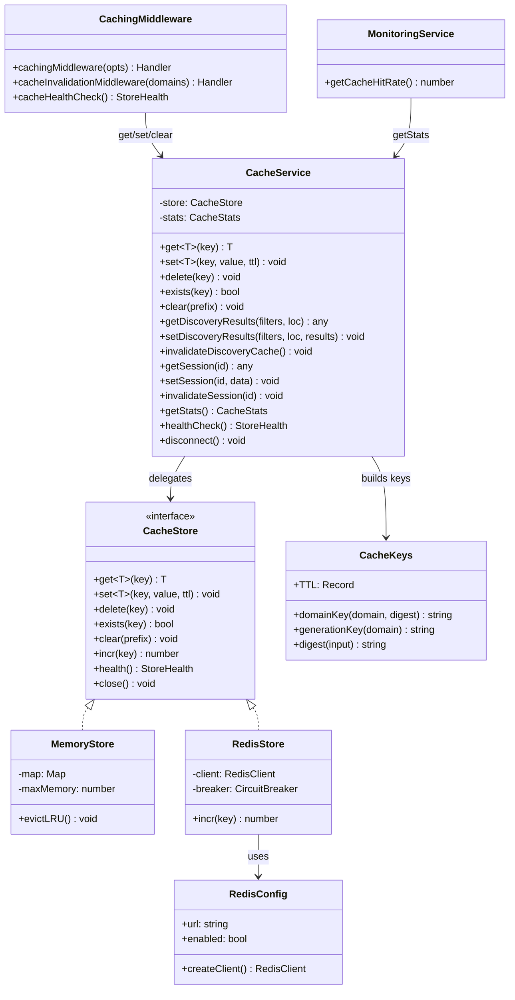
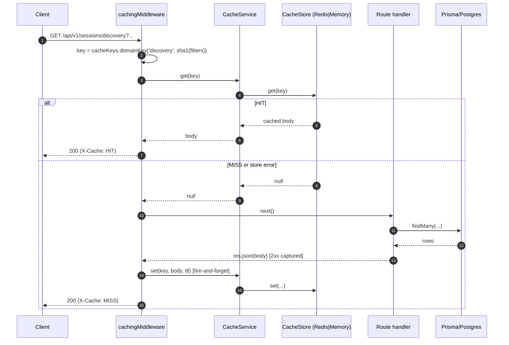
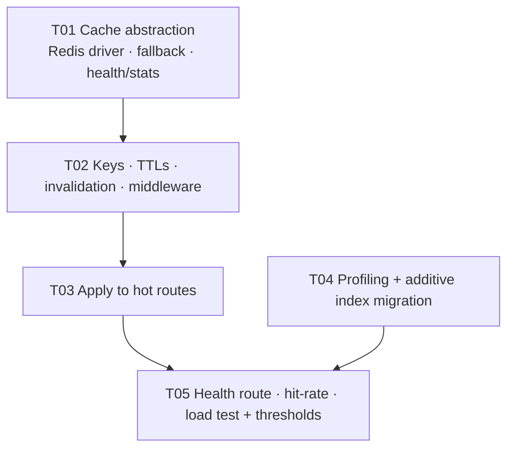

# Story 6.2 — Performance, Caching, and Query Optimization — System Design

**Author:** Architect (高见远)
**Status:** Ready for implementation
**Source story:** `docs/stories/6.2.story.md`
**Epic:** `docs/epics/epic-6.md` (Workstream WS2, P0)

---

## 0. Recon verification (facts confirmed against the codebase)

| # | Claim | Verdict | Evidence |
|---|-------|---------|----------|
| 1 | `services/cacheService.ts` is an in-memory `Map` cache (TTL discovery 5m / session 10m / popular 15m / location 30m / stats 60m; 256 MB cap) | ✅ confirmed | `cacheService.ts:20-46,119-143,285-295` |
| 2 | `middleware/caching.ts` provides `cachingMiddleware`, `cacheInvalidationMiddleware`, `cacheWarmingMiddleware`, `cacheHealthCheck` | ✅ confirmed | `caching.ts:25,130,173,186` |
| 3 | The `redis` npm package is installed but **never imported** anywhere in `src/` | ✅ confirmed | grep: no `createClient`/`from 'redis'` in `src/` |
| 4 | `cachingMiddleware` / `cacheInvalidationMiddleware` are **defined but not applied to any route** | ✅ confirmed | grep: only the definitions in `caching.ts` |
| 5 | `config/redis.ts` does **not** exist | ✅ confirmed | `backend/src/config/` contains only `socket.ts`, `database.ts`, `env.ts` |
| 6 | `discoveryService.discoverSessions` already calls `cacheService.getDiscoveryResults/setDiscoveryResults` | ✅ confirmed | `discoveryService.ts:138,145` (cache-first, DB fallback) |
| 7 | `monitoringService.getCacheHitRate()` is a placeholder returning `0` | ✅ confirmed | `monitoringService.ts:337-340` |
| 8 | Health surfaces: `server.ts` `/health` (line 99) and `/api/v1/health` (line 151); `healthcheck.ts` exists; `cacheHealthCheck` unused | ✅ confirmed | `server.ts:99,151`; `healthcheck.ts:3` |
| 9 | **Story 6.1 already added** `MvpSession.ownerUserId` index and `MvpPlayer.userId` index | ⚠ **NEW** | `schema.prisma:104,357` |
| 10 | **`MvpSession` has NO `ownerDeviceId` index** although `GET /mvp-sessions/my-sessions/:deviceId` filters on it | ⚠ **NEW** | `schema.prisma:97-107` (index list) vs `mvpSessions.ts:1110-1126` |
| 11 | **`MvpPlayer` has NO standalone `deviceId` index** (only `@@unique([sessionId, deviceId])`) | ⚠ **NEW** | `schema.prisma:352-359` |
| 12 | **Test infra (established during 6.1):** `npm test` = `jest --forceExit --runInBand`; `__tests__/setup.ts` patches `net.Server.listen` to bind test servers in 40000-44000 | ⚠ **NEW** | `__tests__/setup.ts:31-45` |
| 13 | Existing index set on `MvpSession` for discovery: `[status]`, `[visibility]`, `[scheduledAt]`, `[latitude,longitude]`, `[skillLevel]`, `[courtType]`, `[status,visibility,scheduledAt]` | ✅ confirmed | `schema.prisma:98-106` |

> Note: 6.1's `RefreshToken` table and auth work are already merged, so this design must not disturb them.

---

## 1. Implementation approach & decisions

The story replaces an in-memory cache with a Redis-backed cache **without changing any caller**, adds explicit invalidation on writes, tunes a small set of hot queries with additive indexes, and commits a load test with thresholds. The guiding principle is **best-effort caching**: the cache may improve latency but must never be required for correctness and must never cause a 5xx.

### D1 — Storage abstraction: `CacheStore` interface with a Redis driver and an in-memory fallback, behind the unchanged `CacheService` public surface

**Recommendation (firm).** Extract the existing Map logic into a `MemoryStore` and add a `RedisStore`, both implementing one interface:

```ts
interface CacheStore {
  get<T>(key: string): Promise<T | null>;
  set<T>(key: string, value: T, ttlSeconds: number): Promise<void>;
  delete(key: string): Promise<void>;
  exists(key: string): Promise<boolean>;
  clear(prefix: string): Promise<void>;
  incr(key: string): Promise<number>;
  health(): Promise<StoreHealth>;
  close(): Promise<void>;
}
```

`CacheService` keeps **every** existing public method (`get`, `set`, `delete`, `exists`, `clear`, `getDiscoveryResults`, `setDiscoveryResults`, `invalidateDiscoveryCache`, `getSession`, `setSession`, `invalidateSession`, `getPopularSessions`, `setPopularSessions`, `getNearbySessions`, `setNearbySessions`, `getStats`, `setStats`, `healthCheck`, `disconnect`) and delegates to the active store. **Callers (`discoveryService`, `middleware/rateLimit`, `middleware/caching`) need zero changes.**

**Why:** the interface is already load-bearing (discovery + rate limiting). Preserving it makes this a drop-in swap and keeps the blast radius small.

### D2 — Graceful degradation: Redis outage must never 500 (AC 14)

**Recommendation (firm).**
- `RedisStore` is created only when `REDIS_URL` is set. On connect failure or a runtime command error, `CacheService` **transparently switches to `MemoryStore`** and marks itself `degraded`.
- Every store call is wrapped: a read error returns `null` (treated as a cache miss); a write error is logged and swallowed. **No cache error ever propagates to a route.**
- Redis client is configured with `disableOfflineQueue: true` and a **bounded** `reconnectStrategy` (e.g. exponential backoff capped at 5s) so a down Redis fails fast instead of stalling requests.
- A **circuit breaker**: after `N` consecutive Redis failures, stop attempting Redis for a cooldown window (e.g. 30s) and serve from memory; probe again after the window. This prevents per-request connection stalls during an outage.
- **AC 6:** `config/socket.ts` and analytics services never import the cache for correctness; on a cold/down cache they hit the DB exactly as today.

### D3 — Key schema: namespaced, hashed, versioned, no PII (AC 16)

**Recommendation (firm).**
- Prefix all keys with `rally:cache:` (overridable via `REDIS_KEY_PREFIX`).
- **Hash** the variable part (filter objects, coordinates, free-text) into a short stable digest (SHA-1, 40 hex) so keys are bounded and **never embed raw user input or PII**. Keys never contain email, phone, or raw `userId`.
- Include a **generation** token per domain (see D4) so invalidation is O(1).
- Enforce a **max entry size** (`CACHE_MAX_ENTRY_BYTES`, default 256 KB): payloads larger than the cap are **not cached** (logged at debug). This bounds memory per entry (AC 15) and prevents a single huge response from dominating memory.
- Values are JSON of the same response body already returned to clients → **no new PII exposure** beyond today's API surface.

### D4 — Invalidation: O(1) generation counters, not `KEYS`/`SCAN` (AC 2, 8, 12)

**Recommendation (firm).** Do **not** use `KEYS` (blocking, O(N)) or rely on `SCAN` for hot paths. Instead:

- Each cache domain has a generation counter: `rally:cache:gen:<domain>`.
- Cache keys embed the current generation: `rally:cache:<domain>:g<gen>:<digest>`.
- **Invalidate = `INCR rally:cache:gen:<domain>`.** All previously cached keys for that domain become unreachable and age out naturally via their TTL. This is atomic, O(1), and works identically for Redis and memory (memory `clear(prefix)` also supported).
- Invalidation is **best-effort and asynchronous** (fire-and-forget after a 2xx write). Writes always commit to the DB first; a failed invalidation can at worst serve a stale read until the short TTL expires — never incorrect data on a mutating path (**AC 8**).
- TTLs are deliberately short on mutable data (discovery/session) so any missed invalidation self-heals quickly.

### D5 — Middleware application on hot endpoints (AC 3, 5)

**Recommendation (firm).**
- Apply `cachingMiddleware` to the hot **GET** endpoints only: discovery list, nearby, session detail (`GET /mvp-sessions/:shareCode`, `GET /mvp-sessions/join/:shareCode`), analytics reads (leaderboard, system, sessions, trends), and discovery stats.
- Apply `cacheInvalidationMiddleware` on their **writes** with the domain list from §3.3.
- Harden the middleware: only cache `2xx` (already true); **strip sensitive response headers** (`set-cookie`, `authorization`) before caching; include a `X-Cache: HIT|MISS` response header for observability.
- The middleware never changes the response body or envelope (**AC 5**).

### D6 — Query profiling + additive, reversible index migration (AC 4)

**Recommendation (firm).** Profile with Prisma query logging and `EXPLAIN ANALYZE` on the hot queries, then add **only** indexes the plan confirms. Two indexes are justified from static analysis alone:

1. **`MvpSession.ownerDeviceId`** — `GET /mvp-sessions/my-sessions/:deviceId` filters `ownerDeviceId + status`; no supporting index exists today (see Recon #10).
2. **`MvpPlayer.deviceId`** — device-only lookups (guest joins, `POST /auth/claim`, device permission checks) scan without an index (see Recon #11).

Candidate (confirm via `EXPLAIN` before adding):
3. `MvpSession [status, visibility, skillLevel]` and/or `[status, visibility, courtType]` for skill/court-filtered discovery.
4. Analytics FK columns if `player_analytics`/`session_analytics` lack them.

Migration is **additive and reversible**: a Prisma migration with `CREATE INDEX IF NOT EXISTS` (and `DROP INDEX` for rollback). ~~For large tables, generate `CREATE INDEX CONCURRENTLY` (run outside a transaction)~~ **Correction (post-QA, F1): `CONCURRENTLY` cannot be used here — Prisma runs the migration in a transaction, so the statements are plain (non-concurrent) `CREATE INDEX IF NOT EXISTS`. See the A7 correction in §9.**

### D7 — Configuration via env only (AC 13)

**Recommendation (firm).** Extend the existing `config/env.ts` (from 6.1) with a `redis` block: `url` (from `REDIS_URL`), `enabled` (true iff `REDIS_URL` set), `keyPrefix`, `connectTimeoutMs`, `maxRetries`. **No hardcoded hosts.** Document all vars in `.env.example`. When `REDIS_URL` is absent, the app runs on the memory store (dev/test default).

### D8 — Hit/miss instrumentation (AC 10, and Story 6.3 readiness)

**Recommendation (firm).** Add `hits`/`misses` counters (and a computed `hitRate`) to `CacheService`, surfaced by `healthCheck()` / a new `getStats()`. Wire `monitoringService.getCacheHitRate()` (currently `0`) to it. This is what makes the "> 80% hit rate" AC measurable rather than aspirational, and gives 6.3 a real signal.

### D9 — Load test: committed script + documented thresholds (AC 9, 11)

**Recommendation (firm).** Add `backend/src/scripts/loadtest.mjs` using **`autocannon`** (a `devDependency`; see §6) against a running server, hitting discovery/session GETs and a write path, reporting p50/p95/p99 and cache hit rate. Commit a results snapshot to `docs/perf/6.2-loadtest-results.md` with thresholds (**p95 < 200 ms, p99 < 500 ms**, hit rate > 80%). The load test is a **manual/CI-optional** step and is **not** part of `npm test`, so the Jest suite stays green and Redis-free. Provide a dependency-free fallback (`node:http` + fixed concurrency) in the same script if adding `autocannon` is undesirable.

### D10 — Tests must be Redis-free and honor the port guard (constraint)

**Recommendation (firm).**
- Unit-test `MemoryStore` directly (no Redis).
- Test `RedisStore` against a **mocked `redis` client** (`jest.mock('redis')`) — never open a real socket.
- Test fallback by forcing the mocked client's `connect()` to reject → assert `MemoryStore` is used and no call throws.
- Test invalidation by generation bump: set a key, perform the write, assert the old key is no longer served (no stale read).
- No test starts a real server beyond `supertest`'s in-process app (compatible with the 40000-44000 port guard in `__tests__/setup.ts`).

---

## 2. File list

### New files

| Path | Purpose |
|------|---------|
| `backend/src/config/redis.ts` | Redis client factory from `REDIS_URL` (lazy connect, bounded reconnect, `disableOfflineQueue`), health probe, `isConfigured()`. |
| `backend/src/services/cache/types.ts` | `CacheStore` interface, `CacheOptions`, `CacheStats`, `StoreHealth`. |
| `backend/src/services/cache/memoryStore.ts` | Extracted in-memory store (Map + TTL + LRU + max-memory + max-entry-size). |
| `backend/src/services/cache/redisStore.ts` | Redis-backed store implementing `CacheStore`. |
| `backend/src/services/cache/cacheKeys.ts` | Key builders, domain generation helpers, TTL constants, digest helper. |
| `backend/src/scripts/loadtest.mjs` | Committed load-test script (autocannon or dependency-free fallback). |
| `backend/prisma/migrations/<ts>_perf_indexes/migration.sql` | Additive/reversible index migration. |
| `backend/src/services/cache/__tests__/memoryStore.test.ts` | Memory store unit tests. |
| `backend/src/services/cache/__tests__/redisStore.test.ts` | Redis store unit tests (mocked client). |
| `backend/src/services/cache/__tests__/cacheService.fallback.test.ts` | Degradation/fallback tests. |
| `backend/src/middleware/__tests__/cachingInvalidation.test.ts` | Middleware hit/miss + invalidation tests. |
| `docs/perf/6.2-caching.md` | TTL + invalidation + key-schema reference. |
| `docs/perf/6.2-loadtest-results.md` | Committed results snapshot + thresholds. |

### Modified files

| Path | Change |
|------|--------|
| `backend/src/services/cacheService.ts` | Delegate to `CacheStore`; keep public interface; add hit/miss stats + `getStats()`; selection/fallback logic. |
| `backend/src/middleware/caching.ts` | Generation-aware invalidation; strip sensitive headers; `X-Cache` header; safe async invalidation. |
| `backend/src/config/env.ts` | Add `redis` config block (env-only). |
| `backend/src/routes/mvpSessions.ts` | Apply `cachingMiddleware` to hot GETs; `cacheInvalidationMiddleware` on writes. |
| `backend/src/routes/discovery.ts` | Apply `cachingMiddleware` to discovery/nearby GETs. |
| `backend/src/routes/analytics.ts` | Apply `cachingMiddleware` to read GETs; invalidate on `/refresh/*`. |
| `backend/src/server.ts` | Expose `/api/v1/health/cache`; graceful Redis shutdown on SIGTERM. |
| `backend/src/services/monitoringService.ts` | Wire `getCacheHitRate()` to `cacheService.getStats()`. |
| `backend/prisma/schema.prisma` | Add `@@index` entries (additive). |
| `backend/src/services/__tests__/cacheService.test.ts` | Update for the store abstraction. |
| `.env.example` | Document `REDIS_URL`, `REDIS_KEY_PREFIX`, `CACHE_MAX_ENTRY_BYTES`. |

---

## 3. Data structures & interfaces

### 3.1 Cache module diagram



### 3.2 Core types

```ts
// services/cache/types.ts
export interface StoreHealth {
  status: 'healthy' | 'degraded' | 'unhealthy';
  driver: 'redis' | 'memory';
  details: Record<string, unknown>;
}
export interface CacheStats {
  hits: number;
  misses: number;
  hitRate: number;         // hits / (hits + misses), 0 when no traffic
  driver: 'redis' | 'memory';
  entries: number;         // memory store only
  memoryUsageMB: number;   // memory store only
}
export interface CacheOptions { ttl?: number; keyGenerator?: (req: any) => string; skipCache?: (req: any) => boolean; }
```

### 3.3 Redis key schema + TTL + invalidation

**Key schema**

| Purpose | Key pattern | TTL | Notes |
|---------|-------------|-----|-------|
| Discovery list | `rally:cache:discovery:g<gen>:<sha1(filters+loc)>` | 300 s | filters hashed; no raw input |
| Nearby | `rally:cache:nearby:g<gen>:<sha1(lat,lon,radius,limit)>` | 300 s | rounded coords in digest |
| Session detail | `rally:cache:session:g<gen>:<sessionId>` | 600 s | `sessionId` is a cuid, not PII |
| Popular sessions | `rally:cache:popular:g<gen>` | 900 s | |
| Location | `rally:cache:location:g<gen>:<lat2>:<lon2>:<radius>` | 1800 s | coords truncated to 2 dp |
| Stats / general | `rally:cache:stats:g<gen>` | 3600 s | |
| Analytics leaderboard | `rally:cache:analytics:g<gen>:leaderboard:<limit>` | 300 s | |
| HTTP (middleware) | `rally:cache:http:<method>:<path>:<sha1(query)>` | per-route | **no identity** for public reads |
| Generation counter | `rally:cache:gen:<domain>` | none | `INCR` to invalidate |

**Invalidation rules (domain generations bumped on 2xx write)**

| Write route | Bumps generations |
|-------------|-------------------|
| `POST /mvp-sessions` (create) | `session`, `discovery`, `stats` |
| `PUT /mvp-sessions/:shareCode` (edit) | `session`, `discovery` |
| `PUT /terminate/:shareCode`, `PUT /reactivate/:shareCode` | `session`, `discovery`, `stats` |
| `POST /join/:shareCode`, `DELETE /:shareCode/leave-by-device` | `session`, `discovery` |
| `DELETE /:shareCode/players/:playerId`, add-player | `session`, `discovery` |
| player status / check-in / check-out / rest | `session` |
| `POST /analytics/refresh/*` | `stats`, `analytics` |

---

## 4. Program call flow

### 4.1 Cached GET (hit / miss)



### 4.2 Write that invalidates

```mermaid
sequenceDiagram
    autonumber
    participant C as Client
    participant IM as cacheInvalidationMiddleware(domains)
    participant H as Route handler
    participant DB as Prisma/Postgres
    participant CS as CacheService
    participant ST as CacheStore

    C->>IM: PUT /api/v1/mvp-sessions/:shareCode
    IM->>H: next() (wraps res.json/res.send)
    H->>DB: update session (source of truth)
    DB-->>H: ok
    H-->>IM: res.json(body) [2xx]
    IM->>CS: clear/invalidate(domains) [fire-and-forget]
    CS->>ST: INCR rally:cache:gen:session
    CS->>ST: INCR rally:cache:gen:discovery
    IM-->>C: 200 (fresh data; old keys orphaned, age out via TTL)
    Note over DB,ST: Write never depends on cache success (AC 8)
```

---

## 5. Ordered task list (batch-implementable)

> Grouped into **5 tasks** (infra first, ≥3 files each). Dependencies are explicit; T04 is independent and can run in parallel with T02/T03.

### T01 — Cache storage abstraction, Redis driver, graceful fallback, health & stats
- **Files:** `config/redis.ts` (new), `services/cache/types.ts` (new), `services/cache/memoryStore.ts` (new), `services/cache/redisStore.ts` (new), `services/cacheService.ts` (mod), `config/env.ts` (mod), `.env.example` (mod), `services/cache/__tests__/{memoryStore,redisStore,cacheService.fallback}.test.ts` (new), `services/__tests__/cacheService.test.ts` (mod).
- **Steps:** extract `MemoryStore`; implement `RedisStore` from `REDIS_URL`; store selection + circuit breaker + fallback; hit/miss counters + `getStats()`; keep `CacheService` interface identical.
- **ACs:** 1, 13, 14, 15. **Depends on:** —.

### T02 — Key schema, TTLs, generation-based invalidation, middleware hardening
- **Files:** `services/cache/cacheKeys.ts` (new), `middleware/caching.ts` (mod), `services/cacheService.ts` (mod), `middleware/__tests__/cachingInvalidation.test.ts` (new), `docs/perf/6.2-caching.md` (new).
- **Steps:** key builders + digest + TTL constants; generation counter invalidation; strip sensitive headers; `X-Cache` header; async-safe invalidation; document TTLs/rules.
- **ACs:** 2, 3, 12, 16. **Depends on:** T01.

### T03 — Apply caching + invalidation to hot routes
- **Files:** `routes/mvpSessions.ts` (mod), `routes/discovery.ts` (mod), `routes/analytics.ts` (mod).
- **Steps:** `cachingMiddleware` on discovery/nearby/session-detail/analytics GETs; `cacheInvalidationMiddleware` with the §3.3 domain map on writes; keep envelopes unchanged.
- **ACs:** 2, 3, 5, 6, 8. **Depends on:** T02.

### T04 — Query profiling + additive index migration
- **Files:** `prisma/schema.prisma` (mod), `prisma/migrations/<ts>_perf_indexes/migration.sql` (new), `docs/perf/6.2-caching.md` (append EXPLAIN notes).
- **Steps:** log/EXPLAIN hot queries; add `MvpSession.ownerDeviceId`, `MvpPlayer.deviceId` (confirmed), plus composite candidates only if EXPLAIN justifies; write reversible migration.
- **ACs:** 4, 12. **Depends on:** — (independent).

### T05 — Health/metrics exposure, load test, thresholds & results
- **Files:** `server.ts` (mod), `services/monitoringService.ts` (mod), `scripts/loadtest.mjs` (new), `docs/perf/6.2-loadtest-results.md` (new), `package.json` (mod: `autocannon` devDep + `loadtest` script).
- **Steps:** expose `/api/v1/health/cache`; wire `getCacheHitRate()`; author + run the load test; record p95/p99 + hit rate against thresholds.
- **ACs:** 7, 9, 10, 11. **Depends on:** T03, T04.

---

## 6. Dependency packages

| Package | Type | Rationale |
|---------|------|-----------|
| `redis` | runtime | **already installed** (`^5.8.2`) — used by `RedisStore`. |
| `autocannon` | devDependency (recommended) | Fast, zero-config HTTP load generator for T05. **Optional** — a `node:http`-based fallback is provided in the same script so no dependency is strictly required. |

No other new packages. (Do **not** add a Redis mock library; use `jest.mock('redis')`.)

---

## 7. Shared knowledge / cross-file conventions

- **Cache is best-effort.** Reads fall back to the DB; writes commit to the DB first. **Never** let a cache error surface as a 5xx (AC 14) and **never** gate correctness on cache state (AC 8).
- **Key discipline.** Always build keys via `cacheKeys.*`; never inline raw user input, email, phone, or raw `userId` into a key (AC 16). Hash variable parts.
- **Invalidate by generation.** Use `INCR rally:cache:gen:<domain>`; never `KEYS`/`SCAN` on hot paths.
- **TTLs** come from `cacheKeys.TTL` (single source of truth) — see `docs/perf/6.2-caching.md`.
- **Response envelopes unchanged** (AC 5); the middleware only adds an `X-Cache` header.
- **Env-only config** (AC 13): `REDIS_URL`, `REDIS_KEY_PREFIX`, `CACHE_MAX_ENTRY_BYTES`. Absent `REDIS_URL` ⇒ memory store.
- **Memory bounds** (AC 15): memory store keeps the 256 MB cap + LRU eviction; every store enforces `CACHE_MAX_ENTRY_BYTES` and skips oversized values.
- **Tests are Redis-free** and rely on the 40000-44000 port guard; `npm test` must stay green with Redis down.

---

## 8. Test plan (maps to ACs)

| Layer | File | Covers | ACs |
|-------|------|--------|-----|
| Unit | `cache/__tests__/memoryStore.test.ts` | TTL expiry, LRU eviction, max-entry skip, `incr` | 15 |
| Unit | `cache/__tests__/redisStore.test.ts` | get/set/del/exists/incr against **mocked** client; oversized-value skip | 1, 15 |
| Unit | `cache/__tests__/cacheService.fallback.test.ts` | `connect()` rejects ⇒ memory store used; read/write errors ⇒ no throw, miss | 1, 14 |
| Unit | `middleware/__tests__/cachingInvalidation.test.ts` | GET cached; 2xx write bumps generation ⇒ old key not served (no stale read); non-2xx does not invalidate | 2, 3, 12 |
| Unit | `services/__tests__/cacheService.test.ts` (mod) | interface parity with the previous behaviour | 5 |
| Static | `npm run typecheck` | types across new/changed files | — |
| Load (manual) | `scripts/loadtest.mjs` | p95 < 200 ms, p99 < 500 ms; hit rate > 80% | 9, 10, 11 |

Existing suites must continue to pass unchanged.

---

## 9. Open items / assumptions (with recommended defaults so work proceeds)

| ID | Item | Recommended default |
|----|------|---------------------|
| **A1** | Redis deployment/provisioning (host, TLS, auth) is outside this repo. | Design against `REDIS_URL` only; assume a reachable Redis in staging/prod, memory store everywhere else. |
| **A2** | `maxmemory`/eviction policy is a Redis server setting, not enforceable from the client. | Enforce `CACHE_MAX_ENTRY_BYTES` client-side; document the recommended server policy (`allkeys-lru`) in `docs/perf/6.2-caching.md`. |
| **A3** | Discovery free-text search uses `contains` (ILIKE) — not index-friendly without `pg_trgm`. | Do not add a trigram index in 6.2 (extension may be unavailable); note as a future optimization. |
| **A4** | Caching the full response includes the `timestamp` field, which becomes stale on hits. | Acceptable (clients treat it as advisory); if needed, overwrite `timestamp` at serialization time. Confirm with Product if any client relies on it. |
| **A5** | Cache key for authenticated GETs: include identity or not? | Public reads ⇒ **no identity in key**. If a personalized read is cached later, hash the `userId` (never raw). |
| **A6** | Load test needs a running server + seeded data; not part of CI `npm test`. | Document as a manual/optional CI step; keep thresholds in `docs/perf/6.2-loadtest-results.md`. |
| **A7** | `CREATE INDEX CONCURRENTLY` cannot run inside a transaction. | Author the migration with `CONCURRENTLY` and no surrounding transaction for the large-table indexes; keep it reversible with `DROP INDEX`. |

> **Correction (post-QA, F1):** assumption A7 was applied incorrectly. Prisma Migrate
> wraps **every** migration file in a transaction by default, so placing
> `CREATE INDEX CONCURRENTLY` inside `migration.sql` makes `prisma migrate deploy`
> fail with PostgreSQL error 25001 / Prisma P3018 — the migration cannot be applied
> at all. The shipped migration therefore uses plain `CREATE INDEX IF NOT EXISTS`
> (transaction-safe, applied atomically with the migration record) and remains
> additive + reversible. A non-blocking build on a very large table, if ever needed,
> must be a **separate, explicitly non-transactional** operation, never a
> `CONCURRENTLY` statement inside this file.

---

## 10. Task dependency graph



---

## 11. Compatibility verification checklist (DoD)

- [ ] `CacheService` public interface unchanged; callers untouched (AC 5).
- [ ] Redis-down path returns correct data with no 5xx (AC 14).
- [ ] TTLs + invalidation rules documented; invalidation covered by tests (AC 2, 12).
- [ ] Index migration additive + reversible (AC 4).
- [ ] `REDIS_URL`-only config; no hardcoded hosts (AC 13).
- [ ] Memory bounds enforced (max entry size + LRU) (AC 15).
- [ ] No PII in keys/values beyond existing exposure (AC 16).
- [ ] `/api/v1/health/cache` exposes cache health for 6.3 (AC 7).
- [ ] Load test committed; p95 < 200 ms / p99 < 500 ms / hit rate > 80% recorded (AC 9, 10, 11).
- [ ] `npm run typecheck` and `npm test` pass in `backend` (Redis-free).
