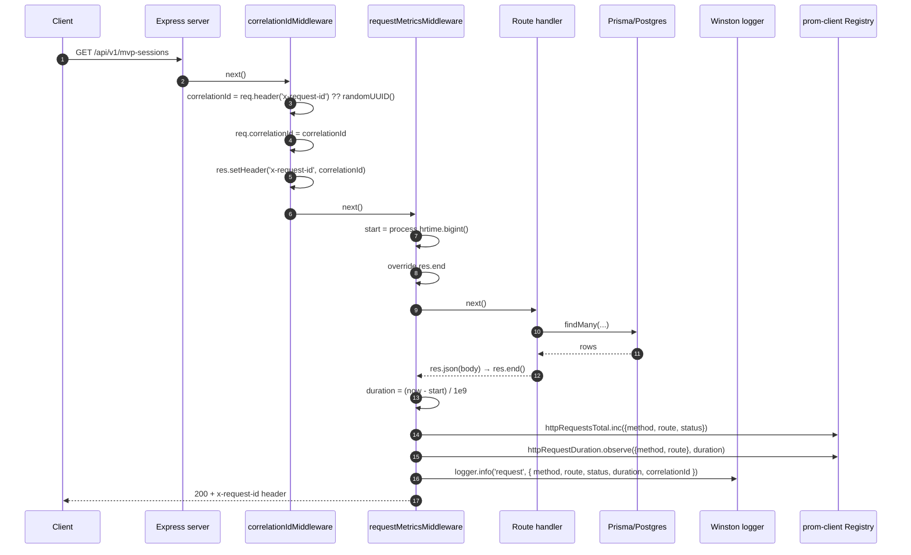
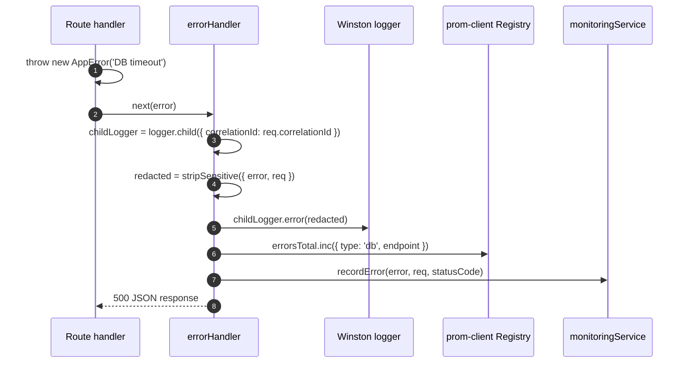
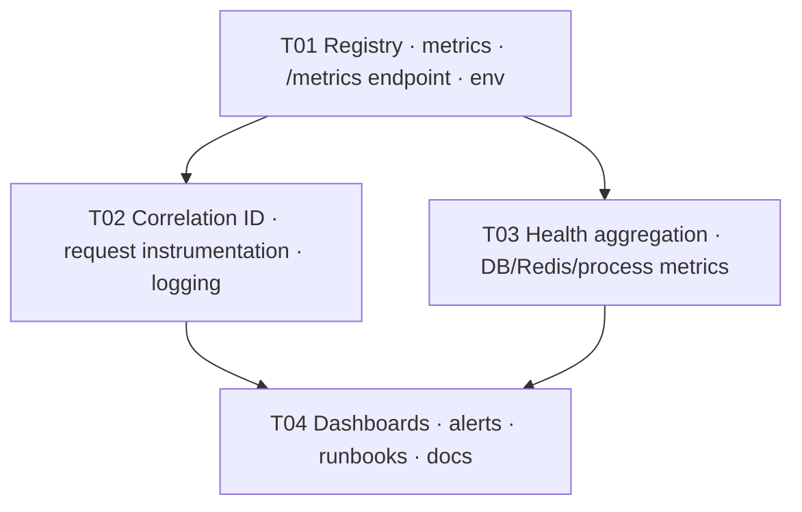

# Story 6.3 — Observability and Alerting — System Design

**Author:** Architect (高见远)
**Status:** Ready for implementation
**Source story:** `docs/stories/6.3.story.md`
**Epic:** `docs/epics/epic-6.md` (Workstream WS3, P0)

---

## 0. Recon verification (facts confirmed against the codebase)

| # | Claim | Verdict | Evidence |
|---|-------|---------|----------|
| 1 | `monitoringService.ts` collects in-process metrics (10k cap) with `PerformanceMetrics`, `ErrorMetrics`, `BusinessMetrics`, `SystemHealth` | ✅ confirmed | `monitoringService.ts:12-50, 52-113` |
| 2 | `getDatabaseConnections()` and `getCpuUsage()` are **placeholders returning 0** | ✅ confirmed | `monitoringService.ts:328-336` |
| 3 | `getCacheHitRate()` is wired to `cacheService.getCacheStats()` (Story 6.2) | ✅ confirmed | `monitoringService.ts:338-346` |
| 4 | `monitoringMiddleware` only wraps `res.json`/`res.send` — misses `res.end`/raw responses | ✅ confirmed | `monitoringService.ts:354-384` |
| 5 | `errorHandler.ts` uses **winston** with JSON format + colorized console | ✅ confirmed | `errorHandler.ts:1-19` |
| 6 | No correlation ID exists in logs or middleware | ✅ confirmed | grep: no `x-request-id`/`correlation-id` in `src/` |
| 7 | No log redaction of sensitive fields (authorization, cookie, password) | ✅ confirmed | `errorHandler.ts:37-44` logs full `err`, `req.ip`, `User-Agent` without redaction |
| 8 | `prom-client` is **not installed** | ✅ confirmed | `package.json` dependencies — absent |
| 9 | Health endpoints: `/health` (static), `/api/v1/health`, `/api/v1/health/cache` (Story 6.2) | ✅ confirmed | `server.ts:99,151`; `caching.ts` |
| 10 | `config/env.ts` exists (Story 6.1) with `nodeEnv/isProduction/isTest` and `jwt` block | ✅ confirmed | `env.ts:51-61` |
| 11 | `config/database.ts` exports the Prisma client | ✅ confirmed | `database.ts:1-5` |
| 12 | `npm test` = `jest --forceExit --runInBand` (test infra from Story 6.1/6.2) | ✅ confirmed | `package.json:15` |
| 13 | Story 6.2 load test baseline: p95=4.1ms, p99=14.6ms, hitRate=100% | ✅ confirmed | `docs/perf/6.2-loadtest-results.md` |
| 14 | `winston` is installed (`^3.17.0`) | ✅ confirmed | `package.json` |
| 15 | `redis` npm package installed (`^5.8.2`) | ✅ confirmed | `package.json` |

> Note: Story 6.1 auth and Story 6.2 cache are merged. This design must not disturb them.

---

## 1. Implementation approach & decisions

The story turns an in-process metric collector into a production-grade observability stack: Prometheus-compatible exposition, structured logging with correlation IDs, a unified health endpoint, and committed dashboards + alerts + runbooks.

### D1 — Metrics backend: `prom-client` (firm)

**Recommendation (firm).** Add `prom-client` (^15.1.3) as a runtime dependency. It is the de-facto standard for Node.js Prometheus exposition, requires zero external service at runtime (the `/metrics` endpoint is self-served), and its text format is compatible with any Prometheus-compatible backend (Datadog, Grafana Cloud, etc.).

Register these metric families:
- `rally_http_requests_total` (Counter) — labels: `method`, `route`, `status`
- `rally_http_request_duration_seconds` (Histogram) — labels: `method`, `route`; buckets: `[0.005, 0.01, 0.025, 0.05, 0.1, 0.25, 0.5, 1, 2.5, 5, 10]`
- `rally_errors_total` (Counter) — labels: `type`, `endpoint`
- `rally_business_active_users` (Gauge)
- `rally_business_total_sessions` (Gauge)
- `rally_system_memory_usage_mb` (Gauge)
- `rally_system_cpu_usage_percent` (Gauge)
- `rally_db_connections_active` (Gauge)
- `rally_cache_hit_rate` (Gauge) — already available from Story 6.2

**Why not pushgateway?** Push adds complexity (another component to run/monitor) and cardinality risk. Pull model via `/metrics` is simpler, stateless, and the Node.js standard.

### D2 — Label cardinality limits (firm)

**Recommendation (firm).** Route labels use a **canonical route pattern** (e.g. `/api/v1/mvp-sessions/:shareCode`) NOT the raw URL. This bounds cardinality to the number of declared Express routes (~few dozen). **Never** use `userId`, `deviceId`, `shareCode`, `email`, or any free-text as a label — that would create an unbounded time series. The `endpoint` field in the existing `monitoringService` in-process store may contain raw URLs; the Prometheus path uses canonical patterns only.

### D3 — Correlation ID strategy (firm)

**Recommendation (firm).** A lightweight `correlationIdMiddleware` runs early in the stack:
- Reads `x-request-id` from the incoming request header (propagates from upstream/client).
- If absent, generates a new `crypto.randomUUID()`.
- Attaches it to `req.correlationId` and echoes it back in the response header `x-request-id`.
- Injects it into **all** winston log entries via a child logger (`logger.child({ correlationId })`).
- Includes it in error reports to `monitoringService`.

Header name: `x-request-id` (standard, Heroku/AWS friendly).

### D4 — Log redaction (firm)

**Recommendation (firm).** Extend winston with a custom format that recursively strips sensitive keys from any logged object. Redacted fields:
- `authorization`, `cookie`, `password`, `token`, `apiKey`, `api_key`, `secret`, `refreshToken`, `accessToken`
- Also strip from `req.headers` before it reaches the log.
- Replace redacted values with `[REDACTED]` (not removed, so the key's presence is visible for debugging).

### D5 — Health endpoint design (firm)

**Recommendation (firm).** Extend the **existing** `GET /api/v1/health` (server.ts:151) to return an aggregated health snapshot that includes:
- `status`: overall status (`healthy`/`degraded`/`unhealthy`) — worst of all subsystems
- `timestamp`, `version`, `uptime`
- `subsystems`: `{ database, redis, cache, process }` each with its own status + details
- Keep `GET /health` (server.ts:99) as a **lightweight static probe** (load balancer liveness check) — no DB queries, just HTTP 200.
- Story 6.2's `GET /api/v1/health/cache` stays as-is (cache-specific detail page).

This satisfies AC 7 without breaking existing callers of `/api/v1/health`.

### D6 — Alert threshold baseline (firm)

**Recommendation (firm).** Use Story 6.2 load test as the empirical baseline:
- Memory driver (worst-case, no Redis): p95=4.1ms, p99=14.6ms, hitRate=100%
- Safety margins: threshold = baseline × 10× for latency, baseline × 0.8 for hit rate.
- Alert rules:
  - `rally_http_request_duration_seconds` p95 > 200ms for 2m
  - `rally_errors_total` rate > 1% of request rate for 2m
  - `rally_cache_hit_rate` < 80% for 5m
  - `rally_db_connections_active` == 0 (or DB health probe fails) for 1m
  - `rally_system_memory_usage_mb` > 200MB for 5m
  - Auth failure surge: `rally_errors_total{type="auth"}` rate > 10/min for 2m

### D7 — Request instrumentation: capture ALL responses (firm)

**Recommendation (firm).** The existing `monitoringMiddleware` only intercepts `res.json`/`res.send` and **misses** raw `res.end()` calls and `res.sendFile()` / `res.redirect()`. Replace it with a middleware that monkey-patches `res.end` (the terminal method) so **every** response path is captured exactly once. Use `on-finished` or a direct `res.end` override (same pattern as `caching.ts` Story 6.2).

### D8 — Database connections metric (firm)

**Recommendation (firm).** Prisma does not expose an active-connection-count API. Use the Prisma `$queryRaw` to run `SELECT count(*) FROM pg_stat_activity WHERE datname = current_database()` on PostgreSQL. This is accurate and low-overhead. Cache the result for 5s to avoid per-request query cost. On non-PostgreSQL (future-proofing), fall back to the placeholder (0).

### D9 — CPU usage metric (firm)

**Recommendation (firm).** Use Node.js `process.cpuUsage()` diff against the service start time, sampled every 5s and cached. This gives user+system CPU time as a percentage of elapsed wall time. Much better than the current placeholder (0).

### D10 — Tests: mock prom-client (firm)

**Recommendation (firm).** Unit tests mock `prom-client` (`jest.mock('prom-client')`) so no real registry state leaks between tests. Integration tests verify the `/metrics` endpoint returns the expected text format. No external Prometheus server needed for `npm test`.

---

## 2. File list

### New files

| Path | Purpose |
|------|---------|
| `backend/src/services/metricsRegistry.ts` | Prometheus `Registry` singleton; metric family definitions; helper to canonicalize Express route patterns. |
| `backend/src/middleware/correlationId.ts` | Generate/propagate `x-request-id`; attach to `req` and response. |
| `backend/src/middleware/requestMetrics.ts` | Request instrumentation middleware (monkey-patches `res.end`); records histogram + counter with canonical route labels. |
| `backend/src/middleware/logRedaction.ts` | Winston format that recursively strips sensitive keys from logged objects. |
| `backend/src/services/healthAggregator.ts` | Aggregates DB, Redis, cache, and process health into a single snapshot. |
| `backend/src/routes/metrics.ts` | `GET /metrics` endpoint (Prometheus text format); access-controlled. |
| `docs/observability/dashboards/rally-overview.json` | Grafana dashboard JSON — latency, error rate, saturation, business KPIs. |
| `docs/observability/alerts/p0-alerts.yml` | Prometheus alert rules for P0 conditions. |
| `docs/observability/observability.md` | Architecture, metric naming, retention, cost, and pipeline documentation. |
| `docs/runbooks/error-spike.md` | Runbook: error rate alert. |
| `docs/runbooks/latency-breach.md` | Runbook: p95 latency alert. |
| `docs/runbooks/db-down.md` | Runbook: database unavailability. |
| `docs/runbooks/redis-down.md` | Runbook: Redis/cache degradation. |
| `docs/runbooks/auth-failure-surge.md` | Runbook: auth failure surge. |
| `backend/src/services/__tests__/metricsRegistry.test.ts` | Metric registry unit tests. |
| `backend/src/middleware/__tests__/correlationId.test.ts` | Correlation ID middleware tests. |
| `backend/src/middleware/__tests__/requestMetrics.test.ts` | Request instrumentation tests. |
| `backend/src/middleware/__tests__/logRedaction.test.ts` | Log redaction format tests. |
| `backend/src/services/__tests__/healthAggregator.test.ts` | Health aggregation tests. |

### Modified files

| Path | Change |
|------|--------|
| `backend/src/services/monitoringService.ts` | Wire `prom-client` registry: increment counters/histograms in `recordApiMetrics` and `recordError`; update gauges in `getSystemHealth`; preserve all existing in-process logic. |
| `backend/src/middleware/errorHandler.ts` | Use correlation-ID-aware child logger; apply redaction format; include `correlationId` in error log metadata. |
| `backend/src/server.ts` | Mount `correlationIdMiddleware` early; mount `requestMetricsMiddleware` after correlation ID but before routes; wire `GET /api/v1/health` to `healthAggregator`; mount authenticated `GET /metrics`. |
| `backend/src/config/env.ts` | Add `metrics` block: `enabled`, `port`, `path`, `authToken` (for `/metrics` basic auth). |
| `backend/src/routes/index.ts` | Ensure `/metrics` route is registered. |
| `backend/package.json` | Add `prom-client` runtime dependency. |
| `backend/.env.example` | Document `METRICS_ENABLED`, `METRICS_PORT`, `METRICS_AUTH_TOKEN`, `LOG_LEVEL`, `CORRELATION_ID_HEADER`. |

---

## 3. Data structures & interfaces

### 3.1 Metric families

```ts
// services/metricsRegistry.ts
import { Registry, Counter, Histogram, Gauge } from 'prom-client';

export const register = new Registry();

export const httpRequestsTotal = new Counter({
  name: 'rally_http_requests_total',
  help: 'Total HTTP requests',
  labelNames: ['method', 'route', 'status'],
  registers: [register],
});

export const httpRequestDuration = new Histogram({
  name: 'rally_http_request_duration_seconds',
  help: 'HTTP request duration in seconds',
  labelNames: ['method', 'route'],
  buckets: [0.005, 0.01, 0.025, 0.05, 0.1, 0.25, 0.5, 1, 2.5, 5, 10],
  registers: [register],
});

export const errorsTotal = new Counter({
  name: 'rally_errors_total',
  help: 'Total application errors',
  labelNames: ['type', 'endpoint'],
  registers: [register],
});

export const businessActiveUsers = new Gauge({
  name: 'rally_business_active_users',
  help: 'Number of active users',
  registers: [register],
});

export const businessTotalSessions = new Gauge({
  name: 'rally_business_total_sessions',
  help: 'Number of total sessions',
  registers: [register],
});

export const systemMemoryUsage = new Gauge({
  name: 'rally_system_memory_usage_mb',
  help: 'Process memory usage in MB',
  registers: [register],
});

export const systemCpuUsage = new Gauge({
  name: 'rally_system_cpu_usage_percent',
  help: 'Process CPU usage percentage',
  registers: [register],
});

export const dbConnectionsActive = new Gauge({
  name: 'rally_db_connections_active',
  help: 'Active database connections',
  registers: [register],
});

export const cacheHitRate = new Gauge({
  name: 'rally_cache_hit_rate',
  help: 'Cache hit rate (0-1)',
  registers: [register],
});
```

### 3.2 Health snapshot

```ts
// services/healthAggregator.ts
export interface SubsystemHealth {
  status: 'healthy' | 'degraded' | 'unhealthy';
  details: Record<string, unknown>;
}

export interface AggregatedHealth {
  status: 'healthy' | 'degraded' | 'unhealthy';
  timestamp: string;
  version: string;
  uptime: number;
  subsystems: {
    database: SubsystemHealth;
    redis: SubsystemHealth;
    cache: SubsystemHealth;
    process: SubsystemHealth;
  };
}
```

---

## 4. Program call flow

### 4.1 Request lifecycle with observability



### 4.2 Error path



---

## 5. Ordered task list (batch-implementable)

> Grouped into **4 tasks**. Dependencies are explicit.

### T01 — Prometheus registry, metric definitions, /metrics endpoint, env config
- **Files:** `services/metricsRegistry.ts` (new), `routes/metrics.ts` (new), `config/env.ts` (mod), `.env.example` (mod), `package.json` (mod: `prom-client`), `services/__tests__/metricsRegistry.test.ts` (new).
- **Steps:** create registry + metric families; canonical route helper; `/metrics` endpoint with auth token check; env block.
- **ACs:** 1, 5, 11, 13, 15. **Depends on:** —.

### T02 — Correlation IDs, request instrumentation, structured logging + redaction
- **Files:** `middleware/correlationId.ts` (new), `middleware/requestMetrics.ts` (new), `middleware/logRedaction.ts` (new), `middleware/errorHandler.ts` (mod), `middleware/__tests__/{correlationId,requestMetrics,logRedaction}.test.ts` (new).
- **Steps:** correlation ID generate/propagate; request metrics middleware (res.end capture, canonical labels); winston redaction format; wire into errorHandler with child logger.
- **ACs:** 2, 6, 8, 13, 14. **Depends on:** T01.

### T03 — Health aggregation, DB/Redis/process metrics, monitoringService wiring
- **Files:** `services/healthAggregator.ts` (new), `services/monitoringService.ts` (mod), `server.ts` (mod), `services/__tests__/healthAggregator.test.ts` (new).
- **Steps:** health aggregator (DB probe via `$queryRaw`, Redis via cacheService, process via `process.memoryUsage()`/`process.cpuUsage()`); update `monitoringService.getSystemHealth()` to set gauges; wire `/api/v1/health` to aggregator.
- **ACs:** 3, 7. **Depends on:** T01.

### T04 — Grafana dashboards, alert rules, runbooks, documentation
- **Files:** `docs/observability/dashboards/rally-overview.json` (new), `docs/observability/alerts/p0-alerts.yml` (new), `docs/observability/observability.md` (new), `docs/runbooks/*.md` (new).
- **Steps:** dashboard JSON (latency p50/p95/p99, error rate, saturation, business KPIs); alert rules with baseline-tuned thresholds; 5 runbooks; architecture/retention/cost doc.
- **ACs:** 3, 4, 9, 10, 12, 16. **Depends on:** T02, T03.

---

## 6. Dependency packages

| Package | Type | Rationale |
|---------|------|-----------|
| `prom-client` | runtime | Prometheus metric registry and exposition format. Standard, zero external dependency at runtime. |

No other new packages. `winston` is already installed.

---

## 7. Shared knowledge / cross-file conventions

- **Metric naming:** all metrics prefixed `rally_`; units in base units (`_seconds`, `_bytes`, `_percent`).
- **Label cardinality:** route labels use **canonical Express patterns** (e.g. `/api/v1/mvp-sessions/:shareCode`), NOT raw URLs. No userId/deviceId/email as labels.
- **Correlation ID:** `x-request-id` header; propagated if present, generated if absent; echoed in response; included in every log line.
- **Redaction:** `authorization`, `cookie`, `password`, `token`, `apiKey`, `secret`, `refreshToken`, `accessToken` → `[REDACTED]`.
- **Health hierarchy:** `GET /health` = lightweight static probe (load balancer); `GET /api/v1/health` = aggregated subsystem health; `GET /api/v1/health/cache` = cache detail (Story 6.2).
- **Env-only config:** `METRICS_ENABLED`, `METRICS_PORT`, `METRICS_AUTH_TOKEN`, `LOG_LEVEL`, `CORRELATION_ID_HEADER`.
- **Best-effort:** metrics/logging never throw; errors in the observability layer are silently swallowed so they cannot break a request.
- **Tests mock prom-client:** `jest.mock('prom-client')` — no real registry state leaks between tests.

---

## 8. Test plan (maps to ACs)

| Layer | File | Covers | ACs |
|-------|------|--------|-----|
| Unit | `services/__tests__/metricsRegistry.test.ts` | Registry creation, metric registration, canonical route helper | 1 |
| Unit | `middleware/__tests__/correlationId.test.ts` | Generate vs propagate, header echo, req attachment | 6 |
| Unit | `middleware/__tests__/requestMetrics.test.ts` | res.end capture, histogram observation, counter increment, canonical labels | 2, 13 |
| Unit | `middleware/__tests__/logRedaction.test.ts` | Sensitive fields stripped, non-sensitive preserved, nested objects | 8, 14 |
| Unit | `services/__tests__/healthAggregator.test.ts` | DB probe, Redis probe, process probe, worst-status rollup | 7 |
| Integration | `routes/__tests__/metrics.test.ts` (new) | `/metrics` returns Prometheus text format; auth enforced | 1, 11 |
| Integration | `routes/__tests__/health.test.ts` (mod) | `/api/v1/health` returns aggregated subsystems | 7 |
| Static | `npm run typecheck` | types across new/changed files | — |
| Manual | Grafana dashboard JSON | Visual verification of panels | 3 |
| Manual | Alert rules YAML | Syntax validation | 4 |

Existing suites must continue to pass unchanged.

---

## 9. Open items / assumptions (with recommended defaults so work proceeds)

| ID | Item | Recommended default |
|----|------|---------------------|
| **A1** | Prometheus server / scrape config is outside this repo. | Design against a self-served `/metrics` endpoint only; assume a Prometheus scraper in staging/prod, none in dev/test. |
| **A2** | Grafana instance provisioning is outside this repo. | Commit dashboard JSONs to `docs/observability/dashboards/` for import; provisioning is an ops concern. |
| **A3** | Alertmanager routing (Slack/PagerDuty/email) is outside this repo. | Commit alert rules YAML to `docs/observability/alerts/`; routing config is ops. |
| **A4** | Log shipping (to Loki/CloudWatch/etc.) is outside this repo. | Document the pipeline in `docs/observability/observability.md`; stdout JSON is the contract. |
| **A5** | Business metrics (`activeUsers`, `totalSessions`) require application-level counting. | Use existing `monitoringService.updateBusinessMetrics()` calls; if none exist, implement a lightweight periodic query (5-min interval) from Prisma. |
| **A6** | Metric retention and cost bounds depend on the scrape interval and TSDB. | Document: "At 15s scrape interval, ~50 metrics × 4 labels ≈ 2MB/day uncompressed"; point to Prometheus retention flags. |
| **A7** | The existing `monitoringService` periodic cleanup interval (`setInterval` every hour) is NOT `.unref()`'d and could keep a Jest worker alive. | Add `.unref()` as a hygiene fix (separate from 6.3 scope but trivial). |

---

## 10. Task dependency graph



---

## 11. Compatibility verification checklist (DoD)

- [ ] `prom-client` installed; `/metrics` endpoint returns valid Prometheus text format (AC 1).
- [ ] 100% of critical routes instrumented (AC 2).
- [ ] Grafana dashboard JSON committed; alert rules YAML committed (AC 3, 4).
- [ ] Runbooks committed for all 5 P0 alert types (AC 10).
- [ ] Correlation IDs propagated through request lifecycle and logs (AC 6).
- [ ] No sensitive data in logs or metric labels (AC 8).
- [ ] Health endpoint aggregates DB + Redis + cache + process (AC 7).
- [ ] Metrics endpoint access-controlled (AC 11).
- [ ] Alert thresholds baseline-tuned from Story 6.2 load test (AC 12).
- [ ] Overhead < 5ms p95 (AC 13) — measured and documented.
- [ ] Structured JSON logs with correlation IDs (AC 14).
- [ ] Env-only config; no hardcoded endpoints (AC 15).
- [ ] Retention and cost documented (AC 16).
- [ ] `npm run typecheck` and `npm test` pass in `backend`.
