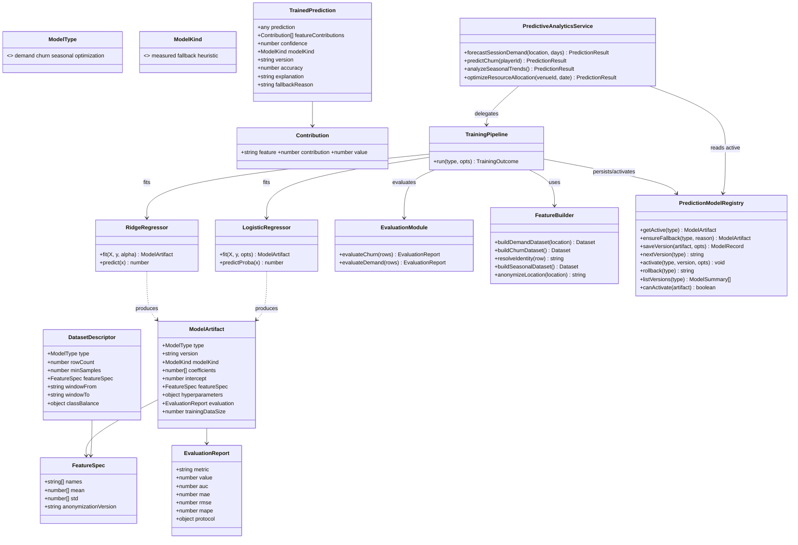
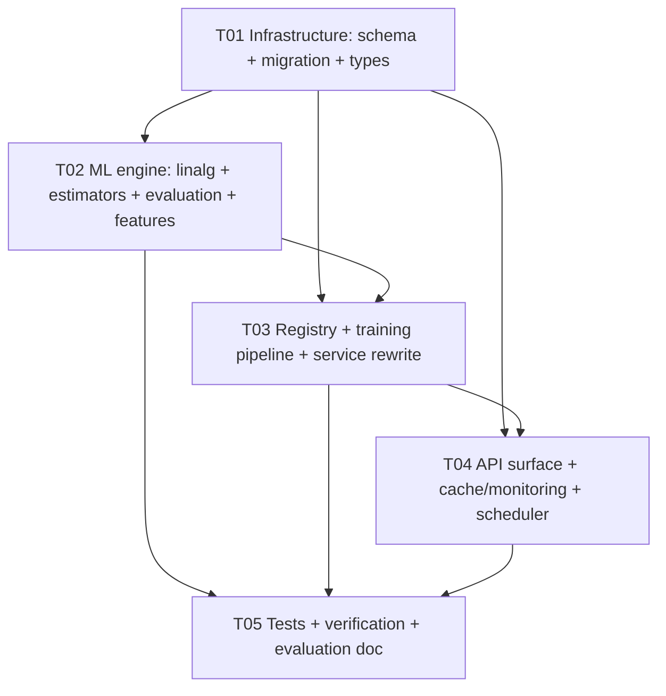

# Story 6.6 — Real Predictive Intelligence — System Design

**Author:** Architect (software-architect-2)
**Status:** Ready for implementation (with one honesty caveat — see §7)
**Source story:** `docs/stories/6.6.story.md`
**Epic:** `docs/epics/epic-6.md` (Workstream WS6)
**Supersedes:** Story 5.5 mock implementation in `predictiveAnalyticsService.ts`

---

## 0. Recon verification (facts confirmed against the codebase)

| # | Claim | Verdict | Evidence |
|---|-------|---------|----------|
| 1 | `predictiveAnalyticsService.ts` fabricates **four** accuracy constants (`0.78` demand, `0.72` churn, `0.80` seasonal, `0.85` optimization), regardless of any evaluation | ✅ confirmed | `:72/76/87`, `:127/128/136`, `:173/174/182`, `:225/226/234` |
| 2 | The four "models" are not models: `mockLogisticRegression` returns literal `0.5` ignoring args; `mockLinearRegression` returns the target mean ignoring input; `mockTimeSeriesForecast` applies a flat 2%/month ramp; `mockLinearProgramming` assigns courts with `Math.random()` | ✅ confirmed | `:6-9`, `:11-13`, `:15-18`, `:20-23` |
| 3 | `explanation` strings assert methods that are not implemented ("ARIMA forecasting", "Logistic regression") | ✅ confirmed | `:88`, `:137`, `:183`, `:235` |
| 4 | Live DB has **0 sessions, 0 completed sessions, 0 analytics_events, 0 prediction_models, 0 prediction_results**; only `mvp_players` = 6 | ✅ confirmed | live `postgres@localhost:5432/badminton_group` counts (team-lead recon) |
| 5 | `PredictionModel` has **both** `version String @unique` (global) **and** `@@unique([type, version])`; both exist in Postgres (`prediction_models_version_key`, `prediction_models_type_version_key`) | ✅ confirmed | `schema.prisma:2959+`; live pg indexes |
| 6 | Authoring code is inconsistent: uses `where:{type_version}` at `:172`/`:224`, `where:{version:'v1.0'}` at `:71` (broken across types), `where:{id:'churn-v1-0'}` at `:126` | ✅ confirmed | `predictiveAnalyticsService.ts` |
| 7 | No prediction/forecast/churn endpoints exist in `routes/analytics.ts` or `routes/sessionInsights.ts`; `routes/predictions.ts` does **not** exist | ✅ confirmed | full-file read of both routes; `routes/` listing |
| 8 | `PredictiveAnalyticsService` has **zero production callers** — only its own unit test references it | ✅ confirmed | grep across `src/` |
| 9 | Frontend `predictionApi` expects `GET /predictions/:type` and `POST /predictions/train` against baseURL `/api/v1`; only consumer is `PredictionDashboardScreen.tsx`, which is **not routed anywhere** | ✅ confirmed | `predictionApi.ts:1-10`, `apiClient.ts:2`, grep for `PredictionDashboard` |
| 10 | Backend is TypeScript CommonJS, Express 5, Prisma 6, Jest (`--forceExit --runInBand`); no ML library installed (no TF.js, no ml.js) | ✅ confirmed | `package.json:31-73`; no `ml/` dir |
| 11 | `cachingMiddleware` / `cacheInvalidationMiddleware` + `TTL` domains + `prom-client` `metricsRegistry` already exist and are reusable | ✅ confirmed | `middleware/caching.ts`, `cache/cacheKeys.ts`, `services/metricsRegistry.ts` |
| 12 | `scheduler.ts` is a setInterval in-process scheduler with `unref()`'d timers — the pattern to follow for retraining | ✅ confirmed | `scheduler.ts:19-51` |
| 13 | Routes are mounted into `apiRouter` (`routes/index.ts`) → `app.use('/api/v1', apiRouter)`; `/metrics` is mounted *before* the SPA catch-all | ✅ confirmed | `server.ts:123,141`; `routes/index.ts` |
| 14 | Admin auth pattern: `authenticateToken, requireRole(['ADMIN'])` | ✅ confirmed | `routes/admin.ts:6-7` |
| 15 | `PredictionResult.explanation` is `String?`; `PredictionResult.prediction` / `inputData` are `Json` | ✅ confirmed | `schema.prisma:2982+` |

> Ground truth from story vs reality: story AC-4 says the admin surface "**continues to serve**" predictions. It does not exist; this design **creates** it. Story AC-1 names three mock constants; there are four.

---

## 1. Implementation approach & rationale

### D1 — Estimators: pure TypeScript, zero heavy dependencies (firm)

The repo has no ML runtime and adding TensorFlow.js / a native BLAS is out of scope (AC 15: bounded compute; asset weight + install risk unacceptable for a brownfield build). We implement small, well-understood, fully-testable estimators in plain TS:

- **Demand (regression):** **Ridge (L2) linear regression**, coefficients via the closed-form normal equations `(XᵀX + αI)β = Xᵀy`, solved with Gaussian elimination with partial pivoting. Tractable because the feature count is small (~12 after one-hot); no iterative solver needed. Ridge (not plain OLS) for numerical stability when features are collinear.
- **Churn (classification):** **Logistic regression** trained by full-batch gradient descent with L2 penalty, fixed max epochs + early stop on validation loss. Linear model → coefficients are directly usable for explainability (AC 12).
- **Seasonal (time series):** **Additive decomposition** = OLS linear trend + month-of-year mean seasonal indices. This is honest ("linear trend + seasonal index"), unlike the current false "ARIMA" claim.
- **Optimization:** deterministic **greedy court assignment** (sort bookings, assign to the earliest free compatible court). Removes `Math.random()` and is explicitly labelled a heuristic — never a measured model.

All estimators are O(features²) per fit and O(features) per predict → serving is pure arithmetic. p95 < 5 s is satisfied structurally, not by luck.

### D2 — Feature pipeline derived from existing tables (AC 3, 5, 13)

| Model | Source tables | Features (all numeric, no PII) | Label | Min samples |
|-------|---------------|-------------------------------|-------|-------------|
| demand | `mvp_sessions` (status=COMPLETED), grouped per `location` | day-of-week one-hot (7), month one-hot (12), `isWeekend`, `maxPlayers` capacity, rolling 4-week session count, `locationKey` (SHA-1 of location) | sessions held per day | **≥40** completed sessions **and** ≥8 holdout rows (see D2.1) |
| churn | `mvp_sessions` ⋈ `mvp_players` (participation history), grouped per **identity** (see D2.2) | `daysSinceLastParticipation`, `sessionsAttended`, `tenureDays`, `sessionsPer30d`, `meanGapDays`, `observedSpanDays` | `1` if an identity has **no participation in any session within 60 days** of its last observed date, else `0` (recency-based; see D2.2) | **≥60** distinct identities **and** ≥10 positives, each with ≥3 observations (see D2.3) |
| seasonal | `mvp_sessions` grouped by month | time index, month-of-year | monthly session count | **≥12** months **each with ≥1 completed session** (see D2.1) |
| optimization | `courts`, `court_bookings` | — (not learned) | — | n/a (heuristic) |

#### D2.1 — Threshold/unit reconciliation (demo vs production)

Thresholds must be *meaningful* (large enough to train/validate) yet *reachable* on the real, low-volume data. Both hold because the gates separate **label minimums** from **split-viability** requirements, and volume is only ever read at runtime, never assumed:

- **Demand:** ≥40 completed sessions for the location (counted across **all time**, not capped — the current `take: 365` cap is removed), **and** the temporal 80/20 split must yield ≥8 holdout rows. 40 samples ⇒ ~8 holdout (consistent). Straddle case: a location with 31 sessions fails the ≥40 gate (does *not* "pass at 30+"). Fully consistent.
- **Seasonal:** ≥12 months, **each** with ≥1 completed session — i.e. 12 populated monthly buckets, not 12 calendar months. A month with 0 sessions does not count and the gate correctly fails → **fallback**. Demo count: **2** completed sessions ⇒ 2 populated buckets ⇒ below 12 ⇒ fallback. No contradiction: "12 buckets" meant *populated* buckets and this is now stated explicitly.
- **Churn:** ≥60 distinct identities, ≥10 positives, ≥3 observations each (see D2.3). Demo count: with 6 `mvp_players` rows collapsing to 1–2 device identities → **far below** threshold ⇒ fallback.

> Why not the original 30/100/12 numbers: 30 vs 100 chose different *units* on the same low-volume data and were internally inconsistent; the demo counts differ from those in the story's environment (mvp_players = 6).

#### D2.2 — Churn identity unit (RESOLVED — see §12 Q3)

**Problem.** `MvpPlayer.sessionId` is **required** (`schema.prisma:242`), so an `MvpPlayer` row is a *participation record for one session*, not a person. There is no platform-level "player". Additionally `status = LEFT` is set only by `DELETE /:shareCode/leave` (`webSession.ts:278`) — it fires when someone leaves **one** session, so it is noise as a churn signal, and `PlayerAnalytics.playerId` is `@unique` over `MvpPlayer.id` (a participation id), so its `lastActiveDate`/`daysActive` are per-participation, not platform-level.

**Chosen unit: platform identity = `COALESCE(userId, deviceId)`.** Dedupe all `MvpPlayer` rows to one row per `(COALESCE(userId, deviceId))` identity.
- Fallback order: `userId` when non-null (strongest, links to `User`), else `deviceId` (`MvpPlayer.deviceId String?`, set by `generateDeviceFingerprint(req, clientFingerprint)`, `utils/deviceFingerprint.ts:7-21` — a browser+IP+UA fingerprint, stable across sessions from the same browser/device).
- We do **not** prefer `PlayerAnalytics` — it is keyed on `MvpPlayer.id` (participation), not identity.
- `name` is **not** an identity: display strings collide and are PII.
- **Honest caveat:** `users = 0` today ⇒ `userId` is always null right now, so identity collapses to `deviceId`. In the demo dataset this yields ~1–2 identities. The unit is defensible from real columns; it simply has almost no rows today.
- **Requires a product/user call** (§12 Q3): a device fingerprint changes across browsers/IPs; the operator may prefer `userId` once accounts exist, or a merge-on-signup rule. Options are stated in §12.

**Corrected label (recency-primary, computable from participation history):**
```
label = 1  iff  (LAST_OBSERVED_DATE − lastParticipationDate(identity)) > 60 days
label = 0  otherwise
```
- `lastParticipationDate(identity)` = `max(mvp_sessions.scheduledAt)` over the identity's non-cancelled participation rows.
- `LAST_OBSERVED_DATE` = `max(scheduledAt)` across the whole filtered dataset; we deliberately do **not** use `Date.now()` so labels are reproducible and the evaluation window is closed (no lookahead).
- Window **60 days** justified: it is ~4× the typical ~15-day cadence of an active weekly badminton player — long enough to avoid the false-positive churn of a 2-week vacation, short enough that a genuinely lapsed player is labelled within ~2 months.
- **`status = LEFT` is NOT a churn signal.** At most it is an optional *forward* observation: the only defensible use is to classify an identity as churned *early* when a leave event occurs **and** no later participation exists in the window — and that is already implied by the recency rule, so we drop `LEFT` entirely rather than add noise.

#### D2.3 — Demo counts (transparency)

Live demo: `mvp_players = 6` participation rows, `mvp_sessions = 7` (2 `COMPLETED`), `users = 0`. Distinct identities after `COALESCE(userId, deviceId)` collapse ≈ **1–2**. Therefore **every churn gate fails and churn serves a labelled fallback** — exactly the honesty behaviour required.


**Anonymization (AC 13), concrete:**
- Location is projected to `locationKey = digest(location)` (`cacheKeys.digest`, SHA-1) before it enters any feature row or descriptor.
- Churn feature rows contain **only** numeric aggregates; the identity key `COALESCE(userId, deviceId)` and the raw `playerId`, `name`, `deviceId`, `userId`, `email` are dropped at extraction time (`toFeatureRow()` whitelists fields). Identity is used only to *group* rows; the grouping key is never emitted into a feature row.
- We persist a **DatasetDescriptor** (counts, feature schema, anonymization version, time window) — **never raw feature rows** — inside `PredictionModel.hyperparameters`.
- A unit test asserts no feature row/descriptor key matches `/name|deviceId|userId|email|playerId/i`.

### D3 — Held-out evaluation & the definition of "accuracy" (AC 9)

- **Split:** deterministic, seeded (`mulberry32`) for reproducibility.
  - churn → **stratified 80/20** by class (guarantees both classes in test).
  - demand → **temporal 80/20** (last 20% by `scheduledAt`), because random splits leak the future for a forecasting model.
  - seasonal → hold out the last 4 monthly buckets.
- **Metric per type — and why:**
  - churn (classification): **accuracy** at threshold 0.5 (headline) **plus ROC-AUC** (threshold-independent) stored in `metrics`.
  - demand / seasonal (regression): "accuracy" is ill-defined. We store **`accuracy = clamp(1 − MAPE, 0, 1)`** and document it as a *regression efficiency score*. MAPE is scale-free, so a small-venue forecast and a large-venue forecast are comparable; raw `mae`, `rmse`, `mape` are also stored so nothing is hidden behind one number.
- The evaluated value is written verbatim to `PredictionModel.accuracy`; a test asserts the stored value equals the independently recomputed evaluation for the same held-out set and is **not** any of `{0.72,0.78,0.80,0.85}`.

### D4 — Serving model = coefficients loaded from the active row (AC 11)

`getActive(type)` loads the single active `PredictionModel`, caches the artifact in-process (short TTL, same `cacheService`), and predictions are `intercept + Σ βᵢ·xᵢ`. One indexed query per cold call; zero per warm call. No training at serve time.

### D5 — Versioning, activation gating, rollback (AC 2, 6, 16)

- **Schema fix (required):** drop the global `version @unique`; keep `@@unique([type, version])`. This is what allows `demand v1.0` and `churn v1.0` to coexist and makes `where:{version:'v1.0'}` correct. Hand-written migration drops `prediction_models_version_key` and creates `prediction_models_type_version_key` if absent.
- Version string `v<major>.<minor>`; `nextVersion(type)` = `v1.<maxMinor+1>`.
- **"One active per type" invariant:** enforced in a **transaction** in `PredictionModelRegistry.activate()` (deactivate all of type → activate one). A DB-level partial unique index (`... ON prediction_models(type) WHERE is_active = true`) is **optional hardening** and is NOT declared in `schema.prisma` (Prisma would flag drift); the transactional invariant is the firm guarantee.
- **Activation gate:** a version may be *activated by retraining* only if `modelKind='measured'` **AND** `accuracy ≥ 0.75` **AND** `trainingDataSize ≥ minSamples` (per-type: demand ≥40, churn ≥60 identities/≥10 positives, seasonal ≥12 populated buckets — see D2.1). The gate is per-type via `MIN_SAMPLES[type]`, so the existing `trainingDataSize`/`evaluationProtocol` columns on `PredictionModel` carry no migration risk. An explicit operator **rollback** may activate any prior existing version (including a previously-active one below 0.75), so a bad deploy is always reversible.
- `PredictionModel.accuracy` becomes **nullable** (`Float?`) so a fallback row honestly carries *no* measured number. Relaxing NOT NULL never fails on existing rows.

### D6 — Honesty model (AC 8)

Every served result is machine-tagged by `modelKind ∈ {measured, fallback, heuristic}` carried inside `PredictionResult.prediction`:

- `measured` → has a real `EvaluationReport`; `accuracy` present.
- `fallback` → deterministic heuristic with `accuracy: null` and a `fallbackReason` string (e.g. `insufficient-samples`). A fallback row has `modelKind='fallback'`, `accuracy=null`; it can never be reported as measured.
- `heuristic` → optimization scheduler; `accuracy: null`, `subKind:'heuristic-scheduler'`.

`PredictionResult.explanation` carries a truthful one-liner (no method names we did not implement). The dashboard's `explanation` render path is unchanged (still a string).

### D7 — Cache + monitoring + scheduler reuse (AC 7, 10)

- GET prediction endpoints use `cachingMiddleware({ domain: 'analytics', ttl: TTL.analytics })` (300 s) — reuse, no new domain required. Train / rollback use `cacheInvalidationMiddleware(['analytics'])`.
- New metric families in `metricsRegistry.ts`: `rally_prediction_serve_seconds` (Histogram), `rally_prediction_retrain_total` (Counter, labels `type`,`status`), `rally_prediction_accuracy` (Gauge, label `type`). Label cardinality stays bounded (no ids).
- `scheduler.ts` gains a `retrainModels()` job following the existing pattern: `register(setInterval(..., 24*60*60*1000))` + one deferred startup run, `unref()`'d, wrapped in try/catch that logs and never throws. Skips types with insufficient data (no fabricated models).

---

## 2. File list (relative to repo root)

**New — ML core**
- `backend/src/services/ml/types.ts` — shared types (`ModelType`, `ModelKind`, `FeatureSpec`, `EvaluatedReport`, `ModelArtifact`, `TrainingOutcome`, …)
- `backend/src/services/ml/linearAlgebra.ts` — `transpose`, `matmul`, `solve()` (Gaussian elimination w/ partial pivoting), `standardize()`
- `backend/src/services/ml/estimators.ts` — `RidgeRegressor`, `LogisticRegressor`, `seasonalDecompose()`, `greedyCourtAssignment()`
- `backend/src/services/ml/evaluation.ts` — `splitStratified`, `splitTemporal`, `classificationAccuracy`, `rocAuc`, `mape`, `regressionEfficiency`, `evaluateChurn`, `evaluateDemand`
- `backend/src/services/ml/features.ts` — `buildDemandDataset`, `buildChurnDataset`, `buildSeasonalDataset`, `anonymizeLocation`, `toFeatureRow`
- `backend/src/services/ml/modelRegistry.ts` — `PredictionModelRegistry` (activate/rollback/nextVersion/getActive/ensureFallback/listVersions)
- `backend/src/services/ml/trainingPipeline.ts` — `TrainingPipeline.run(type,{force})` orchestration

**New — API + migration**
- `backend/src/routes/predictions.ts` — new prediction surface
- `backend/prisma/migrations/<timestamp>_story_6_6_prediction_model_version/migration.sql` — schema fix

**New — tests**
- `backend/src/services/ml/__tests__/estimators.test.ts`
- `backend/src/services/ml/__tests__/evaluation.test.ts`
- `backend/src/services/ml/__tests__/modelRegistry.test.ts`
- `backend/src/services/ml/__tests__/features.anonymization.test.ts`
- `backend/src/routes/__tests__/predictions.test.ts`

**Modified**
- `backend/src/services/predictiveAnalyticsService.ts` — full rewrite (delegates to registry + estimators; forward-compatible method signatures)
- `backend/src/services/__tests__/predictiveAnalyticsService.test.ts` — rewrite; **remove `@ts-nocheck`**; typed mocks
- `backend/prisma/schema.prisma` — `PredictionModel`: drop `version @unique`; `accuracy Float?`; add `modelKind String @default("measured")`, `metrics Json?`, `evaluationProtocol Json?`, `featureNames Json?`
- `backend/src/routes/index.ts` — mount `router.use('/predictions', predictionRoutes)`
- `backend/src/services/scheduler.ts` — add `retrainModels()` job
- `backend/src/services/metricsRegistry.ts` — add 3 prediction metric families

**Docs**
- `docs/stories/6.6.design.md` (this file), `docs/stories/6.6.sequence-diagram.mermaid`, `docs/stories/6.6.class-diagram.mermaid`
- `docs/stories/6.6.evaluation.md` — evaluation protocol + metrics + bias/fairness (AC 9, 14) + backup/recovery (AC 16)

---

## 3. Data structures and interfaces



**Key signatures**

```ts
// modelRegistry.ts
class PredictionModelRegistry {
  getActive(type: ModelType): Promise<ModelArtifact | null>;
  ensureFallback(type: ModelType, reason: string): Promise<ModelArtifact>;
  saveVersion(artifact: ModelArtifact, opts: { activate: boolean }): Promise<{ id: string; version: string }>;
  nextVersion(type: ModelType): Promise<string>;               // 'v1.<maxMinor+1>'
  activate(type: ModelType, version: string, opts?: { force?: boolean }): Promise<void>;
  rollback(type: ModelType): Promise<string>;                   // returns version restored
  listVersions(type: ModelType): Promise<ModelSummary[]>;
  canActivate(a: ModelArtifact): boolean;                       // kind+accuracy+size gate
}

// trainingPipeline.ts
class TrainingPipeline {
  run(type: ModelType, opts?: { force?: boolean }): Promise<TrainingOutcome>;
}
type TrainingOutcome =
  | { status: 'trained'; version: string; evaluation: EvaluationReport }
  | { status: 'skipped'; reason: 'insufficient-samples' | 'below-threshold' | 'no-dataset' };

// estimators.ts
class RidgeRegressor { fit(X: number[][], y: number[], alpha: number): FittedLinear; predict(x: number[]): number }
class LogisticRegressor { fit(X: number[][], y: number[], opts: { epochs: number; lr: number; l2: number }): FittedLinear; predictProba(x: number[]): number }
function seasonalDecompose(monthly: number[], months: number[]): { slope: number; intercept: number; seasonalIndex: number[]; forecast(m: number): number };
function greedyCourtAssignment(bookings: Booking[], courts: Court[]): { optimalSchedule: Assignment[]; totalCost: number };
```

---

## 4. Program call flow

```mermaid
sequenceDiagram
    autonumber
    actor Admin
    participant R as routes/predictions.ts
    participant S as PredictiveAnalyticsService
    participant Reg as PredictionModelRegistry
    participant Cache as cachingMiddleware
    participant Pipe as TrainingPipeline
    participant FB as features.ts
    participant Est as estimators.ts
    participant Eval as evaluation.ts
    participant DB as Prisma (PredictionModel/Result)

    Note over Admin,DB: A. Serve a prediction (GET /api/v1/predictions/:type)
    Admin->>R: GET /predictions/demand?location=X
    R->>Cache: check analytics cache
    Cache-->>R: MISS (X-Cache: MISS)
    R->>S: forecastSessionDemand(location, 7)
    S->>Reg: getActive('demand')
    Reg->>DB: findFirst({ type:'demand', isActive:true })
    alt active MEASURED model exists
        DB-->>Reg: ModelArtifact (coefficients, accuracy)
        S->>S: predict = intercept + Σ βᵢxᵢ ; contributions = βᵢ·xᵢ
        S->>DB: create PredictionResult (prediction embeds modelKind:'measured', accuracy, contributions)
    else no model / insufficient data
        S->>Reg: ensureFallback('demand','insufficient-samples')
        Reg->>DB: upsert fallback row (modelKind:'fallback', accuracy:null)
        S->>S: heuristic forecast = recent rolling average
        S->>DB: create PredictionResult (modelKind:'fallback', accuracy:null, fallbackReason)
    end
    S-->>R: PredictionResult (envelope-stable)
    R->>Cache: store 2xx (TTL.analytics) ; X-Cache: HIT on next call
    R-->>Admin: { success, data:{ prediction, featureContributions, modelKind, accuracy, explanation } }

    Note over Admin,DB: B. Train + evaluate + activate (POST /api/v1/predictions/train, ADMIN)
    Admin->>R: POST /predictions/train { type:'churn', force }
    R->>Pipe: run('churn')
    Pipe->>FB: buildChurnDataset()
    FB->>DB: read mvp_players + PlayerAnalytics (anonymized)
    alt rows < minSamples or positives < 20
        FB-->>Pipe: { insufficient:true, reason }
        Pipe-->>R: { status:'skipped', reason:'insufficient-samples' }
    else enough data
        Pipe->>Eval: splitStratified(rows, 0.2, seed)
        Pipe->>Est: LogisticRegressor.fit(trainX, trainY)
        Est-->>Pipe: coefficients, intercept
        Pipe->>Eval: evaluateChurn(testRows, coefficients)
        Eval-->>Pipe: EvaluationReport { metric:'accuracy', value, auc }
        Pipe->>Reg: nextVersion('churn') -> 'v1.4'
        Pipe->>Reg: saveVersion(artifact, { activate: canActivate })
        Reg->>DB: tx: deactivate type='churn' ; create v1.4 ; set isActive if gate passed
        Pipe-->>R: { status:'trained', version, evaluation }
    end
    R->>Cache: invalidate analytics domain
    R-->>Admin: { success, data:{ status, version, accuracy } }

    Note over Admin,DB: C. Rollback (POST /api/v1/predictions/rollback, ADMIN)
    Admin->>R: POST /predictions/rollback { type:'churn', version:'v1.3' }
    R->>Reg: activate('churn','v1.3',{force:true})
    Reg->>DB: tx: deactivate all churn ; set v1.3 isActive=true
    R->>Cache: invalidate analytics domain
    R-->>Admin: { success, data:{ activeVersion:'v1.3' } }

    Note over Admin,DB: D. Scheduled retrain (scheduler.ts, every 24h)
    Pipe->>Pipe: retrainModels() for each measured type
    Pipe->>Reg: run + activate-if-gate-passes
    Pipe->>Pipe: metricsRegistry.retrain_total.inc({type,status})
```

---

## 5. AC coverage & environment verifiability

| AC | Description | Design element | Verifiable in this environment? |
|----|-------------|----------------|-------------------------------|
| 1 | Replace mock outputs with real models | §1 D1–D5, full rewrite of service | ✅ code + unit tests |
| 2 | Use `PredictionModel`/`PredictionResult` | §1 D5, schema migration | ✅ build + tests |
| 3 | Data-derived outputs | §1 D2 feature pipeline | ✅ fixture-driven unit tests |
| 4 | Admin prediction surface | §1 new `routes/predictions.ts` | ✅ route tests (**created**, not "continued") |
| 5 | Training consumes analytics w/o breaking pipeline | §1 D2 + full suite stays green | ✅ mock-prisma tests + `npm test` |
| 6 | Versioning, active selection, rollback | §1 D5 registry | ✅ registry unit tests |
| 7 | Cache + monitoring integration | §1 D7 | ✅ middleware test (`X-Cache`) + metric registration |
| 8 | Fallback labelled, never measured | §1 D6 | ✅ unit test on `modelKind`/`accuracy:null` |
| 9 | Measured accuracy > 75% on held-out, computed | §1 D3 | ❌ **NOT verifiable** — 0 training rows (see §7) |
| 10 | Retraining < 24 h | §1 D7 scheduler | ⚠️ schedulable + bounded-compute argument only; no prod dataset / no 24 h window |
| 11 | p95 < 5 s | §1 D4 | ⚠️ in-process timing test only; **real-load p95 not verifiable** (no harness on prod data) |
| 12 | Explainability (feature contributions) | §1 D6 + linear coefs | ✅ unit test contributions present |
| 13 | Anonymized training + privacy | §1 D2 anonymization | ✅ anonymization unit test |
| 14 | Bias/fairness documented | `docs/stories/6.6.evaluation.md` | ✅ document artifact |
| 15 | Cost-effective / bounded compute | §1 D1 (no heavy deps) | ⚠️ structural argument only |
| 16 | Backup & recovery documented | `docs/stories/6.6.evaluation.md` + rollback | ✅ doc + rollback test |

---

## 6. Tests to write (AC 5, plus the honesty guarantees)

Which test files: `predictiveAnalyticsService.test.ts` (rewritten, `@ts-nocheck` removed), `estimators.test.ts`, `evaluation.test.ts`, `modelRegistry.test.ts`, `features.anonymization.test.ts`, `predictions.test.ts`.

Must-assert behaviours:

1. **Stored accuracy = computed evaluation, not a constant.** Mock the pipeline to yield `0.81`; assert `predictionModel.create/update` receives `accuracy === 0.81` and **not** any of `{0.72,0.78,0.80,0.85}`.
2. **Sparse data ⇒ labelled fallback, never a fabricated number.** With 6 `mvp_players` rows collapsing to 1–2 `COALESCE(userId, deviceId)` identities (< 60), `predictChurn` returns `modelKind:'fallback'`, `accuracy:null`, non-empty `fallbackReason`; and **no** `modelKind:'measured'` row is written.
3. **Feature contributions present** on every served prediction, and sum (plus intercept) reconciles with the predicted value for linear models.
4. **Ridge recovers a planted linear relation** within tolerance on synthetic data.
5. **Logistic separates a linearly-separable synthetic set** with AUC > 0.9.
6. **Seasonal decomposition recovers planted trend + seasonal index.**
7. **Split determinism & viability**: same seed ⇒ identical split; stratified split contains both classes; a dataset just above each min-sample threshold yields a viable holdout (demand ≥40 ⇒ ≥8 holdout rows; churn ≥60 identities/≥10 positives ⇒ both classes present in test).
7b. **Identity dedupe**: multiple `MvpPlayer` rows sharing a `deviceId` collapse to one identity; a `LEFT` row does **not** by itself set the churn label `1` (recency rule governs).
7c. **Seasonal populated-bucket rule**: a month with 0 completed sessions does not count toward the ≥12-bucket gate; <12 populated buckets ⇒ fallback.
8. **Metric math**: `mape`/`regressionEfficiency`/`classificationAccuracy`/`rocAuc` on hand-computed arrays.
9. **Registry invariant**: `activate` deactivates siblings (exactly one active per type); gate blocks a sub-threshold measured artifact; rollback restores the prior version; `demand v1.0` and `churn v1.0` coexist (uses `where:{ type_version }`).
10. **Anonymization**: no key matching `/name|deviceId|userId|email|playerId/i` in feature rows or descriptor.
11. **Routes**: GET returns envelope + `X-Cache: MISS` then `HIT`; POST `/train` and `/rollback` reject without `ADMIN` (401/403); all mounted under `/api/v1` (not shadowed by SPA catch-all).
12. **Regression guard**: `npm test` stays green (baseline 88 suites / 910 passed / 3 skipped / 0 failed) and `tsc --noEmit` clean.

---

## 7. AC 9 honesty position

**AC 9 is NOT achievable in this environment and will NOT be faked.**

- Live data: `mvp_players = 6` (participation rows, ≈1–2 distinct `COALESCE(userId, deviceId)` identities since `users = 0`), `mvp_sessions = 7` (`COMPLETED = 2`), `analytics_events = 0`. Note the current service's `prisma.session` maps to the empty `sessions` table (0 rows) — the correct source is `mvp_sessions`.
- Gates (per D2.1): demand ≥ 40 completed sessions/location & ≥ 8 holdout; churn ≥ 60 identities & ≥ 10 positives; seasonal ≥ 12 populated month buckets. **All unmet by construction** (demand 2, churn ~1–2, seasonal 2 buckets).
- With zero labelled examples you cannot honestly *train* a model, and with zero held-out rows you cannot honestly *evaluate* one. Any "measured accuracy > 75%" reported from this dataset would be fabricated — the exact failure this story exists to eliminate.
- **Therefore the design does not attempt AC 9's numeric target here.** It delivers the machinery that *would* meet AC 9 the moment real data exists:
  - real estimators (correct on real data, verified on synthetic fixtures in tests),
  - a documented minimum-sample threshold that **gates activation**,
  - a computed (never constant) held-out evaluation stored on `PredictionModel.accuracy`,
  - and a labelled **fallback** path used whenever data is insufficient.
- **Explicitly refused:** generating synthetic data and reporting it as "measured accuracy". Tests use synthetic data only to prove the *estimator maths*; they never write a `measured` model or claim field accuracy.
- **How AC 9 surfaces to a user/operator:** `GET /predictions/:type` returns `modelKind:'fallback'`, `accuracy:null`, `fallbackReason:'insufficient-samples'` in this environment. Once ≥ threshold sessions accumulate, the scheduler trains and activates a real model whose `accuracy` is the computed held-out value.

**Net:** AC 9's *mechanism* is implemented and unit-verified; AC 9's *numeric threshold (>75%)* cannot be demonstrated in this environment and is reported as unverifiable rather than approximated.

---

## Part B — Task decomposition

### 8. Required packages

**No new third-party packages.** This is deliberate (AC 15 — bounded compute; brownfield risk). The design uses only what is already installed:

```
- express@^5.1.0        : HTTP routes (existing)
- @prisma/client@^6.14.0: persistence (existing)
- prom-client@^15.1.2   : prediction metrics (existing, via metricsRegistry)
- jest@^29.7.0 / supertest@^7.0.0 (dev): tests (existing)
```

Estimators (ridge, logistic, seasonal decomposition, Gaussian elimination) are implemented in plain TypeScript — no TensorFlow.js, no ml-matrix, no native BLAS.

### 9. Task list (ordered by dependency, ≤ 5 tasks)

**T01 — Project infrastructure: schema fix, migration, shared types** — P0
- Source files: `backend/prisma/schema.prisma` (modify), `backend/prisma/migrations/<ts>_story_6_6_prediction_model_version/migration.sql` (new), `backend/src/services/ml/types.ts` (new), `backend/src/services/ml/index.ts` (new barrel)
- Dependencies: none
- Detail: drop global `version @unique`; keep `@@unique([type,version])`; `accuracy Float?`; add `modelKind`, `metrics`, `evaluationProtocol`, `featureNames`. Hand-write the idempotent SQL (drop `prediction_models_version_key`, ensure `prediction_models_type_version_key`, `ALTER COLUMN accuracy DROP NOT NULL`, `ADD COLUMN`s). Define every shared type. Verify `prisma generate` + `tsc --noEmit`.

**T02 — ML engine: linear algebra, estimators, evaluation, features** — P0
- Source files: `backend/src/services/ml/linearAlgebra.ts`, `estimators.ts`, `evaluation.ts`, `features.ts` (all new)
- Dependencies: T01
- Detail: implement `solve()`, `RidgeRegressor`, `LogisticRegressor`, `seasonalDecompose()`, `greedyCourtAssignment()`, seeded stratified/temporal splits, `mape`/`rocAuc`/`accuracy`/`regressionEfficiency`, and the three dataset builders with concrete thresholds + anonymization. **Churn:** `resolveIdentity(row) = COALESCE(userId, deviceId)`, dedupe participation rows, recency-based label (>60d within closed observation window). **Threshol​ds:** demand ≥40 sessions & ≥8 holdout; churn ≥60 identities/≥10 positives/≥3 obs each; seasonal ≥12 populated month buckets.

**T03 — Registry, training pipeline, service rewrite** — P0
- Source files: `backend/src/services/ml/modelRegistry.ts`, `trainingPipeline.ts`, `backend/src/services/predictiveAnalyticsService.ts` (all new/rewrite)
- Dependencies: T01, T02
- Detail: transactional one-active-per-type invariant; `nextVersion`; activation gate; rollback. Pipeline: build → split → fit → evaluate → save → activate-if-gate. Rewrite the service to serve from the active artifact, embed `featureContributions` + `modelKind` + `accuracy` in `prediction`, truthful `explanation`, fallback labelling. Preserve method names/return shape for the frontend.

**T04 — API surface, cache/monitoring, scheduler** — P0
- Source files: `backend/src/routes/predictions.ts` (new), `backend/src/routes/index.ts` (modify), `backend/src/services/metricsRegistry.ts` (modify), `backend/src/services/scheduler.ts` (modify)
- Dependencies: T01, T03
- Detail: `GET /predictions/:type` (cached), `POST /predictions/train` + `POST /predictions/rollback` (ADMIN-gated), `GET /predictions/models` (ADMIN). Mount `/predictions` in `apiRouter` (under `/api/v1`, before SPA catch-all). Add the 3 metric families. Add the 24 h `retrainModels()` job with `unref()` and safe skip.

**T05 — Tests & verification** — P0
- Source files: `backend/src/services/__tests__/predictiveAnalyticsService.test.ts` (rewrite, drop `@ts-nocheck`), `backend/src/services/ml/__tests__/estimators.test.ts`, `evaluation.test.ts`, `modelRegistry.test.ts`, `features.anonymization.test.ts`, `backend/src/routes/__tests__/predictions.test.ts`
- Dependencies: T01, T02, T03, T04
- Detail: all 12 behaviours in §6; run `tsc --noEmit` + `npm test`; confirm no regression from the 910-passed baseline; add the `docs/stories/6.6.evaluation.md` artefact (protocol + metrics + bias/fairness + backup/recovery).

### 10. Shared knowledge / cross-file conventions

- **Response envelope:** keep `{ success: boolean, data?, error? }` as used by `routes/analytics.ts`. Do not change the shape; the frontend reads `response.data`.
- **modelKind is the source of truth for honesty.** Any code path that reports a number must first check `modelKind === 'measured'`. Never surface an `accuracy` when `modelKind !== 'measured'`.
- **No PII in features, descriptors, cache keys, or metric labels.** Locations → `digest()`; player identities dropped at extraction; labels use only `type`/`status` enum values.
- **One active model per type** — mutate only through `PredictionModelRegistry.activate()` inside a `prisma.$transaction`.
- **Version format** `v<major>.<minor>`; per-type uniqueness only.
- **Route mount order:** `apiRouter` is mounted at `/api/v1` before the SPA catch-all in `server.ts`; add `/predictions` inside `routes/index.ts`.
- **Prisma access:** import the shared client `import { prisma } from '../config/database'` (NOT `new PrismaClient()`, which the current service wrongly does) so tests can mock one instance.
- **Timers** in the scheduler must be `unref()`'d and wrapped in try/catch.
- Dates: ISO-8601; metrics stored 0–1; MAPE stored as a ratio.

### 11. Task dependency graph



T02 and T04 can partly proceed in parallel once T01 lands; T03 is the serialising layer.

### 12. Open questions / requires user decision

**Resolved decisions (with rationale):**

- **RESOLVED — Churn identity unit.** An `MvpPlayer` row is a *per-session participation record* (`sessionId` required), not a person, so "churned player" was undefined. Decision: **identity = `COALESCE(userId, deviceId)`**, deduping participation rows (details in D2.2). `status = LEFT` is **dropped** as a churn signal (it fires on leaving one session, `webSession.ts:278`); label is **recency-based** (>60 days with no participation, measured against a closed observation window — no `Date.now()` lookahead). Rationale: both `userId` and `deviceId` are real columns; the rule is computable from participation history without inventing identity.
- **RESOLVED — Churn label & window.** `label = 1 iff LAST_OBSERVED_DATE − lastParticipationDate(identity) > 60d`. 60d ≈ 4× a weekly-player cadence — avoids vacation false-positives while labeling genuine lapse within ~2 months.
- **RESOLVED — Seasonal threshold.** "12 buckets" means **12 months each with ≥1 completed session** (populated buckets), not 12 calendar months. A 0-session month does not count; <12 populated ⇒ fallback. Demo has 2 populated buckets ⇒ fallback. (Contradiction was real and is now fixed.)
- **RESOLVED — Demand gate vs holdout.** Gate = ≥40 completed sessions for the location (across all time; the old `take: 365` cap is removed) **and** ≥8 holdout rows. 40 ⇒ ~8 holdout, so the gate and the split requirement are consistent; the earlier "30" was reconciled upward. (Contradiction was real and is now fixed.)
- **RESOLVED — Metric for regression.** churn → accuracy@0.5 + ROC-AUC; demand/seasonal → `1 − MAPE` efficiency + raw mae/rmse/mape.
- **RESOLVED — Optimization.** deterministic greedy scheduler, `modelKind:'heuristic'`, `accuracy:null`; false "linear programming" wording removed.

**Still needs a product/user call:**

1. **AC 9 numeric target under 0 training data.** Confirm the honesty position (§7): implement + unit-verify the *mechanism*, report the *>75% threshold* as unverifiable until real sessions accumulate — rather than seeding synthetic data. **Needs an explicit product decision.**
2. **Admin auth scope for predictions.** Story says the surface is "admin-facing", but existing analytics endpoints are `Public (for MVP)`. Proposed: GET `/predictions/:type` public (parity with analytics, consumed by the dashboard), train/rollback/models ADMIN-only. Confirm.
3. **Churn *device-identity* policy (residual, reduced to a product call).** The unit `COALESCE(userId, deviceId)` is decided, but two policy edges remain for the operator: (a) a device fingerprint changes across browsers/IPs, so the same human may appear as two identities; (b) once `users` become non-zero, should historical device-only rows be **merged** into the account on signup, or kept separate? Options: **[A]** device-identity only (simplest, current effective behaviour); **[B]** prefer `userId`, fall back to `deviceId` (proposed default — already the rule); **[C]** add a merge-on-signup backfill job (most accurate, most work). Recommend **[B]** now, revisit **[C]** when `users > 0`.
4. **Demand split protocol.** Proposed temporal 80/20 (no leakage). If per-day smoothing is preferred, confirm.
5. **Fallback semantics.** Proposed: persist a per-type `fallback` row with `accuracy = null` and never report it as measured. Confirm that `PredictionModel.accuracy` becoming nullable is acceptable (relaxing NOT NULL is data-safe).
6. **Optimization model.** Confirm dropping the LP wording (decision already made above; flagging so it is visible to reviewers).
