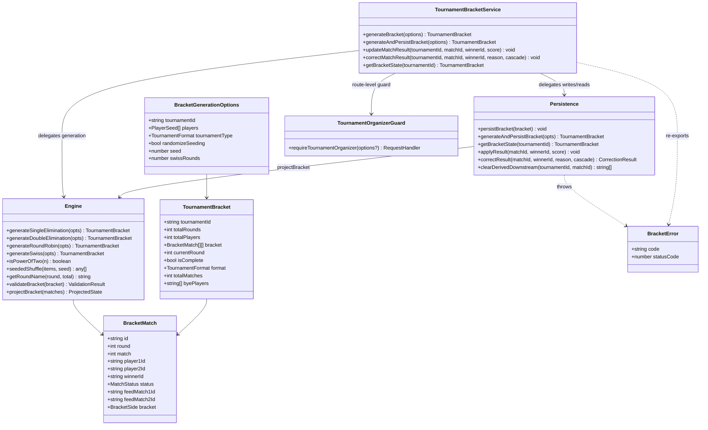
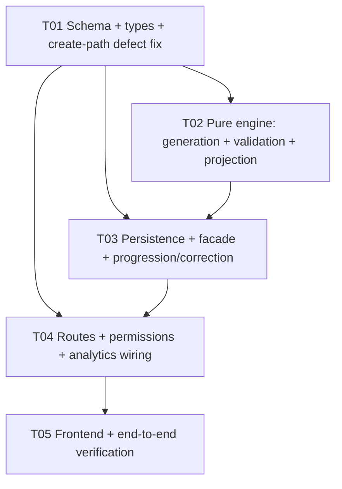

# Story 6.7 — Tournament Bracket Management — System Design

**Author:** Architect (software-architect-2)
**Status:** Ready for implementation (with two AC-verifiability caveats — §8)
**Source story:** `docs/stories/6.7.story.md`
**Epic:** `docs/epics/epic-6.md` (Workstream WS7, P1)
**Depends on:** WS1 (auth, merged), WS3 (observability, merged), Story 6.4 (tournament real-time emitters, present)

---

## 0. Recon verification (every claim read or run against the repo)

| # | Claim | Verdict | Evidence (how verified) |
|---|-------|---------|-------------------------|
| 1 | `tournamentBracketService.ts` = 619 lines, singleton `tournamentBracketService`, async Prisma-backed, public `generateBracket`/`updateMatchResult`/`getBracketState` | ✅ confirmed | read `services/tournamentBracketService.ts` |
| 2 | **`generateBracket` returns an in-memory object and persists NOTHING** — no `TournamentRound`/`TournamentMatch` writes | ✅ confirmed | read `:50-353`; no `prisma.*.create` in any generator |
| 3 | **`tournamentBracketService` is imported ONLY by its 2 test files** | ✅ confirmed | Grep: matches only `tournamentBracketService.ts`, `__tests__/tournamentBracketService.test.ts`, `__tests__/tournamentBracketService.emitters.test.ts` |
| 4 | `bracketService.ts` = 505 lines, static `BracketService`, dead code | ✅ confirmed | read; Grep: only `bracketService.ts` + `__tests__/bracketService.test.ts` |
| 5 | `bracketService` has unique `validateBracket` `:435` and `simulateRoundWinners` `:340` | ✅ confirmed | read `:340-503` |
| 6 | Two incompatible local type sets (`BracketMatch`/`TournamentBracket`) + a **third** shape in the socket module | ✅ confirmed | `tournamentBracketService.ts:9-32`, `bracketService.ts:23-49`, `socket/events/tournamentAnalytics.ts:23-33` |
| 7 | `routes/tournaments.ts` exposes exactly 9 endpoints; **no bracket endpoint**; all `@access Public` (no auth) | ✅ confirmed | read full file |
| 8 | `routes/tournaments.ts` header says "routes disabled" but it **is** mounted | ✅ confirmed | `routes/index.ts:81` `router.use('/tournaments', tournamentRoutes)`; `server.ts:123` mounts `apiRouter` at `/api/v1` |
| 9 | **`POST /:id/start` does NOT generate a bracket** — `startTournament` only sets `status='IN_PROGRESS'` | ✅ confirmed | `tournamentService.ts:271-285` |
| 10 | A third generator `tournamentService.generateBracket` `:54` persists but is **never called** and is broken (assigns the *same* seeded players to every round; power-of-2 only) | ✅ confirmed | `:54-110`; Grep: zero callers of `generateBracket` outside definitions |
| 11 | **Pre-T01**, `TournamentMatch.player1Id`/`player2Id` were NOT NULL with FKs → placeholder/bye slots unrepresentable. **Now nullable (T01 applied).** | ✅ confirmed → **superseded** | Original: psql `player1Id|NO`, `player2Id|NO`. Current: `schema.prisma:1026-1029` `player1Id String?`/`player2Id String?`; migration `20260915000000_story_6_7_bracket_lifecycle/migration.sql:32-33` `ALTER COLUMN … DROP NOT NULL`; live psql now `player1Id|YES`, `player2Id|YES`, `feedMatch1Id|YES`, `feedMatch2Id|YES` |
| 12 | `requireOrganizer` is **session-scoped** (uses shareCode/session membership), cannot express a tournament organizer; `PermissionAction` is a closed 8-action session union | ✅ confirmed | `middleware/permissions.ts:31-40,71-85,148,300` |
| 13 | `Tournament.organizer` is a **free-text String**, not a userId FK; `TournamentResult` is `@unique` per tournament | ✅ confirmed | schema `:889`, `:908` |
| 14 | `rankingService.ts` operates on `MvpPlayer`/`MvpSession` only; `updateRankingsAfterMatch` reads `mvpMatch`; **no bridge to `TournamentPlayer`** | ✅ confirmed | read full file |
| 15 | `tournamentAnalyticsService.calculateBracketEfficiency` calls `prisma.tournamentAnalytics.update` (throws if no analytics row) | ✅ confirmed | `:103-109` |
| 16 | Live DB: **all tournament tables empty** (tournaments/players/rounds/matches/games/results/analytics = 0) | ✅ confirmed | psql counts on `badminton_group` |
| 17 | Existing bracket tests use `@ts-nocheck` | ✅ confirmed | `__tests__/tournamentBracketService.test.ts:1`, `__tests__/bracketService.test.ts:1` |
| 18 | Frontend has `Tournament{Create,Detail,List}Screen.tsx`, `TournamentAnalyticsScreen.tsx`, `services/tournamentApi.ts`; **no bracket screen and no bracket API method** | ✅ confirmed | `find` + read `tournamentApi.ts` |
| 19 | Route validates `organizerName` but `createTournament` reads `input.organizer` → creation currently fails at the DB (organizer required) | ✅ confirmed | `routes/tournaments.ts:32` vs `tournamentService.ts:30,25-50`; schema `:889` |

### Story ↔ repo contradictions (repo wins)

1. **AC 1 "generate valid single/double-elimination brackets"** — false today. Both generators emit **BYE-vs-BYE phantom matches** for odd counts (e.g. 5 players: match 3 = `p4` vs BYE, match 4 = BYE vs BYE), and **double elimination is non-functional in both** (`tournamentBracketService` mis-sizes the losers bracket; `bracketService` creates LB rounds with `matches: []`).
2. **AC 3 "persists to TournamentRound/TournamentMatch/TournamentGame"** — was impossible as written while player slots were NOT NULL (finding 11); **T01 has since relaxed them to nullable**, so this is now unblocked — but no generator persists anything yet, so AC 3 still requires the T02/T03 work.
3. **AC 4 "standings integrate with tournamentAnalyticsService"** — partially there, but `calculateBracketEfficiency` uses `update` and throws without a pre-existing analytics row (finding 15).
4. **AC 5 "existing contracts preserved"** — the route header claims the feature is disabled, yet it is mounted and live. Contracts are real and must be preserved; the comment is stale.
5. **AC 8 "rankings update via rankingService"** — **not achievable**: `rankingService` is `MvpPlayer`/session-scoped with no `TournamentPlayer` bridge (finding 14). See §8.
6. **AC 15 "organizer-only via middleware/permissions.ts"** — the existing `requireOrganizer` is session-scoped and cannot guard tournaments (finding 12). A new guard is required.
7. **Dev Notes "`POST /:id/start` ... generate bracket"** (implied) — start does not generate (finding 9).
8. **Dev Notes "persist rounds/matches"** — neither bracket service persists (finding 2).
9. **Dev Notes "`TournamentBracketScreen.tsx` (if not present)"** — not present; and there is no bracket API method at all (finding 18).
10. **AC 16 "64 players without UI blocking"** — generation is synchronous but cheap; the real cost is per-match DB writes, not CPU. See §6.

> Cross-cutting defect discovered en route: `POST /tournaments` is broken end-to-end (validates `organizerName`, service reads `organizer` → required-field failure). Fix is in T01 scope; flagged because AC 5/AC 15 depend on a working create path.

### 0.1 Independent executed recon (software-qa-engineer, HEAD `d664138`)

The QA engineer **executed** the real generators (ts-node + fake Prisma) rather than reading them. Findings folded into this design:

- **All three generators are incorrect**, confirming D1 ("replace all three"). `tournamentBracketService` persists nothing; `bracketService` is dead; `tournamentService.generateBracket` recreates the *same* R1 matches in every round.
- **Wiring is the critical path, not the engine** (QA finding 1). `generateBracket` has **zero non-test callers**, and `startTournament` (`tournamentService.ts:364`) only flips status — it creates 0 rounds/matches, so `getTournamentStats` returns `totalMatches:0, completionRate:0` **permanently**. Consequence: AC 9's "100% correctness" today describes **unreachable code**; an acceptance test that only calls the pure generator would pass **vacuously**. → The AC 9 test must drive the **new persistence path end-to-end** (T03/T04), asserting rows actually exist and progression reaches completion.
- **The correction path is the worst defect, already reproduced in ≥3 corruption modes** (QA finding 2): (i) correction written to the match but downstream keeps the stale winner; (ii) both next-round slots filled from the **same** upstream match; (iii) recording the same result twice puts the **same player in both slots**. → Correction is promoted to **P0** and these three cases become explicit tests (§7 #6).
- **Determinism**: non-randomized generation *is* deterministic (AC 13 holds on the default path), but `randomizeSeeding:true` uses `sort(() => Math.random() - 0.5)` — non-deterministic **and biased**. → The seeded PRNG must be asserted on the **randomized path too** (§7 #2).
- **Byes**: the old generator never sets a bye winner (no auto-advance) and emits fully-empty matches for odd N; `updateMatchResult` on a `player2Id:null` match does not crash but **mis-advances**. → The domain `BYE` (exactly one real player, winner pre-set, auto-advance) is confirmed as the right model; the engine test asserts "no BYE-vs-BYE" and "bye auto-advances" on the domain shape.
- **QA caveat / corrected DB baseline**: QA had no live DB, so DB-touching logic was exercised through a fake Prisma. The architect's original psql read (`player1Id`/`player2Id` = NOT NULL) **predated T01's migration** and is superseded: T01 is now applied, the schema is `player1Id String?`/`player2Id String?`, and the live DB reports `is_nullable=YES` for `player1Id`, `player2Id`, `feedMatch1Id`, `feedMatch2Id` (verified by re-query). **Design baseline = nullable.** T03/T04 tests must assert against this actual (nullable) schema.
- **Causal correction (matters for §7):** the three corruption modes are **independent logic defects** in `advanceWinnerToNextRound` (reproduced in-memory with a fake Prisma); they do **not** depend on the column constraint. NOT NULL and the corruption modes are two *separate* problems: (a) NOT NULL made PENDING/BYE placeholders **unrepresentable** — that is what forced T01's relaxation; (b) under the *old* NOT NULL schema a placeholder write would have **thrown** (null into NOT NULL) rather than silently corrupted, whereas the silent corruption occurs once slots can hold null. So: **NOT NULL → unrepresentable; the recompute model fixes the separate logic bugs.**

---

## 1. Implementation approach & decisions

### D1 — Canonical service: **extend `tournamentBracketService`, retire `bracketService`** (firm)

`tournamentBracketService` is the only one with real persistence reads/writes (`updateMatchResult`, `getBracketState`), real-time emit (`emitTournamentUpdates`), and a live singleton. `bracketService` is 100% dead, has zero callers, and its `simulateRoundWinners` *fabricates* winners from seed order — wiring it into real progression would corrupt results.

**Decision:** `tournamentBracketService` is canonical. `bracketService.ts` is **deleted**, but its two genuinely useful *pure* utilities are salvaged into the canonical module:
- `getRoundName(round, total)` → moved to `bracket/engine.ts` (round naming).
- `validateBracket(bracket)` → **do NOT reuse the existing one** (independently executed by QA: it is dead *and* **false-positives on byes** — two empty-string slots trigger "Player  appears multiple times"). Write a fresh invariant checker (`isValid`, `errors`, `warnings`) used both as a runtime post-generation assertion and as a test oracle. It must treat a bye as exactly one real player, not two empty slots.
- `simulateRoundWinners` is **not** carried into production. (Optional: keep a renamed `previewWinners` as a test-only helper; never called by the service.)

### D2 — Canonical types live in one module (firm)

There are **three** conflicting bracket shapes today. The canonical domain types move to a single module `backend/src/services/bracket/types.ts`:

- Domain types (`BracketMatch`, `TournamentBracket`, `BracketRound`, `BracketGenerationOptions`, `MatchResult`, `CorrectionResult`) — used by engine + persistence + facade.
- The **socket wire shape** (`socket/events/tournamentAnalytics.ts` `BracketRound`) is a *projection* and is **left byte-for-byte unchanged** to preserve the Story 6.4 real-time contract. `loadBracket` continues to map domain → wire; we do not leak canonical types onto the wire.

Migration path: `tournamentBracketService.ts` keeps exporting `BracketMatch`, `TournamentBracket`, `BracketGenerationOptions` (re-exported from `bracket/types.ts`) so the two existing test files and any future importer keep compiling; the bodies delegate to the new modules. This removes the duplicate definitions without a breaking rename.

### D3 — Generation is a **pure function**; persistence is separate (firm)

`bracket/engine.ts` exports pure generators (`generateSingleElimination`, `generateDoubleElimination`, `generateRoundRobin`, `generateSwiss`) returning a fully-structured `TournamentBracket` with **explicit feed links** (`feedMatch1Id`/`feedMatch2Id`) and correct byes. `bracket/persistence.ts` persists and reads. This split makes AC 9/AC 13 testable without a DB.

**Seeding rule (deterministic, documented — AC 13):**
1. Sort by explicit `seed` asc; then `winRate` desc; then `totalMatches` desc; then `playerName` asc (total order ⇒ deterministic).
2. Place into the bracket using **standard bracket seeding order** (e.g. for 8: `1,8,5,4,3,6,7,2`) so the top two seeds can only meet in the final.
3. **Byes go to the highest seeds**: pad to the next power of two; seed 1 receives the first bye, seed 2 the next, etc. A bye match has exactly **one** real player and is auto-advanced. **Never** emit a BYE-vs-BYE match.
4. `randomizeSeeding` uses a **seeded PRNG (mulberry32 seeded from an explicit `seed` or `hash(tournamentId)`)** — **never `Math.random()`** (the current code violates AC 13 on that path).

**Double elimination is power-of-two only and fails loudly (T02, `b670ece`).** `generateDoubleElimination` **throws** for a non-power-of-two field with an actionable message rather than emitting a bracket. Rationale: a non-power-of-two double-elimination field requires threading byes through *both* brackets, which changes the structure so the `2n − 2` match count no longer describes it — padding to a power of two would therefore break the story's own stated count. Consequence to state plainly: **a 6-player double-elimination tournament is not supported.** The T03 facade surfaces the throw as an actionable error that a route turns into a **400**. This is a genuine **scope limit** (flagged for product in §13 q3), not a documentation detail — double-elimination *generation* is structurally correct for power-of-two fields, but non-power-of-two double elimination is out of scope. Also note: losers-bracket progression is **deferred** — LB slots fed by winners-bracket *losers* stay null because the schema expresses only winner feeds (T02 header, §13 q3).

### D4 — Generation trigger: hook `POST /:id/start` **and** add an idempotent endpoint (firm)

- `POST /:id/start` keeps its current contract (`{success, message}`) but now **also** generates + persists the bracket when none exists (idempotent: if rounds already exist, skip). Additively return `data: { bracket }` — the frontend ignores unknown keys, so this is non-breaking.
- Add **additive** endpoints (AC 5): `POST /:id/bracket/generate` (idempotent; `force` to regenerate before any result exists), `GET /:id/bracket`, `POST /:id/matches/:matchId/result`, `POST /:id/matches/:matchId/correct`, `GET /:id/standings`.
- Never regenerate after any match is COMPLETED (guard) — regeneration would orphan results.

### D5 — Progression & **AC 12 correction** via deterministic re-projection (firm — the primary risk)

Today `updateMatchResult` advances by picking "the first match with an empty slot" — a logic defect that silently corrupts once placeholder slots can be null (post-T01), and could never represent a placeholder at all under the old NOT NULL schema. Either way the winner is placed non-deterministically. Incremental advancement is the corruption vector the story names as its primary risk. **QA reproduced three concrete corruption modes** by execution (§0.1): (i) the corrected winner is written to the match but the downstream slot keeps the **stale** winner; (ii) **both** next-round slots get filled from the **same** upstream match; (iii) recording the same result **twice** places the **same player in both slots**. Re-recording an already-advanced result does not refuse and does not no-op — it silently corrupts. These are **independent logic bugs** (not caused by the column constraint). **Correction is therefore P0, not merely a risk.**

**Decision: make progression a pure *projection* of recorded results.**
- **Slot rule — per-slot, re-derive only when a feeder is declared (T02, `b670ece`).** `projectBracket` re-derives a slot **only when a feeder link is declared for that slot**; a slot with **no** declared source is **authoritative as stored**. That single rule covers round 1, **every round-robin and Swiss round** (those are paired independently, not fed by links), and the losers-bracket slots that take a winners-bracket *loser* (which winner-feed links cannot express). A declared-but-dangling link resolves to `null` — that is how a stale slot is cleared. **This is per-slot, not per-round**; the natural misreading "recompute the round" would corrupt round-robin and Swiss brackets, whose slots are never fed.
- `projectBracket(matches)`: pure function (no DB) — order matches (round, then bracket side, then match number), walk them resolving each feeder's winner, and emit `ProjectedState` (slots + status + changed ids). Byes: a **self-paired** match (no feed links at all) with exactly one player is a structural bye and is auto-advanced; a partially-fed later round is **not** a bye (a null slot there means "not decided yet" → stays `PENDING`). A stored winner is kept only if it is one of the two projected occupants — otherwise it is cleared, which is how a corrected upstream result removes a player who should no longer have advanced. `CANCELLED` is terminal (winner cleared).
- `applyResult(matchId, winnerId, score)`: set the winner, then call `projectBracket`. Idempotent (re-applying the same result yields the same state).
- **`correctResult(matchId, winnerId, reason)` (AC 12):** (1) require the match's downstream matches to be **not COMPLETED** unless `cascade: true`; (2) set the new winner; (3) **clear** all slots/winners derived downstream; (4) re-project; (5) re-emit; (6) write an audit row. Because state is *recomputed*, a correction self-heals — there is no stale incremental state to unwind. This is strictly more robust than an incremental "advance + manual revert".
- Schema support: `TournamentMatch.feedMatch1Id/feedMatch2Id` (nullable self-relation) make projection format-agnostic; for single elimination the same mapping is derivable arithmetically, but explicit links also cover double elimination.

### D6 — AC 15 permissions: a **tournament** organizer guard (firm — **landed**, commit `ff71a3a`)

`requireOrganizer` is session-scoped and unusable here. `backend/src/middleware/tournamentPermissions.ts` is now **implemented** (136 lines; 12 tests green in `__tests__/tournamentPermissions.test.ts`; `tsc --noEmit` exit 0). It exposes a **factory**, not a bare handler:

```ts
export interface TournamentOrganizerGuardOptions { param?: string } // default 'id'
export const requireTournamentOrganizer = (
  options: TournamentOrganizerGuardOptions = {}
): RequestHandler
```

T04 wires it as `router.post('/:id/bracket/generate', requireTournamentOrganizer(), handler)` — i.e. **called** to produce the middleware; `param` is only overridden for routes whose tournament id param is not named `id`.

**Strict-vs-permissive rule (decided: strict).** `resolveIdentity(req)` returns **both** `userId` and `deviceId` on every authenticated request (the JWT wins for `source`, but `deviceId` is still carried from `req.body.deviceId` / the `x-device-id` header). The guard therefore does **not** do an OR:
- when `source === 'jwt'` → authorization is decided **solely** by `userId === organizerUserId`; the carried `deviceId` is **never consulted**;
- `organizerDeviceId` is matched **only** when `source === 'device'` (no JWT present).
- **Rationale:** the existing `identityPrecedence.test.ts` already flags the permissive reading ("JWT user A presenting a device owned by user B is GRANTED B's role"); an OR would let any authenticated user impersonate a device-based organizer by echoing a device id they do not own — a privilege-escalation hole.
- **Consequence (deliberate):** an authenticated user who shares the creating device is **denied** unless they are also the recorded `organizerUserId`. This trades convenience for a fail-closed posture.

**Fail-closed matrix (all five asserted in the test file):**

| Condition | Result | Prisma queried? | `next()` called? |
|-----------|--------|-----------------|------------------|
| missing/empty route param | **400** `MISSING_TOURNAMENT_ID` | no | no |
| tournament not found | **404** `TOURNAMENT_NOT_FOUND` | yes | no |
| anonymous identity (no JWT, no deviceId) | **403** `FORBIDDEN` | yes | no |
| both `organizerUserId` & `organizerDeviceId` `null` (pre-T01 rows) | **403** `FORBIDDEN` (denies every caller) | yes | no |
| Prisma lookup throws | **500** `INTERNAL_ERROR` | yes | no |
| proven organizer (per the strict rule above) | proceed | yes | **yes** |

Because `Tournament.organizer` is free text (finding 13) it is **not** used for authorization. Additive `organizerUserId`/`organizerDeviceId` (§2) are the only source of truth; they are populated on create when an identity is present. The guard is applied **only to the new mutation endpoints**; existing public endpoints are untouched (preserves AC 5 contracts).

### D7 — Analytics & real-time integration (AC 4, 7)

- After a result (or completion), call `TournamentAnalyticsService.calculateParticipationMetrics(tournamentId)` **first** (it `upsert`s the analytics row), then `calculateBracketEfficiency` (which `update`s). This fixes the throw-on-missing-row bug (finding 15).
- Real-time: reuse the existing `emitMatchComplete`/`emitLeaderboardUpdate` after persistence (already wired in `updateMatchResult`). Keep the socket payload shapes unchanged (AC 7, Story 6.4).

### D8 — AC 8 ranking integration: blocked by missing platform identity (honesty — §8)

`rankingService` ranks `MvpPlayer` rows; `TournamentPlayer` has no FK to `MvpPlayer`/`User`. There is no platform-level identity to rank across both (the same gap Story 6.6 documented). **Decision:** do **not** silently feed tournament data into `rankingService` (that would produce meaningless ratings). Provide an **additive nullable** `TournamentPlayer.userId String?` link and a documented, feature-flagged `syncTournamentRankings()` that is a **no-op** until a platform identity exists. Report AC 8 as **not verifiable** in this environment.

---

## 2. Schema changes (additive only — AC 14) — **APPLIED (T01 landed)**

All changes are relaxations or new nullable columns; none drop or retype existing columns, so existing rows/contracts are safe. **Status: T01 is implemented** — migration `20260915000000_story_6_7_bracket_lifecycle` is applied and verified live (`player1Id`/`player2Id`/`feedMatch1Id`/`feedMatch2Id` all `is_nullable=YES`). T02/T03 build on the **nullable baseline**.

| Model | Change | Why | Status |
|-------|--------|-----|--------|
| `TournamentMatch` | `player1Id String` → `String?`; `player1 …` → `TournamentPlayer?` (same for `player2`) | Placeholder slots for future rounds & byes (finding 11). **Required for AC 3.** | ✅ applied |
| `TournamentMatch` | add `feedMatch1Id String?`, `feedMatch2Id String?` (nullable self-relation, named) | Deterministic winner placement for projection/correction (D5). | ✅ applied |
| `TournamentMatch` | add `correctedAt DateTime?`, `correctionReason String?` | AC 12 audit trail. | ✅ applied |
| `Tournament` | add `organizerUserId String?`, `organizerDeviceId String?` | AC 15 authorization (D6); `organizer` stays for back-compat. | ✅ applied |
| `TournamentPlayer` | add `userId String?` | AC 8 forward path (nullable; unused until identity exists). | ✅ applied |
| `TournamentRound` | `@@index([tournamentId, roundNumber])` (already present) — no change | — | — |

Migration is a single hand-written, idempotent, additive migration; `prisma generate` + `tsc --noEmit` must stay clean.

---

## 3. File list (relative to repo root)

**New — canonical bracket module**
- `backend/src/services/bracket/types.ts` — canonical domain types + enums (**landed** T02 `b670ece`; type-only, side-effect free)
- `backend/src/services/bracket/engine.ts` — pure generators (single/double/RR/Swiss), seeded PRNG, bye placement, `getRoundName`/`getBracketRoundName`, `validateBracket`, `projectBracket` (**landed** T02 `b670ece`)
- `backend/src/services/bracket/persistence.ts` — `BracketError`, `persistBracket` (3 batched statements in one `$transaction`), `generateAndPersistBracket` (idempotent), `getBracketState`, `applyResult`, `correctResult`, `clearDerivedDownstream` (**landed** T03 `8231147`)
- `backend/src/services/bracket/index.ts` — barrel (**landed** T02; exports `./types` + `./engine`, side-effect free)
- `backend/src/middleware/tournamentPermissions.ts` — `requireTournamentOrganizer` (**landed** `ff71a3a`; factory + strict rule, §D6)

**New — tests**
- `backend/src/services/bracket/__tests__/engine.test.ts`
- `backend/src/services/bracket/__tests__/projection.test.ts`
- `backend/src/services/bracket/__tests__/correction.test.ts`
- `backend/src/routes/__tests__/tournaments.bracket.test.ts`
- `backend/src/middleware/__tests__/tournamentPermissions.test.ts`

**Modified**
- `backend/src/services/tournamentBracketService.ts` — now a thin facade delegating to `bracket/*` (**landed** T03 `8231147`); **keeps** its exported names (`BracketMatch`, `TournamentBracket`, `BracketGenerationOptions`, `generateBracket`, `updateMatchResult`, `getBracketState`, singleton) and **re-exports `BracketError`** for routes
- `backend/src/services/tournamentService.ts` — fix `organizer` field defect; `startTournament` calls bracket generation
- `backend/src/services/tournamentAnalyticsService.ts` — **T04**: call ordering fix (participation before efficiency); wire after result; switch off its own `new PrismaClient()` to the shared client (§11)
- `backend/src/routes/tournaments.ts` — additive bracket endpoints + organizer guard on mutations; keep existing 9 contracts
- `backend/prisma/schema.prisma` — §2 changes (**landed** T01)

**Deleted**
- `backend/src/services/bracketService.ts` (retire; salvage 2 pure fns per D1)

**Frontend (additive)**
- `frontend/Rally/src/services/tournamentApi.ts` — add bracket methods (`getBracket`, `generateBracket`, `recordResult`, `correctResult`)
- `frontend/Rally/src/screens/TournamentDetailScreen.tsx` — add a Bracket tab (follow existing patterns)
- `frontend/Rally/src/components/TournamentBracketView.tsx` — new presentational component (optional; if a screen is preferred, `TournamentBracketScreen.tsx`)

---

## 4. Data structures and interfaces



**Type notes (synced with T02, commit `b670ece`)**

- `TournamentBracket` carries **three additive fields** beyond T01's shape: `format: TournamentFormat`, `totalMatches: number`, `byePlayers: string[]`. `totalMatches` counts match **nodes including bye matches** (single elim: `realMatches = totalMatches − byePlayers.length = totalPlayers − 1`; double elim: `2n − 2`); `byePlayers` lists first-round bye recipients, highest seed first (empty when the format has no byes). Both are the fields the story requires populated.
- **`format` is deliberate.** `validateBracket(bracket)` takes only the bracket, and a 2-player round-robin and a 2-player single-elimination bracket are **structurally identical** (one round, one match) while their invariants differ. Without `format` the validator cannot distinguish them and would have to guess. The engineer flagged this as an intentional deviation from the earlier class diagram rather than hiding it; the doc now reflects it. `TournamentFormat` is identical to the Prisma `TournamentType` enum (no mapping layer); `MIXED` is **not** generatable — the engine rejects it explicitly.
- `BracketMatch.player1Id`/`player2Id`/`winnerId`/`feedMatch*Id` are **nullable** (T01), and `bracket?: BracketSide` (`WINNERS | LOSERS | GRAND_FINAL`) lets double elimination be represented; single elim / RR / Swiss use `WINNERS` only.
- `MatchStatus` is a superset of the DB enum `TournamentMatchStatus`: it adds domain-only `PENDING` (future-round placeholder) and `BYE` (exactly one real player, auto-advanced). Persistence maps `PENDING→SCHEDULED` and `BYE→COMPLETED` on write and re-derives them on read, so neither the wire nor the API ever sees a state the schema cannot hold.

**Key signatures**

```ts
// bracket/engine.ts
export function generateSingleElimination(o: BracketGenerationOptions): TournamentBracket;
export function generateDoubleElimination(o: BracketGenerationOptions): TournamentBracket; // THROWS on non-power-of-two field
export function generateRoundRobin(o: BracketGenerationOptions): TournamentBracket;
export function generateSwiss(o: BracketGenerationOptions): TournamentBracket;
export function isPowerOfTwo(n: number): boolean;
export function seededShuffle<T>(items: T[], seed: number): T[];         // mulberry32 — deterministic
export function getRoundName(round: number, total: number): string;      // elimination-relative
export function getBracketRoundName(side: BracketSide, round: number, winnersRounds: number): string;
export function validateBracket(b: TournamentBracket): { isValid: boolean; errors: string[]; warnings: string[] };
export function projectBracket(matches: StoredMatch[]): ProjectedState;   // pure; no DB

// bracket/persistence.ts  (T03, 8231147)
export class BracketError extends Error { code: string; statusCode: number }   // lives HERE, not types.ts (see note)
export async function persistBracket(b: TournamentBracket): Promise<void>;     // 3 batched statements in one $transaction
export async function generateAndPersistBracket(o: BracketGenerationOptions): Promise<TournamentBracket>; // idempotent — route entry point
export async function getBracketState(tournamentId: string): Promise<TournamentBracket | null>;
export async function applyResult(matchId: string, winnerId: string, score?: string): Promise<void>;
export async function correctResult(matchId: string, winnerId: string, reason: string, cascade?: boolean): Promise<CorrectionResult>;
export async function clearDerivedDownstream(tournamentId: string, matchId: string): Promise<string[]>; // returns changed match ids

// services/tournamentBracketService.ts (facade) — also re-exports BracketError for routes
// middleware/tournamentPermissions.ts  (landed — commit ff71a3a)
export interface TournamentOrganizerGuardOptions { param?: string }        // default 'id'
export const requireTournamentOrganizer =
  (options?: TournamentOrganizerGuardOptions): RequestHandler => ...       // factory — call it to get the middleware
```

**T03 notes (commit `8231147`)**

- **`clearDerivedDownstream(tournamentId, matchId)` returns `Promise<string[]>`** (the changed match ids) — it voids downstream recorded winners and re-projects. §4 previously typed it `void`; corrected.
- **`BracketError` lives in `persistence.ts`, not `types.ts`**, and the facade **re-exports it** (`export { BracketError } from './bracket/persistence'`) so routes can map it. Rationale: `types.ts` is deliberately **type-only** (plus `as const` runtime mirrors) so the barrel `index.ts` stays **side-effect free** — importing it can never pull a Prisma client or socket emitter into a test. `BracketError` is a runtime class, so it belongs with the runtime module. It carries `code` and `statusCode` (e.g. `BRACKET_GENERATION_FAILED` → **400** for a non-power-of-two double-elimination field).
- **Round naming.** `getRoundName` is **elimination-relative** (`2^(total−round+1)`); applying it to a 5-round round robin would mislabel it "Round of 32". Non-elimination formats therefore use `Round n`, and `getBracketRoundName(side, round, winnersRounds)` dispatches: `GRAND_FINAL`→"Grand Final", `LOSERS`→"Losers Round n", otherwise `getRoundName`.

---

## 5. Program call flow

```mermaid
sequenceDiagram
    autonumber
    actor Org as Organizer
    participant R as routes/tournaments.ts
    participant G as requireTournamentOrganizer()
    participant S as tournamentBracketService (facade)
    participant E as bracket/engine.ts
    participant P as bracket/persistence.ts
    participant DB as Prisma
    participant Emit as socket/events/tournamentAnalytics
    participant An as tournamentAnalyticsService

    Note over Org,An: A. Generate (POST /:id/start  OR  POST /:id/bracket/generate)
    Org->>R: POST /api/v1/tournaments/:id/bracket/generate
    R->>G: authorize (strict: jwt→userId===organizerUserId; device→deviceId===organizerDeviceId)
    G-->>R: ok (else 400/403/404/500)
    R->>S: generateAndPersistBracket({tournamentId, players, type, seed})
    Note right of S: idempotent — if rounds already exist, return stored bracket (no regen)
    S->>E: generateSingleElimination(...)   (pure — generateBracket delegates here)
    E->>E: sort (seed→winRate→matches→name); standard seeding; byes to top seeds; seed PRNG
    E-->>S: TournamentBracket (feed links set, no BYE-vs-BYE)
    S->>E: validateBracket(bracket)
    S->>P: persistBracket(bracket)
    P->>DB: $transaction: (1) createManyAndReturn rounds (2) createManyAndReturn matches (3) UPDATE…FROM(VALUES) feed-link remap
    S-->>R: bracket
    R-->>Org: { success, data:{ bracket } }

    Note over Org,An: B. Record a result (POST /:id/matches/:matchId/result)
    Org->>R: POST .../result { winnerId, score }
    R->>G: authorize
    R->>S: updateMatchResult(tournamentId, matchId, winnerId, score)
    S->>P: applyResult(matchId, winnerId, score)
    P->>DB: tx: set match.winnerId=COMPLETED; clear non-R1 slots; write game score
    P->>E: projectBracket(all matches)
    E-->>P: projected slots (feedMatch1→player1, feedMatch2→player2; byes auto-advance)
    P->>DB: tx: update next-round slots; round/tournament status
    P-->>S: done
    Note right of S: analytics refresh DEFERRED to T04 (see note) — not called here yet
    S->>Emit: emitMatchComplete(id, matchId); emitLeaderboardUpdate(id)   (best-effort)
    S-->>R: void
    R-->>Org: { success, message }

    Note over Org,An: C. Correct a mistaken result (POST /:id/matches/:matchId/correct) — AC 12
    Org->>R: POST .../correct { winnerId, reason, cascade }
    R->>G: authorize
    R->>S: correctMatchResult(tournamentId, matchId, winnerId, reason, cascade)
    alt downstream match already COMPLETED and cascade=false
        S-->>R: { success:false, error:{code:'DOWNSTREAM_COMPLETED'} }
    else
        S->>P: correctResult(...)
        P->>DB: tx: set new winner; clear derived downstream slots/winners; correctedAt/reason
        P->>E: projectBracket(all matches)
        P->>DB: tx: rewrite downstream; recompute status
        Note right of S: analytics refresh DEFERRED to T04 (same as branch B)
        S->>Emit: emitMatchComplete + emitLeaderboardUpdate (re-emit corrected state)
        S-->>R: { success, data:{ recomputed:true } }
    end
    R-->>Org: result
```

**T03 flow notes (commit `8231147`)**

- **Route entry point is `generateAndPersistBracket`** (idempotent): both `POST /:id/bracket/generate` and `POST /:id/start` call it. It **skips regeneration when rounds already exist** (returns the stored bracket). `generateBracket` stays **pure** (delegates to the engine, validates, no DB) so AC 9/AC 13 are testable without a database (D3).
- **`persistBracket` uses three batched statements, not two** (supersedes the earlier "2 round-trips"): (1) `createManyAndReturn` rounds, (2) `createManyAndReturn` matches, (3) one `UPDATE … FROM (VALUES …)` to remap `feedMatch1Id`/`feedMatch2Id`. The remap **cannot** ride the same `createMany` because the row ids do not exist until after the insert. Still **O(1) statements in field size**, inside one `$transaction`. *Do not "optimise" this back to two statements — that would break the feed-link remap.*
- **Analytics refresh is deferred to T04** (design's earlier §5 had the facade calling it). **T04 action:** call `TournamentAnalyticsService.calculateParticipationMetrics(id)` **first** (it `upsert`s the analytics row), **then** `calculateBracketEfficiency(id)` (which `update`s). The order matters: participation-before-efficiency is exactly what fixes `calculateBracketEfficiency`'s **throw-on-missing-row** bug (finding 15). **Second T04 action:** `tournamentAnalyticsService.ts` instantiates its own `new PrismaClient()`; per §11 it must use the shared client from `config/database` (so tests can mock one instance).

---

## 6. AC 16 — 64-player cost analysis (verified reasoning)

- 64 players, single elimination → `log2(64)=6` rounds, `32+16+8+4+2+1 = 63` matches. 128 players → 127 matches / 7 rounds.
- **CPU:** generation is O(n) over players/matches — sub-millisecond; the pure engine holds no I/O. Not a bottleneck.
- **The real cost is DB writes.** The existing pattern writes one row per match with sequential `await` (63 round-trips). **Decision (as landed, T03 `8231147`):** `persistBracket` issues **three batched statements** inside a single `$transaction` — `createManyAndReturn` rounds, `createManyAndReturn` matches, then one `UPDATE … FROM (VALUES …)` to remap feed links — so the statement count is **O(1) in field size** (not 63), and the third statement is required because feed-link ids only exist after the match insert. Emission happens **after** the response and is fire-and-forget (already the pattern).
- **No background job / queue is required** for 64 (or 128) players. "Without UI blocking" is satisfied by (a) a fast server response and (b) a frontend loading state on the Bracket tab. If a future format explodes to thousands of participants, that is a separate concern; state this explicitly rather than over-engineering now.

---

## 7. Tests to write (AC 9, AC 11, AC 12)

Which files: `bracket/__tests__/engine.test.ts`, `projection.test.ts`, `correction.test.ts`, `routes/__tests__/tournaments.bracket.test.ts`, `middleware/__tests__/tournamentPermissions.test.ts` (and extend the two existing bracket tests, removing `@ts-nocheck`).

Must-assert behaviours:

1. **Correctness matrix (AC 9):** for n ∈ {2,3,4,5,6,7,8,9,15,16,17,31,32,64}, single elimination produces `ceil(log2 n)` rounds, `n-1` real matches, and **zero BYE-vs-BYE** matches; byes are assigned to the **top seeds**; every non-bye slot is a distinct player; round counts are `2^(R-r)`. **Anti-vacuity guard (QA §0.1):** the AC 9 test must run through the **persistence path end-to-end** and assert that rows were actually created and progression reaches completion — a pure-generator-only test would pass vacuously because today's call graph is unreachable.
2. **Determinism (AC 13):** same inputs + same `seed` ⇒ deep-equal brackets across two runs — asserted on **both** the default **and** the `randomizeSeeding:true` path (QA: the randomized path is the one that used `Math.random()`); **no `Math.random`** appears in `bracket/` (static check).
3. **Double elimination:** WB + LB structure well-formed; LB match counts consistent with `2n-2` total matches for n players; no empty LB rounds.
4. **Round robin / Swiss:** every unordered pair plays exactly once (RR); Swiss produces the configured number of rounds.
5. **Progression (AC 3, AC 11):** play a full 8-player bracket via `applyResult`; assert champion in `TournamentResult`, `status='COMPLETED'`, `TournamentPlayer.finalRank` set; assert idempotency (re-applying a result is a no-op — and specifically does **not** put the same player in both next-round slots).
6. **Correction (AC 12) — the three QA-reproduced corruption modes are explicit cases:** (i) correcting a mid-bracket result must **remove the stale winner downstream** and advance the true winner; (ii) after correction, the two next-round slots must be filled from **different** upstream matches; (iii) recording the **same result twice** must not place the same player in both slots. Plus: the `DOWNSTREAM_COMPLETED` guard fires without `cascade`, and correction writes an audit row.
7. **Placeholder persistence:** a bracket with future-round placeholders persists and reads back (proves the nullable-slot relaxation works end-to-end).
8. **Permissions (AC 15):** mutations 403 for a non-organizer identity and 200 for the organizer identity; existing public GETs remain 200 without auth (contract preserved).
9. **Analytics wiring (AC 4):** `applyResult` on a tournament with no analytics row does **not** throw (participation upsert runs first).
10. **Regression guard:** `tsc --noEmit` clean; `npm test` stays green vs baseline (88 suites / 910 passed / 3 skipped).

---

## 8. Verifiability & honesty position (AC 8, AC 10)

**AC 10 — "tournament completion rate > 80%":** a product metric computed across *real* tournaments. Live DB has **0 tournaments**, so it cannot be demonstrated here. The design computes `completionRate = completedMatches / totalMatches` (already in `getTournamentStats`/analytics) and drives it to 100% for a completed bracket in tests — but the *>80% across tournaments* target is reported **unverifiable** in this environment, not approximated.

**AC 8 — "player rankings update via rankingService":** **not achievable today.** `rankingService.ts` ranks `MvpPlayer`/session data; `TournamentPlayer` has no link to `MvpPlayer` or `User`, and (as Story 6.6 established) `MvpPlayer` is itself session-scoped with no platform identity. Wiring tournament results into `rankingService` would fabricate cross-domain ratings. **Decision:** add an additive nullable `TournamentPlayer.userId` and a `syncTournamentRankings()` that is an explicit **no-op until a platform identity exists** (feature-flagged, documented). AC 8 is reported **unverifiable in this environment**; the *mechanism* (link + hook) is designed, the *effect* (rankings change) cannot be shown without identity data.

**Verifiable here:** AC 1, 2, 3, 5, 6 (frontend additive), 7 (emit shapes), 9 (generation correctness — but **must be asserted through the persistence path**, not the pure generator alone, or it passes vacuously; §0.1), 11, 12, 13, 14, 15, 16.
**Not/only partly verifiable here:** AC 4 (analytics row behaviour testable; "standings integrate" end-to-end needs data), AC 8 (no identity bridge), AC 10 (0 tournaments).

---

## Part B — Task decomposition

### 9. Required packages

**No new packages.** Everything uses existing deps (`express@^5.1.0`, `@prisma/client@^6.14.0`, `socket.io`, `jest`, `supertest`). The engine is pure TypeScript; the seeded PRNG is hand-rolled (mulberry32) — no ML/crypto dependency needed.

### 10. Task list (ordered by dependency, ≤ 5 tasks)

**T01 — Schema + canonical types + defect fix** — P0
- Files: `backend/prisma/schema.prisma` (modify), new additive migration, `backend/src/services/bracket/types.ts` (new), `backend/src/services/bracket/index.ts` (new), `backend/src/services/tournamentService.ts` (fix `organizer` field)
- Deps: none
- Detail: nullable `player1Id/player2Id`, add `feedMatch1Id/feedMatch2Id`, `correctedAt/correctionReason`, `Tournament.organizerUserId/organizerDeviceId`, `TournamentPlayer.userId`. Define canonical types + enums. Fix create-path defect so tournaments can actually be created. `prisma generate` + `tsc --noEmit` clean.

**T02 — Pure engine (generation + validation + projection)** — P0
- Files: `backend/src/services/bracket/engine.ts` (new), `backend/src/services/bracket/__tests__/engine.test.ts`, `projection.test.ts` (new)
- Deps: T01
- Detail: single/double/RR/Swiss with correct byes (no BYE-vs-BYE), standard seeding, seeded PRNG; `getRoundName`; **fresh** `validateBracket` (the old one false-positives on byes — do not reuse); pure `projectBracket`. Covers AC 1, 2, 9, 13. **This is the highest-risk, most-tested unit.**

**T03 — Persistence + facade + progression/correction** — P0
- Files: `backend/src/services/bracket/persistence.ts` (new), `backend/src/services/tournamentBracketService.ts` (rewrite as facade), `backend/src/services/bracket/__tests__/correction.test.ts` (new), extend `tournamentBracketService.test.ts` / `.emitters.test.ts` (drop `@ts-nocheck`)
- Deps: T01, T02
- Detail: `persistBracket` (batch `createMany` in `$transaction`), `getBracketState`, `applyResult`, `correctResult` + downstream clearing, re-emit. **Correction is P0** (QA reproduced 3 live corruption modes, §0.1) — `correction.test.ts` must cover the stale-winner, same-upstream-slots, and double-record cases, and be exercised against the **real nullable-slot Prisma path** (not only a permissive mock). Covers AC 3, 12, 16. Delete `bracketService.ts`.

**T04 — Routes + permissions + analytics wiring** — P0
- Files: `backend/src/routes/tournaments.ts` (modify), `backend/src/middleware/tournamentPermissions.ts` (new), `backend/src/middleware/__tests__/tournamentPermissions.test.ts` (new), `backend/src/services/tournamentAnalyticsService.ts` (modify), `backend/src/routes/__tests__/tournaments.bracket.test.ts` (new)
- Deps: T01, T03
- Detail: hook `/:id/start`; add `bracket/generate`, `GET bracket`, `matches/:id/result`, `matches/:id/correct`, `standings`; organizer guard on mutations only; analytics call-order fix; preserve existing 9 contracts. **`tournaments.bracket.test.ts` is the AC 9 anti-vacuity acceptance test** — it must drive generate → results → completion end-to-end and assert persisted rows, so the "100% correctness" claim cannot pass on unreachable code. Covers AC 4, 5, 7, 9, 15.

**T05 — Frontend + end-to-end verification** — P1
- Files: `frontend/Rally/src/services/tournamentApi.ts` (modify), `frontend/Rally/src/screens/TournamentDetailScreen.tsx` (modify), `frontend/Rally/src/components/TournamentBracketView.tsx` (new)
- Deps: T04
- Detail: bracket API methods + Bracket tab (generate / view / record result / correct) following existing screen patterns; loading state for AC 16. Run `tsc --noEmit` + `npm test` (backend) and frontend lint/test; confirm no regression. Covers AC 6, 11, 16.

### 11. Shared knowledge / cross-file conventions

- **One canonical bracket type module** (`bracket/types.ts`). Never re-declare `BracketMatch`/`TournamentBracket` locally.
- **Socket wire shapes are frozen** — map domain → wire in `socket/events/tournamentAnalytics.ts`; do not leak canonical types to clients.
- **Prisma access:** import the shared client `import { prisma } from '../config/database'` (NOT `new PrismaClient()`, which both bracket services currently do) so tests can mock one instance.
- **Determinism:** no `Math.random()` anywhere in `bracket/`; use `seededShuffle`.
- **Response envelope:** `{ success, data?, error?, message? }` (unchanged).
- **Transactions:** every progression/correction write is a single `$transaction`; re-projection is idempotent.
- **Guards:** existing public tournament endpoints stay public; only **new** mutation endpoints get `requireTournamentOrganizer`.
- **Progression is a projection**, never incremental append.
- **`types.ts` is type-only; runtime classes live with runtime code.** Keep the barrel side-effect free — do not move `BracketError` into `types.ts` (importing the barrel must never pull a Prisma client or socket emitter into a test).
- **Test files are currently type-checked by nothing.** `backend/tsconfig.json` excludes `**/*.test.ts`, ts-jest runs transpile-only, and CI has no typecheck step — so the `@ts-nocheck` removals this story requires are **unenforceable today** (finding 17). Another engineer is adding a `typecheck:tests` gate; **once it lands it is the thing that enforces §7's typed-test requirement.** Until then, removing `@ts-nocheck` is a convention, not a guarantee.

### 12. Task dependency graph



T02 is the critical path (AC 9 correctness). T04 can start once T01 lands for the guard/route scaffolding; its persistence calls need T03.

### 13. Open questions / requires user decision

1. **AC 8 ranking integration** — confirm the honesty position (§8): add the nullable `TournamentPlayer.userId` link + documented no-op `syncTournamentRankings()` and report AC 8 unverifiable, rather than fabricating cross-domain ratings. **Needs a product decision.**
2. **AC 15 organizer identity** — `Tournament.organizer` is free text. Proposed: additive `organizerUserId`/`organizerDeviceId`, guard accepts either, existing public endpoints unchanged. Confirm, or specify that all tournament mutation should require an authenticated organizer account.
3. **Double elimination scope (now concrete — needs a product call).** T02 settled the generation constraint: `generateDoubleElimination` **throws for non-power-of-two fields** (a 6-player double-elimination tournament is **not supported**; it becomes a 400), and **losers-bracket progression is deferred** (LB slots fed by winners-bracket losers stay null — winner-feed links cannot express a loser feed). So today: single elim + RR + Swiss are fully playable; double elim is structurally correct for power-of-two fields but only partially playable. **Decision needed:** is that acceptable for this story, or must double elimination be fully playable (requires loser-feed links / a schema addition and threading byes through both brackets)? Recommend accepting the constraint now and filing the fuller version as a follow-up — but this is a real product scope limit, flagged rather than buried.
4. **Correction cascade policy** — proposed: block correcting a match whose downstream is COMPLETED unless `cascade: true`, and when cascading, void downstream results and re-project. Confirm the operator-facing semantics.
5. **`POST /:id/start` response** — proposed: keep `{success, message}` and additively add `data.bracket`. Confirm this is acceptable (vs a strict no-new-keys reading of AC 5).
6. **`bracketService.ts` deletion** — confirm removal (vs a one-release deprecated re-export shim). It is 100% dead code, so deletion is recommended.

---

## Appendix — Diagrams

- `docs/stories/6.7.sequence-diagram.mermaid`
- `docs/stories/6.7.class-diagram.mermaid`
