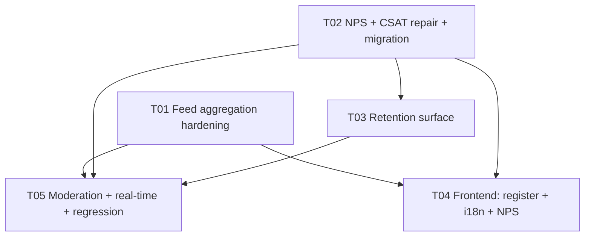

# Story 6.8 — Design: Community and Social Engagement

**Author:** Architect (software-architect-2)
**Status:** Ready for implementation
**Source story:** `docs/stories/6.8.story.md`
**Epic:** `docs/epics/epic-6.md` (Workstream WS8)
**Ground truth:** verified against `3990a58` (HEAD). Every claim below carries a `file:line` citation.

> **Read this first.** Two of the last three stories (6.6, 6.11) shipped against *wrong assumptions about the repo*. I re-verified every system claim in `6.8.story.md` before designing. **Three of the story's load-bearing claims are false**, and they change the shape of the work:
> 1. `CommunityFeedScreen.tsx` is **not missing** — it exists, is exported, is spec-tested, and is **not routed**. The real gap is *registration*, not creation.
> 2. `TournamentFeedback` is **not** an NPS store. `rating Int // 1-5 scale` is **CSAT**, not NPS (0–10).
> 3. The feed is **not** "cursor" — the entire stack is `limit`/`offset`.
>
> See §1 (recon), §2 (gaps), §3 (the two conflicts).

---

## 1. Recon verification (current state, HEAD `3990a58`)

| # | Claim | Verdict | Evidence |
|---|-------|---------|----------|
| 1 | Feed is backed by `GET /api/sharing/feed` → `sharingService.getCommunityFeed` | ✅ exists | `backend/src/routes/sharing.ts:81`; `backend/src/services/sharingService.ts:76` |
| 2 | Feed response is `{ shares, sessions, total }` | ✅ | `sharingService.ts:118-122` |
| 3 | `total` is the **true** total (for pagination) | ❌ **bug** | `sharingService.ts:121` → `total: shares.length` (the *page* length, not the collection) |
| 4 | Feed privacy filter covers **all** share types | ❌ **bug** | `sharingService.ts:81-85` filters **only** `path:['session_share']`; `match`/`achievement` shares leak when `stats_share`/`achievements_share` = `private` |
| 5 | Feed query is bounded | ⚠️ partial | `routes/sharing.ts:83` `limit` is unvalidated (no schema, no max); `sharingService.ts:115` recent-sessions `take: 10` is hard-coded |
| 6 | AC 16 says "cursor pagination" | ❌ **conflict** | whole stack is offset: `frontend/…/services/socialApi.ts:62` `(limit, offset, userId)`; `routes/sharing.ts:83-84` |
| 7 | `CommunityFeedScreen.tsx` is absent ("if not present") | ❌ **story wrong** | file exists: `frontend/Rally/src/components/CommunityFeedScreen.tsx`; exported `frontend/Rally/src/components/index.ts:13` |
| 8 | The feed screen is reachable | ❌ **orphan** | not imported by `navigation/MainTabNavigator.tsx` nor `navigation/AppNavigator.tsx` (`grep -rn CommunityFeedScreen src/navigation` → 0) |
| 9 | The analytics dashboard is reachable (AC 4 surface) | ❌ **orphan** | `components/AnalyticsDashboardScreen.tsx` exported at `components/index.ts:20`; no navigator import |
| 10 | AC 3: `TournamentFeedback` captures **NPS** | ❌ **conflict** | `backend/prisma/schema.prisma:1897` → `rating Int // 1-5 scale` = **CSAT**; NPS is 0–10 |
| 11 | `TournamentFeedback` is never written | ⚠️ superseded | it **is** written at `backend/src/routes/tournament-analytics.ts:177`; router mounted `backend/src/routes/index.ts:87` (since 6.11) |
| 12 | The feedback write path is correct | ❌ **bug** | `tournament-analytics.ts:161` uses `req.user.id` (**User.id**) as `TournamentFeedback.playerId`, whose FK targets **`MvpPlayer.id`** (`schema.prisma:1902`); fallback literal `'temp-user-id'`; participation check `deviceId: playerId` (`:169`) compares a device id to a user id |
| 13 | Feedback `rating` is validated 1–5 | ❌ | `tournament-analytics.ts:156` — validation is commented out (`// validationMiddleware(feedbackSchema)`) |
| 14 | Feedback returns the standard envelope | ❌ | `tournament-analytics.ts:192` returns `{ message, feedback }`, not `{ success, data }` |
| 15 | AC 7: friend routes use `friendService` | ✅ canonical | `backend/src/routes/friends.ts:2` imports `FriendService` from `../services/friendService` |
| 16 | `friendsService.ts` is used anywhere | ❌ **dead** | imported **only** by `backend/src/services/__tests__/friendsService.test.ts:20` |
| 17 | AC 5: feed real-time comes "from Story 6.4" | ❌ **greenfield** | 6.4 shipped rooms `session:`/`tournament:`/`user:`/`discovery:` only (`docs/stories/6.4.design.md` §D3); there is **no** feed room or feed event |
| 18 | AC 4: onboarding/retention is surfaced today | ⚠️ partial | `backend/src/routes/analytics.ts:223` `/system` + `SystemAnalytics` (`schema.prisma:1909`, has `totalActiveUsers`/`newUsersToday`/`returningUsers`); **no** onboarding/retention/cohort endpoint |
| 19 | AC 11: feed/sharing interactions are covered by tests | ⚠️ **nominal** | `frontend/Rally/src/__tests__/social-components.test.tsx` exports a **spec object** (`socialComponentsTestSpecs`) — no `describe`/`it`, so Jest asserts nothing |
| 20 | AC 15: new strings are localized | ❌ | `CommunityFeedScreen.tsx:168,179,206,207,116,120,124` hard-code English; `i18n/translations/*.ts` have no community keys |
| 21 | AC 2: share / share-card flows exist | ✅ | `routes/sharing.ts:42` (`POST /sharing/share`), `backend/src/routes/shareCard.ts` |
| 22 | `socialApi.getCommunityFeed` is correct **post-6.10** | ✅ | `apiService.ts:111-113` unwraps one envelope level; consumer pinned by `frontend/…/services/__tests__/apiService.consumers.test.ts:166` |

**Net:** the backend feed *works* but is privacy-fragile and mis-paginated; the feed **UI is built and tested but unreachable**; NPS **does not exist** and the closest store is a different instrument (CSAT) with a broken write path.

---

## 2. Gaps to close (in priority order)

| # | Gap | Class | Owner task |
|---|-----|-------|-----------|
| G1 | Feed screen orphaned — never registered in any navigator (AC 1) | P0 functional | T04 |
| G2 | Feed privacy filter ignores `match`/`achievement` share types (AC 13) | P0 **privacy leak** | T01 |
| G3 | `total` = page length, so pagination is unusable (AC 16) | P1 correctness | T01 |
| G4 | No NPS instrument; `TournamentFeedback` is CSAT (AC 3) | P1 functional | T02 |
| G5 | CSAT write path is broken (wrong identity + FK + no validation + no envelope) (AC 3) | P1 correctness | T02 |
| G6 | No onboarding/retention surface (AC 4) | P2 functional | T03 |
| G7 | No moderation/reporting path (AC 14) | P2 functional | T05 |
| G8 | Feed has no real-time and no plan (AC 5) | P2 design | T05 |
| G9 | New strings not localized (AC 15) | P2 quality | T04 |
| G10 | Existing "social tests" assert nothing (AC 11) | P2 quality | T01/T05 |

---

## 3. The two conflicts, resolved

### 3.A — AC 3 "NPS/satisfaction via `TournamentFeedback`" vs the schema

**The conflict.** The story equates NPS and satisfaction and points both at `TournamentFeedback`. The schema says `TournamentFeedback.rating Int // 1-5 scale` (`schema.prisma:1897`). **NPS is a 0–10 "likelihood to recommend"; CSAT is a 1–5 satisfaction score. They are different instruments with different scales and different questions** — a 1–5 value cannot be an NPS score, and storing a 0–10 value in a column the analytics service already reads as 1–5 would corrupt every existing aggregation.

**Resolution (repo wins; both instruments, clearly labelled).**
- `TournamentFeedback` **stays CSAT** (tournament-scoped satisfaction, 1–5). It is *not* repurposed.
- NPS becomes a **new, additive, platform-level model** `NpsResponse` (`score Int` 0–10, `userId?`, `deviceId?`, `submittedAt`), served by `POST /api/v1/community/nps` and aggregated by `GET /api/v1/community/nps/summary`.
- The story's wording is recorded as imprecise: **AC 3 is satisfied by two instruments, not one.**

**A second defect in the same model (found while designing the write path).** `TournamentFeedback.playerId` FKs to **`MvpPlayer.id`** (`schema.prisma:1902`), but `MvpPlayer` is **session**-scoped — `sessionId String` is **required** (`schema.prisma:242`). `TournamentPlayer` is a separate, **tournament**-scoped model (`schema.prisma:929`) and the schema states verbatim (`:940-944`) that **"there is no `TournamentPlayer` → `MvpPlayer`/`User` bridge today."** So a tournament-scoped feedback row is FK'd to a *session* player, and **no path exists** from tournament participation to an `MvpPlayer.id`. **This is the root cause** of the route reaching for `User.id` and a `'temp-user-id'` literal (§1 #12). **Resolution:** repoint the FK to **`TournamentPlayer.id`** (see D5 and §14 — a deliberate, justified exception to "additive-only").

**Rejected alternatives.**
- *Widen `rating` to 0–10 and call it NPS.* Rejected: silently reinterprets existing 1–5 rows and the `TournamentAnalyticsService` aggregation; a tournament-scoped row is the wrong unit for a platform NPS.
- *Store NPS as `AnalyticsEvent { type:'nps_response', data:{score} }`.* Rejected: no schema-level range guarantee, no index on score, and aggregation becomes JSON digging. Kept as the fallback if a migration is disallowed (see §11 Q3).
- *Bridge `TournamentPlayer → MvpPlayer` at read time.* Rejected: impossible — `MvpPlayer` has no tournament key and `sessionId` is required; the two identity namespaces do not intersect (§11 Q4).

### 3.B — AC 16 "cursor pagination" vs the offset stack

**The conflict.** AC 16 and the story's "Integration Approach" both say *cursor* pagination. The shipped stack is **offset end to end**: `socialApi.getCommunityFeed(limit, offset, userId)` (`socialApi.ts:62`) → `GET /sharing/feed?limit&offset` (`sharing.ts:83-84`) → `findMany({ take: limit, skip: offset })` (`sharingService.ts:93-94`).

**Resolution (additive — do not break the existing consumer).**
- Keep `limit`/`offset` working exactly as today (the frontend and the 6.10 consumer test depend on them).
- Add an **optional** opaque `cursor` query param. When present, the query switches to **keyset** pagination ordered by `(createdAt DESC, id DESC)` with `WHERE (createdAt, id) < (cursorCreatedAt, cursorId)`; `offset` is then ignored.
- The response gains `nextCursor` (opaque, `base64(createdAt|id)`) — `null` on the last page. `shares`/`sessions`/`total` keep their names.
- Bound `limit` to `[1, 50]` (default 20) in a Joi schema on the route (AC 16 "bounded queries").

**Rejected alternatives.**
- *Replace offset with cursor.* Rejected: breaks `socialApi.getCommunityFeed`, the 6.10 consumer test (`apiService.consumers.test.ts:166`) and `CommunityFeedScreen`; a deliberate breaking change the story does not ask for.
- *Leave offset only, ignore AC 16.* Rejected: offset over a `createdAt`-ordered, append-heavy feed double-serves/skips rows on insert; AC 16 is explicit.

---

## 4. Design decisions

| # | Decision | Rationale |
|---|----------|-----------|
| **D1** | Fix `getCommunityFeed` in place: real `total` (`prisma.share.count` with the *same* `where`), a **per-type** privacy filter, an explicit `select` projection, and a bounded `limit`. | G2/G3. Minimal diff, no new endpoint, keeps the 6.10 contract. |
| **D2** | Per-type privacy: filter each share by its own key — `session_share` for `type='session'`, `stats_share` for `'match'`, `achievements_share` for `'achievement'`. | G2. The current single-key filter is a real leak. Prisma JSON `path` filters cannot be parameterised by a column, so the fix is **three guarded sub-queries merged in SQL-equivalent form** or a raw `WHERE (type = 'session' AND privacy->>'session_share' <> 'private') OR …`. Chosen: a raw `prisma.$queryRaw` predicate is rejected (SQL-injection surface + no test parity); use **one `findMany` with an `OR` of three `{ type, sharer: { privacySettings: { path:[key], not:'private' } } }` branches** (Prisma compiles this correctly and it is unit-testable with a mocked client). |
| **D3** | Additive keyset pagination (see §3.B). | AC 16, no break. |
| **D4** | NPS = new `NpsResponse` model (§3.A). CSAT = existing `TournamentFeedback`, **write path repaired**. | AC 3. |
| **D5** | **Repoint `TournamentFeedback.playerId` → `TournamentPlayer.id`** (FK-target change), then repair the write path: `resolveIdentity(req)` → find the caller's `TournamentPlayer` by **`(tournamentId, deviceId)`** (primary) and/or **`(tournamentId, userId)`** (secondary) → use **that** id; no match → 403 "must participate". Validate `rating ∈ [1,5]`; return the `{ success, data }` envelope. | G5. The FK target was semantically wrong (tournament feedback pointed at a *session* player) and there is no `TournamentPlayer → MvpPlayer` bridge (`schema.prisma:940-944`), so the old path was unimplementable — that is *why* the route used `User.id` + `'temp-user-id'`. The table is provably empty (§11 Q4), so repointing needs no data migration. This is the **one deliberate exception** to additive-only (§14). |
| **D6** | Moderation: additive `ShareReport` model + `POST /api/v1/sharing/:shareId/report` (guest-allowed with `deviceId`) + `GET /api/v1/sharing/reports` (admin). | AC 14 "path defined". Rejected: `AnalyticsEvent`-based reporting (not queryable/actionable as a moderation queue). |
| **D7** | Real-time (AC 5): add an **optional** `feed:global` room + `feed:new` event, emitted **after** the share row is persisted, **gated by `FEED_REALTIME_ENABLED` (default `false`)**. | AC 5 says "where appropriate". A global broadcast is an unbounded fan-out with no demonstrated need; the honest read is *off by default, available on demand*. See §9 (AC 5). |
| **D8** | Frontend: register `CommunityFeed` in the **Profile stack** (next to `CommunityLeaderboard`/`VenueDirectory`) and surface it from `MoreScreen`; register `AnalyticsDashboard` in the same pass. | G1/G9. Fixes the 6.11-class orphan for both screens. |
| **D9** | i18n: add a `community` namespace to `en/fr/ko/tl`; route all new strings (feed, NPS, moderation) through it. | AC 15. |
| **D10** | `friendsService.ts` is left untouched (dead code, out of scope) but **recorded**. | AC 7 is "remain compatible" = do not break; deleting is a separate cleanup. |

---

## 5. Backend design

### 5.1 Feed aggregation — `sharingService.getCommunityFeed` (D1, D2, D3)

Signature (back-compatible, additive):

```ts
async getCommunityFeed(
  userId?: string,
  limit: number = 20,
  offset: number = 0,
  cursor?: string,          // NEW, optional
): Promise<{ shares: Share[]; sessions: MvpSession[]; total: number; nextCursor: string | null }>
```

- `shares`: `where` = OR of the three per-type privacy branches (D2), `orderBy: [{createdAt:'desc'},{id:'desc'}]`, `take: limit`, and either `skip: offset` (no cursor) or `cursor` keyset predicate.
- `total`: `prisma.share.count({ where })` — the **same** `where`, so it matches the filtered set (fixes G3).
- `sessions`: unchanged shape, but `take` is bounded and `offset` is *not* applied to sessions (they are a fixed "recent" rail); document this.
- `nextCursor`: `shares.length === limit ? encode(shares[limit-1]) : null`.

The route validates `limit ∈ [1,50]`, `offset ≥ 0`, `cursor` opaque, via a Joi schema (currently **no** schema — `routes/sharing.ts:81`).

### 5.2 NPS + CSAT (D4, D5)

**NPS** — `NpsResponse { id, score Int (0–10), userId String?, deviceId String?, comment String?, submittedAt }`, `@@index([submittedAt])`. Served by:
- `POST /api/v1/community/nps` — body `{ score, comment? }`; identity from `resolveIdentity(req)`; `score ∈ [0,10]` enforced by Joi; returns `{ success, data: { id, score } }`.
- `GET /api/v1/community/nps/summary` — admin; returns `{ responses, promoters, passives, detractors, nps }` where `nps = (promoters − detractors) / responses × 100` (promoter ≥9, detractor ≤6).

**CSAT repair** — `POST /api/v1/tournaments/:id/feedback` (`tournament-analytics.ts:152`). Requires the FK repoint in D5 first (`playerId → TournamentPlayer.id`):
1. `identity = resolveIdentity(req)`; reject anonymous (feedback is authenticated-only today).
2. Resolve the participant as a **`TournamentPlayer`** row for this tournament:
   - JWT caller → `prisma.tournamentPlayer.findFirst({ where: { tournamentId, userId: identity.userId } })`.
   - Device-only caller → `prisma.tournamentPlayer.findFirst({ where: { tournamentId, deviceId: identity.deviceId } })`.
   - If both are present, prefer `deviceId` (see §11 Q4 — `TournamentPlayer.userId` is still NULL-by-design, so `deviceId` is the primary key).
   - Take **that row's `id`**. If no row matches → `403 { success:false, error:'Must participate in tournament to provide feedback' }`.
3. Validate `rating ∈ [1,5]` (restore the disabled schema).
4. `prisma.tournamentFeedback.create({ tournamentId, playerId: <TournamentPlayer.id>, rating, comments })`.
5. Return `{ success: true, data: feedback }`.
6. Remove the `'temp-user-id'` fallback entirely (it guarantees an FK violation).

### 5.3 Onboarding / retention surface (G6, AC 4)

A read-only aggregate composed from existing tables — **no new writes**:
- `GET /api/v1/community/retention` (admin/organizer) → `{ newUsers7d, retained7d, retentionRate, weeklyActive, feedWeeklyActive, feedEngagementRate }`.
- `weeklyActive` = distinct identities with a `MvpPlayer` row in a session whose `scheduledAt` falls in the last 7 days.
- `feedWeeklyActive` = distinct `Share.sharerId` in the last 7 days; `feedEngagementRate = feedWeeklyActive / weeklyActive`.
- Reuses `SystemAnalytics` (`schema.prisma:1909`) where a daily rollup already exists; otherwise computes on read (bounded window, indexed on `createdAt`).

> This is the **instrument** for AC 9/AC 10 — it *measures*; it does not *guarantee* the thresholds.

### 5.4 Moderation (D6, AC 14)

`ShareReport { id, shareId, reporterUserId?, reporterDeviceId?, reason, createdAt }`, `@@index([shareId])`. `POST /api/v1/sharing/:shareId/report` (guest-allowed via `deviceId`, mirroring the sharing routes' identity model). Admin list `GET /api/v1/sharing/reports?status=`.

### 5.5 Real-time (D7, AC 5)

- `config/socket.ts`: add a `join-feed` handler that joins `feed:global` **only when `env.feed.realtimeEnabled`**.
- `socket/events/feedEvents.ts` (new): `emitFeedNew(item)` → `emitToRoom('feed:global','feed:new', item)` via the 6.4 `ioRegistry`, called **after** `prisma.share.create` succeeds, wrapped in `try/catch` so real-time never breaks the business path (same discipline as 6.4 `FIX-7`).
- Frontend: `CommunityFeedScreen` subscribes only when the flag is on; otherwise relies on pull-to-refresh.

---

## 6. Frontend design

| Change | File | Detail |
|--------|------|--------|
| Register the feed | `frontend/Rally/src/navigation/MainTabNavigator.tsx` | Add `CommunityFeed` to `ProfileStackNavigator` (next to `CommunityLeaderboard`), and `AnalyticsDashboard` alongside it. |
| Surface it | `frontend/Rally/src/screens/MoreScreen.tsx` | A row linking to `CommunityFeed` (discoverability). |
| i18n + NPS entry | `frontend/Rally/src/components/CommunityFeedScreen.tsx` | Replace hard-coded English with `t('community.*')`; add a "How likely to recommend?" NPS prompt (0–10) that POSTs `/community/nps`. |
| i18n keys | `frontend/Rally/src/i18n/translations/{en,fr,ko,tl}.ts` | New `community` namespace (feed title, empty state, retry, NPS question + 0–10 labels, report action). |
| Pagination | `frontend/Rally/src/services/socialApi.ts` | `getCommunityFeed(limit, offset, userId, cursor?)`; append `cursor` when given; return `nextCursor`. |

The feed screen already handles `response.success`/`response.data` correctly against the **post-6.10** contract (`apiService.ts:111-113` unwraps one level) — **verified by the pinned consumer test** (`apiService.consumers.test.ts:166`). No double-unwrap bug exists.

---

## 7. Data structures & interfaces

Class diagram: `docs/stories/6.8.class-diagram.mermaid`. Key new/derived types:

```ts
// backend/src/services/sharingService.ts
export interface CommunityFeedResult {
  shares: FeedShare[];
  sessions: RecentSession[];
  total: number;               // true count (fixes G3)
  nextCursor: string | null;   // NEW
}
export interface FeedQuery { limit: number; offset: number; cursor?: string; userId?: string }

// NPS (D4)
export interface NpsResponseInput { score: number /*0-10*/; comment?: string }
export interface NpsSummary { responses: number; promoters: number; passives: number; detractors: number; nps: number }

// Retention (5.3)
export interface RetentionMetrics {
  newUsers7d: number; retained7d: number; retentionRate: number;
  weeklyActive: number; feedWeeklyActive: number; feedEngagementRate: number;
}
```

Prisma additions. **`NpsResponse` and `ShareReport` are purely additive (new tables, D4/D6).** The **third** change is a deliberate FK-target repoint (D5, §14):

```prisma
// D5 — FK-target change on an EXISTING model (not additive; justified in §14).
// Before: player MvpPlayer  @relation(fields: [playerId], references: [id])
model TournamentFeedback {
  // ...
  player TournamentPlayer @relation(fields: [playerId], references: [id])  // repointed
  // ...
}
```

```prisma
model NpsResponse {
  id          String   @id @default(cuid())
  score       Int      // 0-10 (NPS) — NOT TournamentFeedback.rating (1-5 CSAT)
  userId      String?
  deviceId    String?
  comment     String?
  submittedAt DateTime @default(now())
  @@index([submittedAt])
  @@map("nps_responses")
}

model ShareReport {
  id               String   @id @default(cuid())
  shareId          String
  reporterUserId   String?
  reporterDeviceId String?
  reason           String
  createdAt        DateTime @default(now())
  share            Share    @relation(fields: [shareId], references: [id], onDelete: Cascade)
  @@index([shareId])
  @@map("share_reports")
}
```

`Share` gains `reports ShareReport[]`. `NpsResponse` and `ShareReport` are **new tables** (no existing column changes). The **only** change to an existing table is the D5 FK repoint: `tournament_feedback.player_id` keeps its type (`String`) and nullability (required) and only its **referenced table** changes (`mvp_players` → `tournament_players`). The table is empty (§11 Q4), so the migration drops and recreates one constraint and touches no rows.

---

## 8. Program call flow

Sequence diagrams: `docs/stories/6.8.sequence-diagram.mermaid`. Three flows are specified:
1. **Feed load with keyset pagination + per-type privacy** (T01).
2. **NPS submit + summary** and **CSAT submit (repaired path)** (T02).
3. **Share → optional `feed:new` broadcast → report** (T05).

---

## 9. AC traceability

| AC | Statement (short) | Where | Verifiable in this repo? |
|----|-------------------|-------|--------------------------|
| 1 | Community feed | T01, T04 | ✅ route + aggregation + registration tests |
| 2 | Social sharing | T05 (verify) | ✅ existing routes + regression |
| 3 | NPS/satisfaction | T02, T04 | ✅ endpoint tests (NPS + CSAT, both scales asserted) |
| 4 | Onboarding/retention surfaced | T03, T04 | ✅ endpoint returns computed metrics; dashboard registration test |
| 5 | Real-time "where appropriate" | T05 | ⚠️ **partially** — event path unit-testable; **gated off by default** |
| 6 | Identity/guest rules | T01, T02, T04 | ✅ identity-resolution tests |
| 7 | Friend/challenge compatibility | T05 | ✅ no route change; regression suite |
| 8 | Metrics feed communityService/analytics | T02, T03 | ✅ |
| 9 | Feed weekly engagement **> 30%** | T03 (instrument) | ❌ **instrument-only** |
| 10 | NPS collected from **> 25%** | T02, T03 (instrument) | ❌ **instrument-only** |
| 11 | Feed/sharing covered by tests | T01–T05 | ✅ |
| 12 | No regression messaging/notifications | T05 | ✅ |
| 13 | Privacy respected | T01, T05 | ✅ (the leak is the point of T01) |
| 14 | Moderation/reporting path | T05 | ✅ |
| 15 | Localization | T04 | ✅ key-parity test across `en/fr/ko/tl` |
| 16 | Pagination + bounded queries | T01, T04 | ✅ keyset + `limit ≤ 50` |

### Honesty positions

- **AC 5 — real-time "where appropriate".** Story 6.4 shipped rooms for *session / tournament / user / discovery* only (`6.4.design.md` §D3). There is **no** feed room or feed event today — AC 5 is **greenfield**, not an integration. I design an *optional* `feed:new` broadcast, **disabled by default**, because a global feed fan-out to every connected socket has no demonstrated need and unbounded cost. This is the honest reading of "where appropriate": the capability exists, the default is *off*.
- **AC 9 / AC 10 — outcome thresholds.** ">30% weekly engagement" and ">25% NPS response" are **population outcomes**, not code properties. They **cannot be verified in this repo** (no production traffic). I ship the **instrument** (T02/T03) and explicitly do **not** claim the thresholds. Marking these "met" would be fabrication.
- **AC 11 — existing "tests" assert nothing.** `social-components.test.tsx` exports a data object, not assertions. T01/T05 must write **real** `describe`/`it` tests; the existing file is a spec, not coverage.

---

## 10. Verification plan

| Layer | Command / artifact | Covers |
|-------|--------------------|--------|
| Backend unit | `backend` `npm test` — new `sharingService.feed.test.ts`, `nps.test.ts`, `retention.test.ts`, `feedback.identity.test.ts` | T01–T03, T05 |
| Backend typecheck | `npx tsc --noEmit` (incl. test-inclusive gate added in 6.7) | all |
| Frontend | `frontend/Rally` lint + `npm test` — registration test (`MainTabNavigator` renders `CommunityFeed`), i18n key-parity, `socialApi` cursor | T04 |
| Privacy | a `match` share with `stats_share='private'` is **absent** from the feed | T01 (G2) |
| Pagination | 3 pages via `cursor` return disjoint ids; `total` is stable across pages | T01 (G3, D3) |
| Regression | messaging + notification suites green | T05 (AC 12) |

---

## 11. Open questions / assumptions

| # | Question | Assumption made |
|---|----------|-----------------|
| Q1 | Is NPS platform-level or per-session? | **Platform-level** (0–10 "recommend Rally"), distinct from per-tournament CSAT. |
| Q2 | Should the feed include friend-only shares for the viewer? | Out of scope; the feed stays public-with-privacy-filter as today. |
| Q3 | If a Prisma migration is disallowed for NPS, fallback? | `AnalyticsEvent { type:'nps_response', data:{score} }` (§3.A rejected alt) — weaker, but zero-migration. |
| Q4 | How does the repaired CSAT path resolve a `TournamentPlayer`? (The old Q4 asked whether `resolveIdentity` exposes `deviceId` — the wrong question. The real constraint is that **no `TournamentPlayer → MvpPlayer` bridge exists**, `schema.prisma:940-944`.) | Match the `TournamentPlayer` row on **`(tournamentId, deviceId)` first**, then **`(tournamentId, userId)`**. `TournamentPlayer.userId` is **NULL-by-design** (6.7 §D8 — no platform identity bridge yet), so **`deviceId` is the primary key** and `userId` the secondary. JWT caller with no `deviceId` on the row → fall back to `userId`; neither → 403. **The `tournament_feedback` table is provably empty** (0 rows; the old path FK-violated on every write), so the D5 FK repoint needs **no data migration** — see §14. |
| Q5 | Is the "recent sessions" rail meant to paginate? | No — it is a fixed rail; `offset` is deliberately not applied (documented in T01). |

---

# Part B — Task decomposition

## 12. Required packages

**No new third-party dependencies.** Everything is built on what is already installed:
```
- express@^5 (routes)            — already present
- @prisma/client@^6 (models)     — already present
- joi@^17 (validation)           — already present (used in routes/community.ts)
- socket.io@^4.8 (feed:new)      — already present (Story 6.4)
- react-native / @react-navigation — already present (frontend)
```
New **dev** needs: none (Jest + RTL already configured).

## 13. Task list (ordered by dependency)

### T01 — Feed aggregation hardening (keyset pagination + real total + per-type privacy)
- **Files:** `backend/src/services/sharingService.ts` (rewrite `getCommunityFeed`), `backend/src/routes/sharing.ts` (Joi schema for `limit`/`offset`/`cursor`; pass `cursor`), `backend/src/services/__tests__/sharingService.feed.test.ts` (**new**), `backend/src/utils/feedCursor.ts` (**new** encode/decode helper).
- **ACs:** 1, 13, 16. **Deps:** —. **Priority:** P0.
- **Note:** the per-type `OR` privacy filter (D2) is the load-bearing change; test with a `match` share whose sharer set `stats_share='private'`.

### T02 — NPS instrument + CSAT write-path repair + migration (additive tables **+ one FK repoint**)
- **Files:** `backend/prisma/schema.prisma` (add `NpsResponse`, `ShareReport`; `Share.reports`; **repoint `TournamentFeedback.player` → `TournamentPlayer`**), `backend/prisma/migrations/<ts>_story_6_8_community/migration.sql` (**new**), `backend/src/routes/tournament-analytics.ts` (repair `/:id/feedback`), `backend/src/services/communityService.ts` (NPS create + summary), `backend/src/routes/community.ts` (`POST /nps`, `GET /nps/summary`), `backend/src/routes/__tests__/nps.test.ts` + `.../feedback.identity.test.ts` (**new**).
- **ACs:** 3, 8, 10 (instrument). **Deps:** —. **Priority:** P1.
- **Migration note (the migration is *not* purely additive):** it contains (a) `CREATE TABLE nps_responses`, (b) `CREATE TABLE share_reports` + its FK, and (c) **`ALTER TABLE tournament_feedback DROP CONSTRAINT <old FK to mvp_players>; ADD CONSTRAINT ... FOREIGN KEY (player_id) REFERENCES tournament_players(id)`**. `player_id` keeps its type and NOT NULL; only the referenced table changes. Safe because the table is empty (§11 Q4) — no backfill, no reinterpretation. All three changes live in **one** migration artifact so there is a single file to review.
- **Implementer note:** the Prisma relation rename is `player MvpPlayer` → `player TournamentPlayer`; the field stays `playerId`.

### T03 — Retention / onboarding surface
- **Files:** `backend/src/services/communityService.ts` (add `getRetentionMetrics`), `backend/src/routes/community.ts` (`GET /retention`), `backend/src/services/__tests__/communityService.retention.test.ts` (**new**).
- **ACs:** 4, 8, 9, 10 (instrument). **Deps:** T02 (composes NPS counts). **Priority:** P2.

### T04 — Frontend: register feed + i18n + NPS prompt + cursor
- **Files:** `frontend/Rally/src/navigation/MainTabNavigator.tsx` (register `CommunityFeed` + `AnalyticsDashboard`), `frontend/Rally/src/screens/MoreScreen.tsx` (link), `frontend/Rally/src/components/CommunityFeedScreen.tsx` (i18n + NPS entry + `nextCursor`), `frontend/Rally/src/i18n/translations/{en,fr,ko,tl}.ts` (`community` namespace), `frontend/Rally/src/services/socialApi.ts` (`cursor` param), `frontend/Rally/src/__tests__/communityFeed.registration.test.tsx` + i18n parity (**new**).
- **ACs:** 1, 3, 15, 16. **Deps:** T01, T02. **Priority:** P0.

### T05 — Moderation, real-time, and regression/privacy tests
- **Files:** `backend/src/routes/sharing.ts` (`POST /:shareId/report`, `GET /reports`), `backend/src/socket/events/feedEvents.ts` (**new**), `backend/src/config/socket.ts` (`join-feed`), `backend/src/config/env.ts` (`feed.realtimeEnabled`), `backend/src/routes/__tests__/sharing.report.test.ts`, `backend/src/routes/__tests__/messaging.regression.test.ts` (**new**).
- **ACs:** 2, 5, 12, 13, 14, 11. **Deps:** T01, T02. **Priority:** P1/P2.

## 14. Shared knowledge (cross-cutting)

- **Envelope.** Every JSON route returns `{ success, data?, message?, timestamp }`. The client `apiService.request` unwraps **one** level (`apiService.ts:111-113`). New endpoints must follow the envelope; the **repaired** feedback route must stop returning `{ message, feedback }`.
- **Identity.** Use `resolveIdentity(req)` (`middleware/permissions`) — it yields `{ source:'jwt'|'device'|'none', userId?, deviceId? }` and is the **only** sanctioned resolver. Never read `req.user.name` (it does not exist). **After D5, `TournamentFeedback.playerId` FKs to `TournamentPlayer.id`** (tournament-scoped) — never `User.id`, and never `MvpPlayer.id` (there is no bridge between the two identity namespaces; `schema.prisma:940-944`).
- **Privacy.** A share is visible iff its **own** type key is not `private` (`session_share` / `stats_share` / `achievements_share`).
- **Scales.** NPS = 0–10 (`NpsResponse.score`). CSAT = 1–5 (`TournamentFeedback.rating`). Never mix them.
- **Pagination.** Offset for back-compat; keyset (`createdAt,id`) when `cursor` is supplied. `limit ≤ 50`.
- **Real-time.** Emit only **after** persist; never let a socket failure break the business path (6.4 `FIX-7` discipline). Feed broadcast is gated and **off by default**.
- **Additive-only schema — with one recorded exception.** New tables only; no type/nullability change on existing columns. **The single exception is D5:** `tournament_feedback.player_id` is **repointed** from `mvp_players(id)` to `tournament_players(id)`. Justification (so the next engineer does not treat it as a violation): (a) the old FK target was **semantically wrong** — tournament feedback pointed at a *session* player; (b) the table is **provably empty** (0 rows, and it *could not* have rows because the old write path FK-violated on every call), so there is no data to migrate or reinterpret; (c) a "purely additive" alternative would need a **new nullable `tournamentPlayerId`** *and* to make the required `playerId` nullable — a nullability change — so additive-only buys nothing. The column's type (`String`) and NOT NULL are unchanged; only the referenced table changes.

## 15. Task dependency graph


